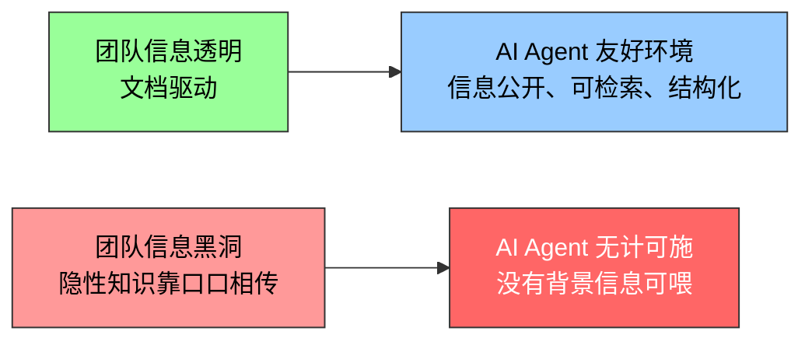
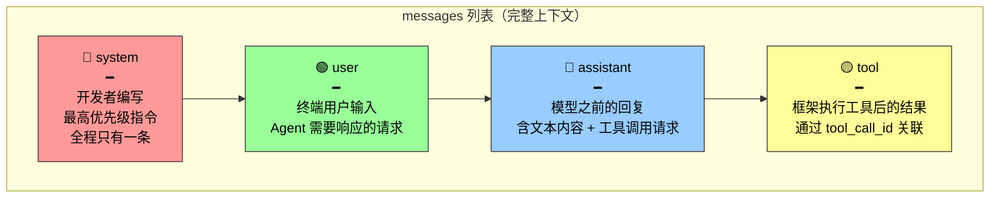
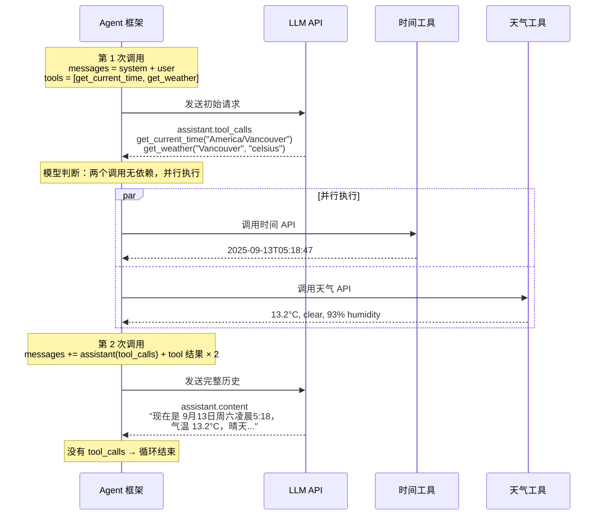
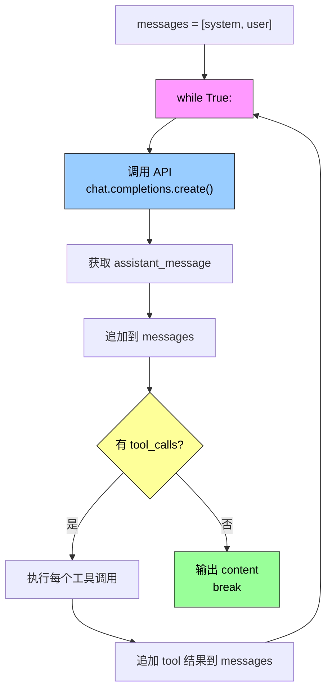

第一章把上下文比作 Agent 的"眼睛"——Agent 只能基于它看到的信息做决策。第二章深入眼睛的"视网膜结构"：这些信息到底以什么形式送给大模型？每次 API 调用背后发生了什么？

答案就是**上下文工程（Context Engineering）**——它决定 Agent 在每个决策点能看到什么信息、以什么结构看到这些信息。一个设计精良的上下文就是一套高效的信息供给系统。

---

## 上下文才是 Agent 能力的真正上限

大语言模型在标准测试中成绩亮眼，但落到实际业务场景中常常让人失望。原因不神秘：模型的能力是通用的，但执行具体任务需要背景信息——你们的产品架构、业务规则、内部约定——这些信息模型根本不知道。

### "永远的新员工"类比

想象一位天才工程师加入你的团队。他具备深厚的理论功底和卓越的编程能力，但对你们的产品架构、业务逻辑、技术债务、团队规范一无所知。更糟的是：关键的架构决策散落在不同团队成员的记忆中，代码库缺乏文档。

这位天才即便智力超群，也难以发挥真正的价值。**这就是当前 AI Agent 面临的困境。**

以一个 Coding Agent 为例。同样是"帮我修复这个 bug"，Agent 拿到的上下文质量直接决定它能否完成任务：

| 需要的上下文类别 | 具体内容 | 没有这些会怎样 |
|----------------|---------|---------------|
| **实时代码上下文** | 目录结构、模块职责、核心数据结构、代码规范 | 代码语法正确但风格格格不入，甚至引入架构冲突 |
| **流程规范** | Git 分支策略、提交规范、CI/CD 要求 | 可能直接往主分支提交未经测试的代码 |
| **环境信息** | 开发环境配置、测试数据库、staging 部署方式 | 本地能跑通的修复，测试环境立刻崩溃 |

这三类信息构成了 Agent 有效工作的**最低信息需求**。

> **模型本身的智力只是基础，上下文的质量才是 Agent 能力的真正上限。** 一个中等能力的模型配上精心组织的上下文，往往能胜过一个顶级模型在信息匮乏下的盲目摸索。

### 上下文工程首先是一个组织问题

OpenAI 研究员翁家翌曾精辟总结："人和模型一样，最重要的是 Context。"他以自身经历举例——"自己在 OpenAI 的工作也没有那么难，如果换一个人，如果有他所有的 context，也是能干的。"

同样的道理适用于 Agent：**决定 Agent 能力上限的不是模型参数量，而是它在每个决策点能获得多少、多精准的上下文。** 他还指出"团队合作中最大的问题也是 context 的不一致"，而"AI 短时间内无法取代人的最大原因也是 context——因为 AI 跟人并不在同一个环境里面"。

这恰好揭示了上下文工程的核心张力：它首先是一个技术问题（怎么把信息结构化地送给模型），但更根本地是一个**组织问题**。大多数团队的关键知识都是隐性的：架构决策只有老员工记得，业务规则靠口口相传，重要背景信息锁在私聊记录里。如果团队本身就是一个信息黑洞，再好的 AI Agent 也无计可施。

一个反例是 Linux 内核开源项目：分布全球的开发者协作维护了三十多年，成功的秘诀是高度透明、文档驱动的沟通文化——所有讨论公开，每个决策有详细记录，任何新加入者都能通过阅读历史来理解代码演化。这种工作方式天然创造了对 AI 友好的环境：**信息是公开的、可检索的、结构化的。**



> 构建 AI 原生团队，首先是一场文档化运动，而不只是部署新工具。

---

## 消息的四种角色：API 的基本语法

现在从技术层面拆解：上下文信息到底以什么形式送给大模型？

以 OpenAI Chat Completions API 为例（Anthropic、Google 等厂商结构大同小异），核心是一个 **messages 列表**。每条消息有一个 role 标识：



四个角色各司其职，任何时候你打开 messages 列表，都能清晰地看到对话的完整脉络。

此外，**工具定义（tools）作为请求的独立字段**（而非消息），告诉模型有哪些工具可用、每个工具接受什么参数。

---

## 从单轮问答到多轮工具调用：消息列表的演化

### 单轮对话：最简模式

```json
// Request
{
  "model": "Qwen3-0.6B",
  "messages": [
    {"role": "system", "content": "You are a helpful coding assistant."},
    {"role": "user", "content": "Hello, who are you?"}
  ]
}

// Response
{
  "choices": [{
    "message": {
      "role": "assistant",
      "content": "Hi! I'm a coding assistant. I can help you write code..."
    }
  }]
}
```

只包含一条 system 和一条 user，模型返回一条 assistant。这是最基本的交互模式——每次调用**完全无状态**，模型需要的所有信息必须在请求的 messages 中完整提供。

### 多轮工具调用：Agent 的完整心跳

真正的 Agent 场景复杂得多。当用户问"What's the current time and weather in Vancouver?"时，模型无法凭自身知识回答（它不知道"现在"是什么时候），需要调用外部工具。



让我们追踪 messages 列表在每一轮的变化：

```
初始状态（第 1 次调用前）:
  [system] [user]

第 1 次调用后（追加 assistant + tool 结果）:
  [system] [user] [assistant(tool_calls)] [tool:时间] [tool:天气]

第 2 次调用后（追加最终回复，循环结束）:
  [system] [user] [assistant(tool_calls)] [tool:时间] [tool:天气] [assistant(content)]
```

**关键细节**：第 2 次请求包含了第 1 次的全部历史——system、user、assistant（含 tool_calls）、以及两个 tool 结果。这就是"每次调用都是无状态的"的真正含义：模型不会"记住"上一轮对话，Agent 框架必须每次都把完整历史重新发送。

---

## Agent 核心循环：不到 20 行 Python

理解了 JSON 结构之后，用代码串起来就非常简单。以下是一个**最简 Agent 实现**：

```python
from openai import OpenAI

client = OpenAI()

# ── 工具定义 ──
tools = [
    {
        "type": "function",
        "function": {
            "name": "get_current_time",
            "description": "Get the current date and time in a specific timezone",
            "parameters": {
                "type": "object",
                "properties": {
                    "timezone": {"type": "string"}
                }
            }
        }
    },
    {
        "type": "function",
        "function": {
            "name": "get_weather",
            "description": "Get the current weather for a specific city",
            "parameters": {
                "type": "object",
                "properties": {
                    "city": {"type": "string"},
                    "unit": {"type": "string", "enum": ["celsius", "fahrenheit"]}
                }
            }
        }
    }
]

# ── 工具执行函数（实际应调用真实 API）──
def execute_tool(name, arguments):
    if name == "get_current_time":
        return '{"datetime": "2025-09-13T05:18:47", "day_of_week": "Saturday"}'
    elif name == "get_weather":
        return '{"temperature": 13.2, "unit": "celsius", "conditions": "clear"}'

# ── 初始消息列表 ──
messages = [
    {"role": "system", "content": "You are a helpful assistant. Use tools to get real-time information."},
    {"role": "user", "content": "What's the current time and weather in Vancouver?"},
]

# ── Agent 核心循环 ──
while True:
    response = client.chat.completions.create(
        model="Qwen3-0.6B",
        messages=messages,
        tools=tools
    )

    assistant_message = response.choices[0].message
    messages.append(assistant_message)

    # 没有 tool_calls → 模型已给出最终回复
    if not assistant_message.tool_calls:
        print(assistant_message.content)
        break

    # 执行每个工具调用，追加结果到消息列表
    for tool_call in assistant_message.tool_calls:
        result = execute_tool(tool_call.function.name, tool_call.function.arguments)
        messages.append({
            "role": "tool",
            "tool_call_id": tool_call.id,
            "content": result,
        })
    # 回到 while 开头，用更新后的 messages 再次调用模型
```

**核心逻辑只有一个 while 循环和一个判断**：模型返回了 tool_calls → 执行工具 → 把结果追加到 messages → 继续循环。没有 tool_calls → 输出结果 → 退出。

这就是第一章介绍的 ReAct 循环在 API 层面的具体实现。整个 Agent 框架的核心工作，就是**管理这个 messages 列表**——在合适的时机追加消息，然后把整个列表送给模型。



---

## API 视角看上下文：静态前缀 + 轨迹

通过上面的完整交互，可以清晰地看到 Agent 每次调用模型时上下文的构成：

```
┌──────────────────────────────────────────────────────┐
│  静态前缀（每一轮都不变）                                │
│  ┌──────────────────────┐ ┌────────────────────────┐ │
│  │ System Prompt        │ │ Tool Definitions        │ │
│  │ 身份、规则、约束       │ │ 工具名、描述、参数格式    │ │
│  └──────────────────────┘ └────────────────────────┘ │
├──────────────────────────────────────────────────────┤
│  轨迹（随交互不断增长）                                  │
│  [user] → [assistant] → [tool] → [user] → [assistant] │
│                                       → ...            │
└──────────────────────────────────────────────────────┘
```

上半部分（静态前缀）在整个对话中保持不变，下半部分（轨迹）随着交互不断增长。这正是第一章"上下文的五个组成部分"在 API 层面的具象化。

这个"静态前缀 + 轨迹"的结构是后续所有上下文优化技术的基础：

| 优化技术 | 基于的结构特性 | 作用 |
|---------|--------------|------|
| **KV Cache** | 静态前缀不变 | 前缀部分只需计算一次，后续调用复用结果 |
| **上下文压缩** | 轨迹可压缩 | 旧消息可摘要化、截断或选择性保留 |
| **提示工程** | System Prompt 可控 | 精心设计静态前缀，塑造 Agent 行为 |
| **Agent 状态栏** | 动态注入到静态区域 | 运行时状态以结构化方式注入前缀 |

本章后续将围绕这个结构的每一层展开——如何利用静态前缀的不变性加速推理（KV Cache）、如何设计好的 System Prompt、如何防范提示注入、如何按需加载专业技能（Agent Skills），以及如何在对话历史膨胀时进行智能压缩。

---

## 总结：Context 是 Agent 的水和空气

读完本节，建立三条核心认知：

| # | 认知 | 延伸 |
|---|------|------|
| 1 | **上下文决定能力上限** | 模型智力是下限，上下文质量是上限。天才工程师在没有文档的团队里也发挥不了价值 |
| 2 | **API 是无状态的** | 每次调用必须发送完整的 messages 列表。Agent 框架的核心工作就是管理这个列表 |
| 3 | **静态前缀 + 轨迹** | 前半不动（利于缓存），后半可压缩。所有上下文优化技术都基于这个二分结构 |

上下文工程不是"往 prompt 里塞更多信息"，而是**系统性地设计、组织和管理 AI 完成任务所需的全部背景知识**——这个差异，就是 Demo 和产品的差异。
