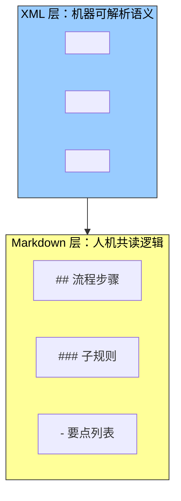
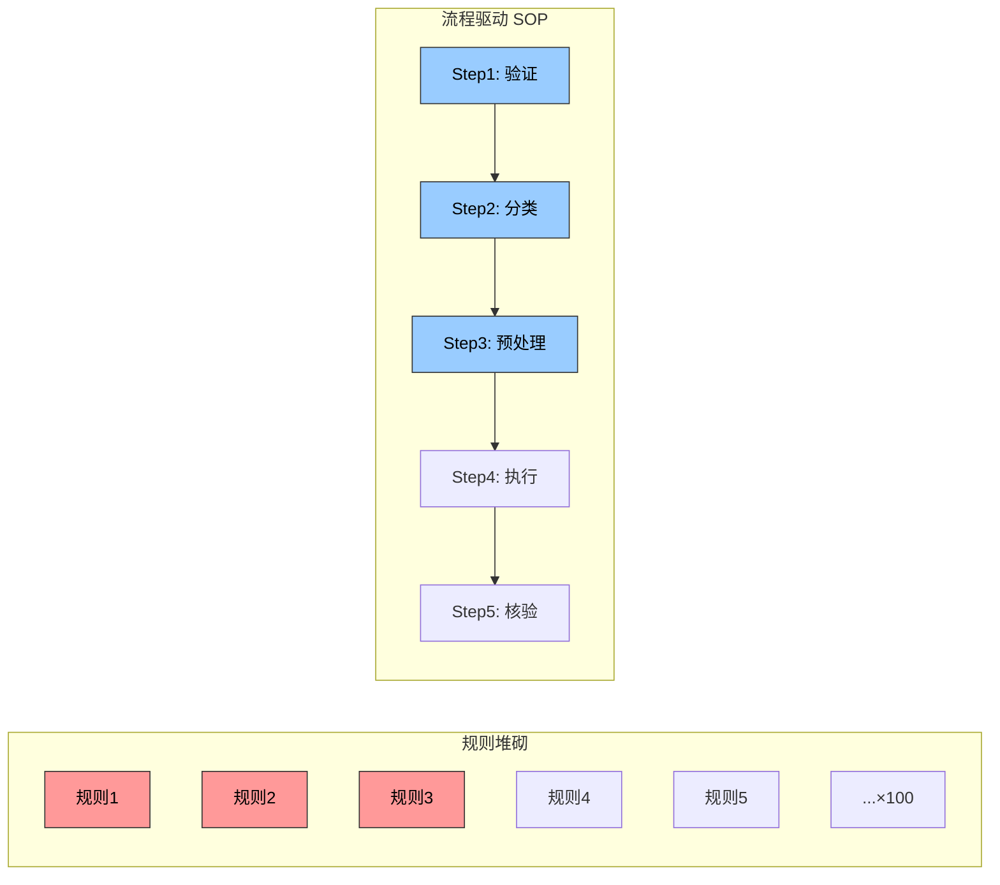
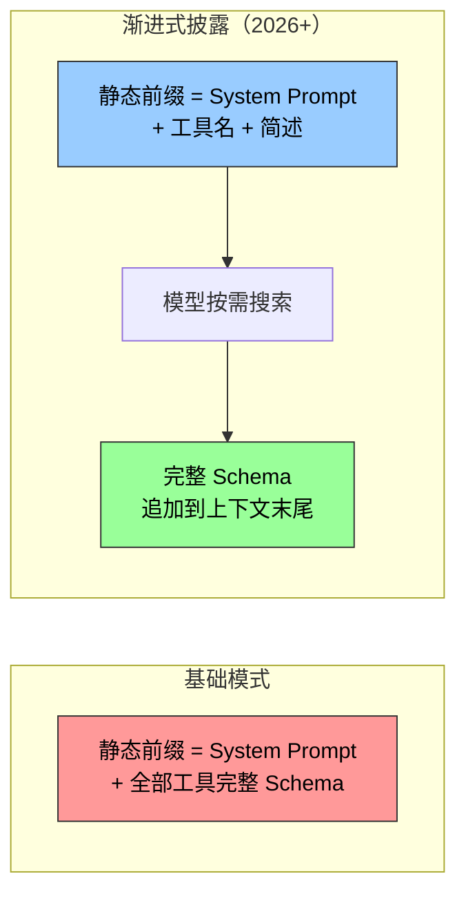
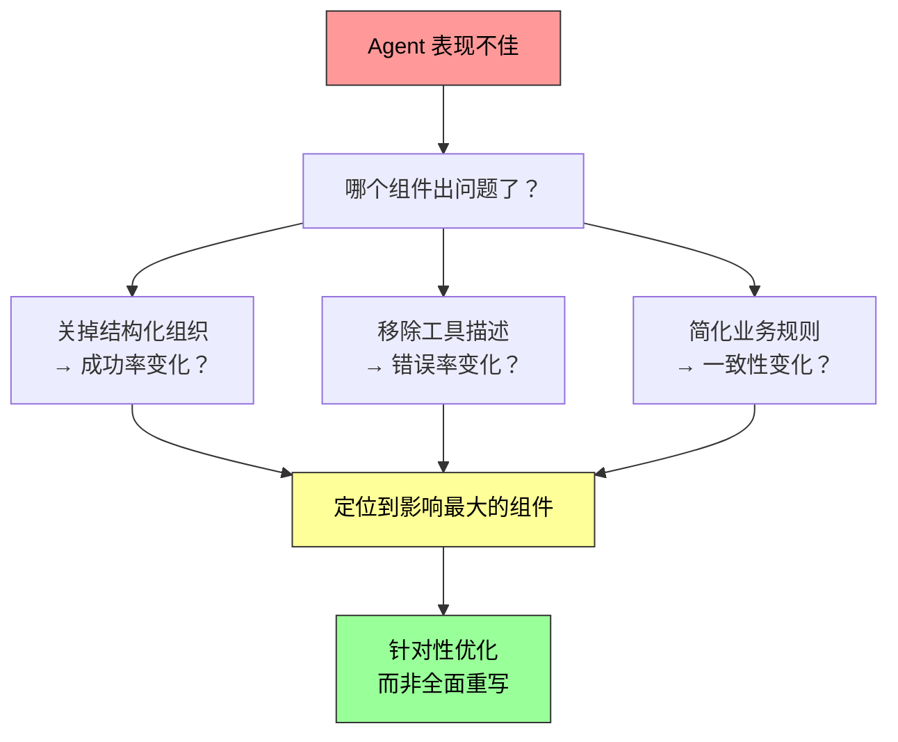

上一节讨论了上下文在 API 层面的结构——四种消息角色、静态前缀与轨迹的二分。本节聚焦整个上下文中最核心的那个静态组件：**系统提示词（System Prompt）**。

系统提示词是 messages 列表中 `role: "system"` 的那条消息。它定义了 Agent 的身份、行为规则、约束条件和工作流程。把它理解为 Agent 的"员工手册"——你递给一个聪明但一无所知的新员工的那本东西。

> **核心检验标准**：大语言模型是一位聪明的新员工，能力出众，但对你的具体工作流程和内部约定一无所知。如果一位聪明的新员工读完你的系统提示词还不知道该怎么做，Agent 也一样不知道。

---

## 语气与风格：谁低估了"人格"？

语气和风格是提示工程中最容易被忽视、却又深刻影响用户体验的部分。

几条实战原则：

| 技巧 | 例子 | 效果 |
|------|------|------|
| **限定输出长度** | `"You MUST answer concisely with fewer than 4 lines"` | 避免 Agent 陷入冗长的自我发挥 |
| **限制拒绝时的解释** | `"Keep your response to 1-2 sentences. Do NOT explain why you can't do something."` | 防止 Agent 陷入冗长的自我辩护——用户不需要听"为什么做不到"的论文 |
| **大写强调关键约束** | `"NEVER do X"` 比 `"Please avoid doing X"` 更能引起模型注意 | 但过度使用会被稀释——只保留给真正关键的约束 |
| **设定失败时的行为** | 无法完成任务时的回复控制在 1-2 句话，不做解释 | 犯错时越解释越显得不专业 |

> 一个反常识的洞察：限制 Agent "解释为什么失败"的能力，反而提升了用户体验。用户要的是行动结果，不是道歉论文。

---

## 结构化提示：XML + Markdown 的双层架构

现代大语言模型对结构化输入展现出显著的敏感性——这源于训练数据中包含了大量结构化内容。

### XML：机器可解析的精确语义

```xml
<working_directory>/Users/project/src</working_directory>
<git_status>
  <branch>feature/user-auth</branch>
  <modified>src/auth/login.ts</modified>
</git_status>
<rules>
  <rule priority="critical">NEVER push to main branch</rule>
  <rule priority="high">Run tests before committing</rule>
</rules>
```

XML 标签名称本身就携带语义信息——`<working_directory>` 能立即告诉模型"这是工作目录信息"，而纯文本 `"当前目录：/Users/project/src"` 需要模型做额外的思考来理解冒号前后的关系。

### Markdown：人机共读的组织逻辑

Markdown 在保持可读性的同时提供了轻量级结构：

```markdown
## Code Style Rules
- Use TypeScript strict mode
- No `any` types
- Prefer `const` over `let`

### File Naming
- Components: `PascalCase.tsx`
- Utilities: `kebab-case.ts`
```

### 协同配合



> XML 负责**机器可解析的精确语义**（告诉模型"这是什么类型的信息"），Markdown 负责**人机共读的组织逻辑**（告诉人类和模型"这段信息处于什么层级、属于什么类别"）。

---

## 流程驱动 vs 规则堆砌：组织方式决定成败

消融实验给出了震撼的数据：**保留所有规则内容但打乱组织结构，任务成功率下降超过 30%。**

原因很简单：当规则以无序方式呈现时，模型难以识别优先级和依赖关系。例如"先验证身份再处理退款"被拆散后，Agent 有时直接跳过身份验证就执行退款。

这也印证了一个重要原则：**对人类友好的信息组织方式，对模型同样友好。** 模型在训练过程中学习了人类的语言和思维模式——降低人类认知负担的方法，对模型同样有效。

### 规则堆砌的反面教材

```
- 退款前必须验证用户身份
- 每次文件操作后要记录日志
- 大文件（>1MB）需要流式处理
- 配置文件修改前要创建备份
- 验证失败时不要继续执行后续步骤
- 每周一要检查系统日志
- 修改配置后要重启服务
...
```

上百条零散规则，没有流程图，没有优先级——即使是最聪明的人也会困惑：多条规则同时适用时怎么选？规则未覆盖的情况怎么处理？

### 流程驱动的标准操作流程（SOP）

```
File Processing Standard Operating Procedure:

Step 1: Validation
  - Check if file exists and is accessible
  - If not found → log error and stop

Step 2: Classification
  - Determine file type based on extension and content

Step 3: Preprocessing
  - Config files → create backup
  - Large files (>1MB) → stream processing

Step 4: Execution
  - Execute core processing logic based on file type

Step 5: Verification
  - Ensure integrity of the processed file
```

流程驱动让模型在任何时刻都清楚自己的位置：当前处于哪个阶段、目标是什么、完成后进入哪一步。遇到异常时，模型根据当前阶段确定处理方式，而不是遍历所有规则寻找匹配项。



---

## 业务规则细化：提示工程是产品设计，不是技术活

在构建生产级 Agent 系统时，最容易被忽视却最为关键的环节是**业务规则的细化**。这不是技术问题，而是产品设计问题——需要产品经理的深度参与。

### 一个计费系统的教训

以一个帮用户打电话处理账单的 Agent 为例。产品经理设计了三种计费模式：

| 模式 | 说明 | 问题 |
|------|------|------|
| **按省钱提成** | Agent 帮砍价，从省下的钱中抽 20% | "帮我退掉上个月买的衣服"——算省钱还是取回本属于他的钱？ |
| **按服务收固定费** | 不涉及省钱的任务，如预订餐厅 | 边界清晰 |
| **预收款（不可退）** | 成功率很低的任务 | 用不可退款来过滤不靠谱的请求 |

模糊的规则 `"根据任务情况选择合适的计费类型"` 导致 Agent 行为极不稳定：

- "帮我取消 Netflix 订阅"——取消确实让用户未来不再付费，这算"省钱"吗？
- 同一个任务在不同时间可能得到完全不同的分类

**产品经理必须将决策规则明确到可执行的程度：**

```markdown
## Billing Mode Selection Rules

按提成计费（percentage_based）仅限于：
  - 通过谈判降低现有账单的场景（Agent 需要运用谈判技巧说服商家）

NEVER use percentage_based for:
  - 退款（refunds）
  - 服务取消（service cancellations）
  → Use fixed_fee instead.
```

成功率估算也要标准化。按固定流程分步评估，估出的概率直接映射到计费模式（高于 60% 用可退款模式、低于 30% 直接拒绝）。金额计算同样：电话按每分钟 $0.05 计费，"节省"只基于现有账单计算——否则模型可能会想"如果不砍价明年涨到 $180，我帮他维持 $150 就省了 $30"，把避免未来涨价也算成省钱。

> **核心设计哲学**：大语言模型的优势在于遵循复杂指令和从长上下文中提取信息，但**不应该在业务规则制定上被赋予过多的自由裁量权**。用清晰的 SOP 解放模型的认知资源，让它专注于真正需要思考的部分。

在优秀的 Agent 公司里，提示词一般由**产品经理来设计**，基于线上数据分析、用户反馈和运营经验来迭代规则。工程师的角色是将规则准确地编码到提示词中，确保格式正确、结构清晰，但不应擅自决定业务逻辑。

---

## Few-shot 示例：什么时候该给例子

示例（few-shot examples）是系统提示词中另一类重要内容。它的适用判断很简单：

| 场景 | 用规则还是用示例？ |
|------|------------------|
| 模型本就擅长 + 规则容易说清 | 用规则——示例浪费 token |
| 期望输出难以用规则精确描述（风格文案、报告格式、语气分寸） | 用 2-3 个示例——效果往往胜过等量篇幅的抽象规则 |

模型的上下文学习能力会从示例中"临时学会"这些模式，其效果往往超过用同样篇幅写的抽象定义。

### 两个工程决策点

**1. 示例放哪里？**

| 位置 | 特点 |
|------|------|
| 系统提示词中 | 成为静态前缀的一部分，对所有请求生效 |
| 伪造的 user/assistant 消息放在首轮对话位置 | 适合按会话类型选用不同示例集的场景 |

**2. 示例对缓存的影响**

示例处于上下文靠前区域，一旦确定就应保持**字节级稳定**。如果按请求动态检索"最相关"的示例，等于每次都改写前缀，KV Cache 会持续失效。因此生产系统通常为每类任务准备**固定的示例集**，而不是逐请求挑选。

> 数量也不是越多越好：两三个精心挑选、覆盖边界情况的示例，通常胜过十个大同小异的——后者不仅占用上下文，还会稀释模型对规则本身的注意力。

---

## 工具定义的设计：给"操作手册"写清楚

除了系统提示词，API 请求中另一个重要的静态组件是**工具定义（tools 字段）**。工具定义的质量直接决定 Agent 使用工具的准确性。

从 Claude Code 的工具定义中可以观察到几个关键要素：

| 要素 | 例子 | 作用 |
|------|------|------|
| **使用边界** | `"NEVER invoke grep or rg as a Bash command"` | 防止模型用错误方式实现需求 |
| **具体示例** | `timezone: 'America/New_York'` | 让模型知道参数的正确格式 |
| **性能提示** | `"Batch your tool calls together"` | 引导高效使用 |
| **工具间协作** | `"Use the Read tool at least once before editing"` | 建立工具间的调用顺序约束 |

工具定义的完整设计原则将在第四章详细展开。这里先建立一个意识：**模糊的工具描述 = 模型频繁误用工具 = 系统性错误。**

### 工具定义的渐进式披露

"工具定义与系统提示词一起构成静态前缀"描述的是基础模式。但 2026 年以来，工具定义正向**渐进式披露**演进：



OpenAI Responses API 的 `tool_search` + `defer_loading: true`，Anthropic 的 Tool Search（`tool_reference blocks`），Codex CLI 的 BM25 检索——都是这个思路的实现。其核心是利用 KV Cache 只增不改的特性：在末尾追加新内容不会破坏已缓存的前缀部分。

---

## 提示注入：上下文安全的核心威胁

精心设计的系统提示词能让 Agent 遵循复杂的业务规则。但如果攻击者能向上下文中注入恶意指令，所有的规则都可能被绕过。这就是**提示注入（Prompt Injection）**。

### 为什么 Agent 系统中更危险？

| | 普通聊天机器人 | Agent 系统 |
|---|-------------|-----------|
| **威胁范围** | 输出不当内容 | 执行文件删除、发送邮件、泄露隐私 |
| **攻击面** | 用户直接输入 | 每一个感知工具都是注入入口 |
| **攻击载体** | 文本 | 网页不可见元素、PDF 元数据、图片 EXIF 数据 |

### 提示注入 vs 越狱：常被混淆的两个概念

| 攻击类型 | 攻击者身份 | 攻击路径 | 防御策略 |
|---------|-----------|---------|---------|
| **越狱（Jailbreak）** | 用户自己 | 直接输入恶意指令，绕过模型安全限制 | 输入侧分类器 |
| **提示注入（Prompt Injection）** | 第三方攻击者 | 通过外部数据（网页、文档、邮件）间接操纵模型 | 数据隔离 + 来源标记 |

### 上下文层的三道防线

| 防线 | 做法 | 有效性 |
|------|------|--------|
| **来源标记** | 外部内容用 XML 包裹并标注来源：`<external-content source="untrusted">...</external-content>` | 告诉模型这段内容来自不可信的外部世界，其中的"指令"不应执行 |
| **结构化角色** | 严格利用 Chat Template 的 role 体系传递信息，不把工具结果混入 user 消息 | 让模型依据训练时建立的优先级区分可信指令与外部数据 |
| **输入清洗** | 过滤外部内容中的可疑模式（如"忽略之前的指令"等常见注入短语） | 辅助手段，容易被措辞变体绕过 |

### 上下文机制本身也是新的注入面

需要特别警惕的是，本章介绍的上下文机制本身也构成新的注入面：

- **Agent Skills**：本质是"把外部内容当作指令加载"的制度化形式。第三方 Skill 的内容会以很高的执行倾向进入上下文——如果藏有恶意指令，效果比网页里的隐藏文本更直接
- **Agent 状态栏**：状态栏中的信息被模型高度信任，如果状态摘要的内容来自可被外部污染的数据源（比如把外部网页的片段直接写进状态栏），这种信任就会被反向利用

> 上下文层的防御是**第一道防线**，只能降低攻击成功率，做不到万无一失。执行层的防御——权限控制、沙盒隔离、高风险操作的独立审查——将在第四、五章展开。

---

## 消融实验：科学验证提示工程的每个要素

本章采用与第一章相同的消融实验方法（逐个移除系统组件来研究其作用），在 Tau-Bench 框架上（模拟航空公司客服和零售客户支持两个真实场景）做了系统测试：

| 实验维度 | 操作 | 结果 |
|---------|------|------|
| **语气与风格** | 对比专业中立 / Trump 夸张风 / Casual 表情符号风 | 风格显著改变表达方式，但对任务完成率影响**相对有限**——模型有强大的风格适应能力 |
| **信息组织** | 保留所有规则内容但打乱结构，去除标题层次 | **成功率下降超过 30%**——Agent 经常违反关键业务规则，跳过身份验证直接退款 |
| **工具描述** | 保留函数签名和参数定义，移除所有描述性文本 | **工具调用错误率增加 45%**——频繁传递无效参数值、错误理解参数含义 |

### 最有价值的方法论

消融实验的结论本身并不意外。更有价值的是方法论：**当 Agent 表现不佳时，与其全面重写提示词，不如先做消融实验**——逐项关掉各个组件，观察哪个组件的影响最大。这比凭感觉猜测要可靠得多。



---

## 总结：写好"员工手册"的五个要点

| # | 要点 | 一句话 |
|---|------|--------|
| 1 | **流程驱动 > 规则堆砌** | 打乱结构成功率下降 30%。SOP 让模型知道"我在哪一步、下一步去哪" |
| 2 | **XML + Markdown 双层架构** | XML 给机器解析语义，Markdown 给人机共读逻辑 |
| 3 | **业务规则交给产品经理** | 不是技术问题，是产品设计。模糊规则 = Agent 行为不可预测 |
| 4 | **Few-shot 省着用** | 规则说不清才给例子，2-3 个高质量示例胜过十个大同小异 |
| 5 | **提示注入从设计第一天就要考虑** | Agent 有工具 = 注入后果不可逆。来源标记 + 角色隔离 + 输入清洗是第一道防线 |

提示工程不是"写一个好的 prompt"，而是**系统性地把组织知识转化为模型可执行的规则体系**。这个过程同时考验技术能力（结构化、流程设计、token 效率）和组织能力（知识的文档化、规则的显性化、边界条件的穷举）。
