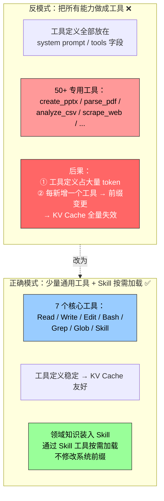
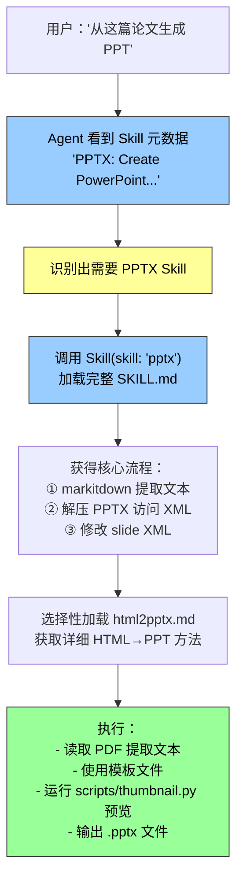

前面讨论了 Skills 的渐进式披露机制和三种注入方式。现在回到一个更根本的架构问题：**Skills 和工具到底是什么关系？为什么不能把所有能力都做成工具？**

---

## 两种不同的能力承载形态

| 维度 | 工具（Tools） | Skills |
|------|-------------|--------|
| **本质** | Agent 的"执行原语"——最基础的行动能力 | Agent 的"领域知识包"——特定任务的操作知识 |
| **数量** | 少而精（Claude Code 仅 7 个核心工具：Read、Write、Edit、Bash、Grep、Glob、Skill） | 可以很多，按需加载 |
| **定义位置** | 系统提示词的 tools 字段，静态前缀的一部分 | 元数据在上下文末尾按需注入 |
| **加载方式** | 启动时全部加载 | 渐进式披露：元数据 → 完整内容 → 子文档 |
| **内容构成** | 函数签名、参数定义、使用说明 | 流程指导、子文档引用、可执行脚本 |
| **变更影响** | 修改定义 → KV Cache 前缀失效 | 修改 Skill 内容 → 仅影响下次加载该 Skill 时 |

---

## 为什么工具要少而 Skill 可以多？

核心原因在于 **KV Cache 的经济学**。



如果把所有专用能力都做成工具——`create_pptx`、`parse_pdf`、`analyze_csv`、`scrape_web` 等 50+ 个——工具的完整 schema 全部塞在系统提示词中，会带来三层代价：

1. **token 浪费**：大部分工具在当前任务中根本用不到
2. **缓存脆弱**：新增或修改任何一个工具定义，整个前缀失效，重算数万到数十万 token
3. **注意力稀释**：50 个工具的定义铺在面前，模型选择时的"信噪比"急剧下降

而采用 **"少量通用工具 + Skill 按需加载"** 模式：

- 核心工具保持 7 个左右（Read、Write、Edit、Bash、Grep、Glob、Skill）
- 工具定义稳定 → KV Cache 前缀长期有效
- 领域知识通过 `Skill` 这个通用工具按需加载，内容以 tool result 形式追加到轨迹末尾，不破坏缓存

---

## Skill 工具：一个"元工具"

注意工具列表中有一个特殊的 `Skill` 工具——它是整个 Skills 机制的**加载通道**：

```
工具列表:
  Read    — 读取文件
  Write   — 写入文件
  Edit    — 编辑文件
  Bash    — 执行命令
  Grep    — 搜索代码
  Glob    — 匹配文件
  Skill   — 加载 Skill 内容          ← 这是"元工具"
```

Agent 调用 `Skill(skill: "pptx")` 时，框架读取对应的 SKILL.md 并返回其内容作为 tool result。从 API 角度看，这和其他工具调用没有区别——模型请求、框架执行、结果追加到消息列表。

但从能力角度看，`Skill` 工具是**唯一一个"内容不由代码生成而由外部文件决定"的工具**——它的返回结果是人类编写的、可版本控制的知识文本。这让 Skills 成为 Agent 能力扩展的"软通道"：不需要改代码、不需要重新部署、不需要新增工具定义，只需要写一篇 SKILL.md。

---

## 选择框架：能力该沉淀为工具还是 Skill？

这个选择在第四章会详细展开，第八章则探讨 Agent 在自我进化过程中如何自主决策。这里先给出一个初步的判断框架：

| 能力特征 | 适合做成 | 原因 |
|---------|---------|------|
| **调用频率极高**，几乎每个任务都用 | 工具 | 每次按需加载反而浪费 |
| **有严格的安全约束**，需要精确参数校验 | 工具 | 工具定义天然带参数 schema，框架可在执行前校验 |
| **领域专用**，只有特定场景才需要 | Skill | 按需加载，不占用通用场景的上下文 |
| **知识密集型**，需要流程指导和子文档 | Skill | Skill 的三层结构天然适合知识组织 |
| **需要频繁迭代更新** | Skill | 修改 Skill 不影响 KV Cache；修改工具定义会导致前缀失效 |
| **需要跨模型复用** | Skill | Skill 是纯文本知识，不依赖特定 API 格式 |

---

## 实验 2-6：用 Skills 从论文生成 PPT

这个实验直观验证了 Skills 机制的价值。任务是"从一篇学术论文的 PDF 生成一份 10-15 页的演示文稿"。



整个过程完美体现了渐进式加载：从元数据到核心流程到子文档，每一步只加载刚好够用的信息。最终产物覆盖论文的标题页、问题背景、方法概述、关键结果和结论，至少包含 3 张从论文中提取的图表。

---

## 总结：少工具、多 Skill

| # | 要点 |
|---|------|
| 1 | 工具是"执行原语"——数量少、定义稳定、KV Cache 友好 |
| 2 | Skill 是"领域知识包"——按需加载、内容可迭代、不破坏缓存 |
| 3 | `Skill` 这个工具是唯一的"元工具"——它的返回结果不是代码生成，而是人类编写的外部知识 |
| 4 | 能力该沉淀为工具还是 Skill？高频 + 严格校验 → 工具；领域专用 + 知识密集 + 需频繁迭代 → Skill |
| 5 | 目标：让核心工具数量始终保持在个位数，把所有领域知识推向 Skill 生态 |
