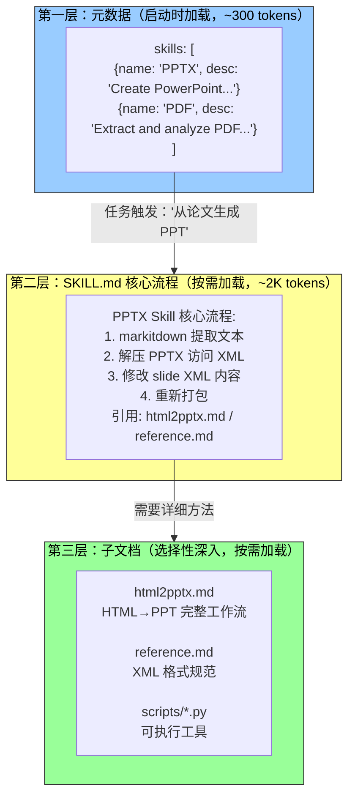
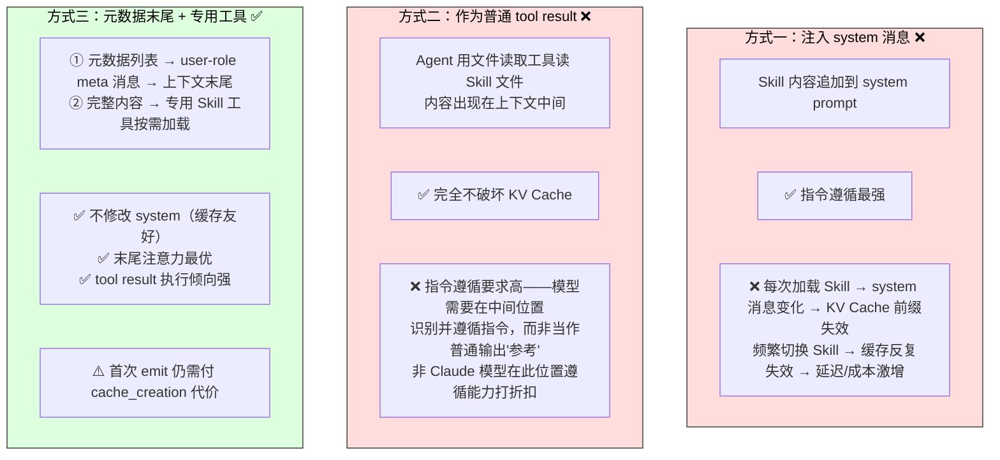
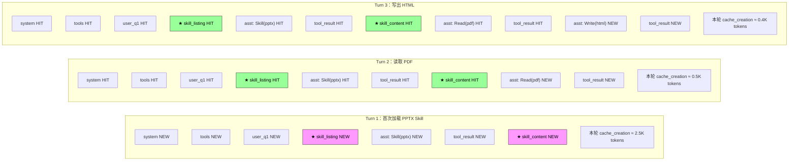

随着 Agent 覆盖的业务场景越来越多，系统提示词会不断膨胀——客服的退款规则、编程的代码规范、文档的格式要求⋯⋯全部塞进一个 prompt 会带来两个致命问题：

1. **浪费 token**：大部分内容与当前任务无关
2. **注意力被稀释**：无关信息过多会稀释模型对关键内容的注意力（后续将在"上下文腐化"概念中详细讨论）

这就是从静态提示工程到**动态提示词**的自然演进：不是把所有知识一次性塞给 Agent，而是让它**按需加载**。Agent Skills 系统正是这一理念的工程化实现。

---

## 渐进式披露：三层知识结构

Skills 的核心设计哲学是**渐进式披露（Progressive Disclosure）**——就像你不会把公司所有部门的操作手册堆到新员工桌上，而是先给一份总目录，需要哪本再去取。



### 第一层：元数据——路由决策的关键

每个 Skill 的 SKILL.md 开头是 YAML frontmatter，包含 `name` 和 `description`。Agent 框架启动时扫描所有 Skill，将它们的 name + description（仅数百 token）注入上下文，让 Agent 知道"我有哪些能力可用"。

**description 的写法决定了路由准确率。** 它应该像路由条件而非功能介绍：

| | 错误的写法 | 正确的写法 |
|---|----------|----------|
| 形式 | "Help with backend development" | "Use when the user needs to create or modify backend API endpoints, database schemas, or server configuration. Don't use for frontend tasks, deployment scripts, or test writing." |
| 问题 | 宽泛到任何后端工作都触发 | 明确了触发边界 + 反例排除 |

**实践中缺少反例的 Skill 描述会让路由准确率明显下降。** 宽泛的描述在不相关的任务上频繁误触发；补上反例后，路由准确率显著回升。反例不是可选项，而是 Skill 路由能否准确触发的关键。

核心原则：**"何时该用我"比"我能做什么"重要得多。**

### 第二层：核心流程

当 Agent 判断某个任务需要特定 Skill 时，通过专用的 `Skill` 工具加载完整的 SKILL.md。以 PPTX Skill 为例，其中包含处理 PowerPoint 文件的核心流程——如何用 markitdown 提取文本、如何解压 PPTX 访问原始 XML、关键文件路径约定等。

### 第三层：细则按需深入

主文件通过引用指向更详细的子文档：`html2pptx.md`（HTML 模板创建 PowerPoint 的完整工作流）、`reference.md`（格式技术细节）、`scripts/`（可执行工具代码）。Agent 会根据具体需求选择性地深入阅读相关子文档。

> **Skill 不只包含指导性文档，还可捆绑可执行代码工具和模板文件**——从纯粹的知识传递升级为实际的**能力赋予**。

---

## Skills 的更大意义：能力的社区化生态

Skills 的价值不仅在于优雅的上下文管理，更在于为领域知识的积累提供了一条**可持续的路径**。

每个 Skill 都是自包含的知识模块，可以独立开发、测试、版本控制和分享。这意味着 Agent 的能力扩展从集中式的系统提示词编辑，转变为分布式的、社区驱动的生态构建：

| 类比 | 说明 |
|------|------|
| **Python 的 pip** | 每个包封装了某个领域的最佳实践，开发者可直接使用、定制或创建全新包 |
| **Node.js 的 npm** | 同样：独立模块、版本管理、社区共享 |
| **Agent Skills** | 每个 Skill 封装了某个领域的操作知识——文档处理、数据分析、代码生成 |

Anthropic 官方 Skills 仓库已涵盖 PPTX、PDF、DOCX、数据分析、代码生成等领域。这揭示了一个重要原则：**选择 Agent 交互模式时应对齐模型厂商的训练方法论。** 使用 Claude 构建 Agent 时，应充分利用 Skills 和结构化系统提示；基础模型公司推行的 Agent 用法本质上是它们专门训练过的模式，同一生态内的模型天然具有最优表现。

---

## Skills 的三种实现方式与工程权衡

Skill 内容放在上下文的什么位置？这是一个根本性的设计决策，直接关系到 KV Cache 效率和指令遵循效果。



### 方式三的详细机制（Claude Code 实际采用）

把"路由"和"执行"两步分离，分别回避前两种方式的痛点：

**第一步：元数据列表注入**

所有已安装 Skill 的 name + description（合计仅数百 token）以一条 `user` 角色的 meta 消息注入到上下文**末尾**，外层用 `<command-metadata>` 标签包裹：

- 不修改 system 消息 → KV Cache 前缀不受影响
- 位于上下文末尾 → 注意力位置最优
- 增量发送：每个 Skill 只在首次出现时发送，已发送过的不再重复 → 稳态下每轮元数据增量为零

**第二步：完整内容通过专用工具加载**

当模型从元数据列表中识别出某个 Skill 适合当前任务时，调用 `Skill(skill: "pdf")` 工具，工具内部读取 SKILL.md 返回。结果作为 tool result 出现在对话历史中。

这绕过了方式二的指令遵循风险——模型对"自己刚刚主动调用的工具的输出"有**更强的执行倾向**，远胜于对上下文中间一段普通文件内容的遵循。

### 一个需要诚实的权衡

"末尾"的注意力优势只在注入的**当轮**成立。增量发送的元数据永久留在轨迹中，随着会话增长会逐渐滞留到上下文中部，位置优势随之衰减。这是"只发一次、节省缓存"与"每轮置底、保住注意力"之间的权衡——后续讨论 Agent 状态栏的持久追加式更新时，会再次遇到同一个取舍。

---

## emit-once：KV Cache 优化的核心模式

通过追踪一个完整任务（"从这个 PDF 生成 PPT"）的轨迹和缓存演化，可以直观理解 emit-once 的设计效果。

### 轨迹视角

```
messages: [
  {role: "system", content: "你是 Claude Code 助手..."}     ← 固定不变，KV Cache 缓存
  {tools: [Skill, Read, Bash, Edit, Write, ...]}           ← 固定不变

  {role: "user", content: "帮我从这个 PDF 生成 PPT"}

  {role: "user", isMeta: true, content: "★ Available skills: pdf, pptx, ..."}  ← emit-once ~300 tokens

  {role: "assistant", tool_calls: [Skill(skill: "pptx")]}
  {role: "tool", content: "Launching skill: pptx"}                           ← 占位符
  {role: "user", isMeta: true, content: "★ Base directory: ...\n# PPTX Skill\n## Workflow: ..."}  ← emit-once ~2K tokens

  {role: "assistant", tool_calls: [Read(file: "input.pdf")]}
  {role: "tool", content: "...PDF 文本内容..."}
  {role: "assistant", tool_calls: [Write(file: "slides.html")]}
  {role: "tool", content: "Wrote 12345 bytes"}

  ... 后续轮次 ...
]
```

### KV Cache 演化



关键洞察：

| 概念 | 含义 |
|------|------|
| **NEW** | 该轮新增 token，需支付一次 cache_creation 代价 |
| **HIT** | 已在缓存前缀，本轮免费命中 |
| **★ emit-once** | 仅 Turn 1 付一次 cache_creation，之后所有轮次永久 HIT，边际成本为零 |

### 常见误解澄清

**"对 KV Cache 友好"不是"零成本"。** 首次 emit 那几百到几千 token 终归要付一次写入代价（Prompt Cache 的缓存写入是加价计费）。它的准确含义是**一次性写入、永久受益**——要让模型知道某个 Skill 的存在，至少得让它进缓存一次；Claude Code 做到的就是只付这一次，之后整个会话都不再重复。

对比方案——把同样的信息塞进 system prompt——每次更新都会让其下游的整条 trajectory 失效，进入 cache_creation 的量级是**数万到数十万 token**。那才是真正的不友好。

---

## 总结：模块化是 Agent 能力的未来

| # | 要点 | 一句话 |
|---|------|--------|
| 1 | **渐进式披露** | 三层结构：元数据 → 核心流程 → 子文档。不是把整本手册塞给 Agent，而是给它目录 + 按需取阅 |
| 2 | **description 写路由条件** | "何时该用我"比"我能做什么"重要。缺少反例的 description 会频繁误触发 |
| 3 | **方式三：元数据末尾 + 专用工具** | 既不破坏 system KV Cache，又绕过了上下文中间位置的指令遵循风险 |
| 4 | **emit-once = 一次写入、永久受益** | 首次支付 cache_creation，后续所有轮次免费命中。对比方案（改 system prompt）的代价是数万到数十万 token |
| 5 | **Skills = Agent 的包管理生态** | 类比 pip/npm——独立开发、测试、版本控制、社区分享。Agent 能力从集中式编辑走向分布式生态 |

Skills 代表了上下文工程从"静态优化"到"动态编排"的关键跃迁。它不再把上下文当作一块需要精心雕琢的巨石，而是构建了一套**知识与能力的按需加载系统**——这为 Agent 处理越来越复杂的任务提供了可持续的工程基础。
