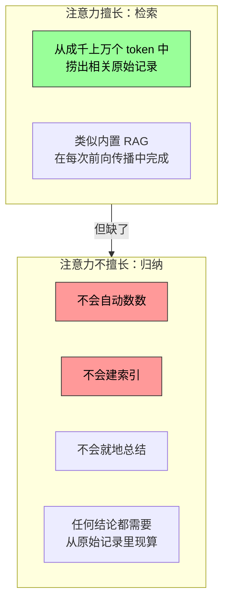
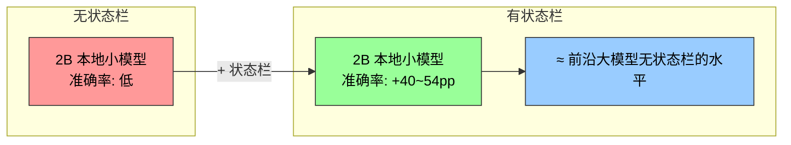
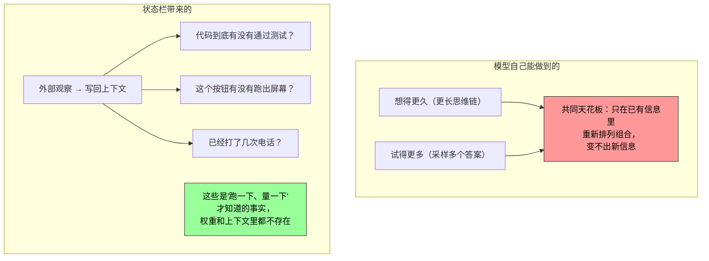

前两节讨论了 Skills——把领域知识按需加载到上下文中。本节讨论另一个方向的上下文优化：不是"加载什么"，而是**"把什么提炼出来"**。

在构建生产级 Agent 时，仅依赖大模型的原生能力远远不够。Agent 执行复杂任务时容易陷入各种陷阱：无限循环（记不清调了几次工具）、状态遗忘（忘了任务已经做完某一步）、目标偏离（在长对话中逐渐跑题）。这些问题的根源是：**Agent 缺乏对自身运行状态的感知能力。**

Agent 状态栏就是解决这个问题的机制。

---

## 操作系统的状态栏，Agent 版

最好的类比是手机屏幕顶部的状态栏。时间、电量、信号强度、通知数量——这些信息不是任何 App 的主界面内容，但你随时可以瞥一眼就掌握设备的当前状态。

Agent 状态栏对模型起着完全相同的作用：

```
┌─────────────────────────────────────────────┐
│ System Prompt + Tool Definitions (静态前缀)   │
├─────────────────────────────────────────────┤
│ 用户消息、模型回复、工具结果...(对话历史)        │
├─────────────────────────────────────────────┤
│ ┌─ Agent 状态栏 ───────────────────────────┐ │
│ │ phone_call 已调用: 3 次 (Xfinity: 3)      │ │
│ │ 约束检查: 已达上限 (3/3) ✗                 │ │
│ │ TODO: [✓] 联系Xfinity  [✓] 确认降价         │ │
│ │ 当前时间: 2025-09-14 10:30                │ │
│ │ 当前状态: 等待用户确认                      │ │
│ └──────────────────────────────────────────┘ │
└─────────────────────────────────────────────┘
```

它**不是对话的主体内容**（不属于用户消息、模型输出或工具结果），而是 Agent 框架持续注入的**实时仪表盘**。模型每次生成新回复时都能"瞥一眼"这些状态，据此做出更准确的决策。

与系统提示词的区别非常明确：

| | 系统提示词 | Agent 状态栏 |
|---|----------|------------|
| 类比 | 入职时发的员工手册 | 屏幕边缘的实时仪表盘 |
| 变化频率 | 不变 | 随任务推进持续更新 |
| 位置 | 上下文最前面（静态前缀） | 上下文末尾 |

---

## 为什么这件事不是"理所当然"的？

你可能会想：上下文里不是有完整的通话记录吗？模型自己不会数吗？

答案令人惊讶：**会，但做得又贵又差。**

### 注意力的本质：半台检索引擎



更形象地说：上下文窗口是一台**只有检索、没有提炼层的引擎**。你问什么，注意力能从成千上万个 token 里把相关的原始记录捞出来。但它缺了另一半：上下文里的东西**从来不会被自动数一遍、建个索引、或就地总结**。

任何"关于这些内容的结论"——一共多少条、有没有超标、进展到哪一步——模型每次要用，都得从原始记录里**现算一遍**。而"现算一遍"的代价，随上下文长度（记作 N）一起往上涨。

### 一个真实的失败场景

Agent 被要求拨打客服电话，系统提示词规定"每个商家不超过 3 次"。但打了 3 次之后，Agent 经常**数不清**到底打了几次，又打了第 4 次，甚至陷入循环反复拨打。

问题在于："已经打了几次"这个知识没有被自动提炼出来，而是以原始通话记录的形式分散在 KV Cache 的向量表示中。模型每次决策都必须花费额外的思考 token 去扫描上下文重新统计——这个过程**效率极低且错误率很高**。

当在每个电话的工具调用结果中直接加入状态信息（如"本次是第 3 次呼叫该商家"），模型就能立即发现已达到限制，不再继续呼叫。

---

## 量化证据：状态栏到底有多大用？

笔者与合作者用一个专门的基准（Context Distillation）量化了状态栏的效果：三类任务（计数、规则归纳、状态跟踪）、11 个模型（从前沿 API 到 2B 本地小模型）、近 2.4 万次评测。

### 结论一：弱模型补准确率



最弱的几个模型配上状态栏，准确率能涨 **40 到 54 个百分点**。一个 2B 的本地小模型直接追平不带状态栏的前沿大模型。

### 结论二：强模型省效率

强模型本来就答得对。状态栏给它们省下来的是成本：每次查询的思考量、延迟、花费**各降大约一个数量级**，思考 token 砍掉 **90% 以上**。

### 结论三：思考量从"随上下文增长"变成"基本恒定"

**不带状态栏**时，每次查询的思考量随上下文变长而**持续增长**（因为"扫描范围"越来越大）。

**带上状态栏**后，思考量变得**基本恒定**——不管上下文堆到多长，模型都只是"瞥一眼"那几格状态。

这就是状态栏带来的质变：它把 Agent 的决策成本从 **O(N) 变成了 O(1)**。

---

## 三条铁律：状态栏怎么做才对

### 铁律一：用代码维护，绝不用 LLM

一个很自然的念头是"那我再叫一个 LLM 去读历史、帮我总结出状态栏"——**结果恰恰相反。**

| 方式 | 准确度 | 原因 |
|------|--------|------|
| 20 行正则函数 | 标准答案级别 | 计数就是计数，不需要"理解" |
| 前沿大模型一次性批量统计 | 大多数格子出错，拖得比不用状态栏还低 | 让 LLM 批量统计长历史 = 把"扫描整段上下文"这个原始难题原封不动搬了个家 |

> 可行的替代：能用代码算就用代码算。实在要用 LLM，也要**逐条抽取、再由代码汇总**——绝不要让 LLM 一次性批量统计。

### 铁律二：想删原始上下文之前，先确认状态栏覆盖了所有会被问到的问题

状态栏是对原始上下文的**一次有损投影**——它只提前算了"你预想会被问到"的那些维度。

一个震撼的极端测试：状态栏里只存了"两两组合"的计数，却去问"三者交叉"的问题。结果：

```
Claude 准确率:  100% (无状态栏，从原始上下文计算)
              → 7.6%  (有状态栏但维度不对)
```

一条看着很像样、实则**答非所问**的状态栏，会变成一个理直气壮把模型带偏的**"假权威"**。

> 实践中把"新增一种问法"当成一次数据库改表结构来对待：要么先给状态栏加上对应的字段，要么这一次就别删原文。

### 铁律三：把状态栏的准确率当成一线生产指标

模型几乎**无条件地相信**状态栏——你写"打了 3 次"，它就当真是 3 次，既不会偷偷去核对，也不会自己重算。

这既是状态栏有效的原因，也意味着**状态栏一旦写错，错误会原样传进最终答案**。大致上，状态栏里的数错个 10% 以内收益还能保住大半；但越过这条线，带着错状态栏可能比不带还糟。

这也接上了之前讨论过的提示注入风险：状态栏里的信息越是来自对真实世界的**可靠观测**越好，绝不能来自可被外部污染的数据源——否则这台"仪器"读出的就是错的刻度。

---

## 更深一层：状态栏为什么从根本上有效？

前面解释了状态栏"省力"的一面——替模型把数数这种低级活干了。但还有一个更深的原因：**状态栏给模型喂进了它自己永远想不出来的信息。**



模型想得更久、试得更多，本质上都是在同一套固定权重和同一段固定上下文里打转，变不出新信息。真正能突破天花板的是**交互**——模型先给出一个东西，让外部"仪器"去观察它在真实世界里的表现，再把观察写回上下文。

Agent 状态栏就是这条原理最日常的落地：**Harness 就是那台"仪器"**，它持续观察真实的运行状态（打了几次电话、当前时间、任务进展、某工具是否报错），把这些观察压缩成一小段写回上下文。

所以状态栏里最有价值的，往往不是模型本可以自己扫一遍数出来的东西（那只是替它省点力气），而是**它根本无从推断的外部事实**——状态栏把"闭卷考试"变成了"随时能查一眼真实世界"。

> 这也给出一条设计原则：**状态栏注入的信息越是来自对外部世界的真实观测，价值越高**；反过来，如果状态摘要是拍脑袋编的、或来自可被污染的数据源，这台"仪器"就会读出错误的刻度。

---

## 总结：三句话记住状态栏

| # | 要点 |
|---|------|
| 1 | **上下文是一台只有检索没有提炼层的引擎**——模型不会自动数数、不会自动总结。状态栏填补了"提炼层" |
| 2 | **用代码维护，放上下文末尾，写成键值对**——绝不用 LLM 批量统计；末尾注意力最优；格式要结构化（"已打 3 次"而非"已经打了三次电话"） |
| 3 | **状态栏把"闭卷考试"变成了"随时查真实世界"**——它喂给模型的信息是外部观察，不是内部推理。这是 Agent 从"自己琢磨"到"感知真实世界"的关键一跃 |
