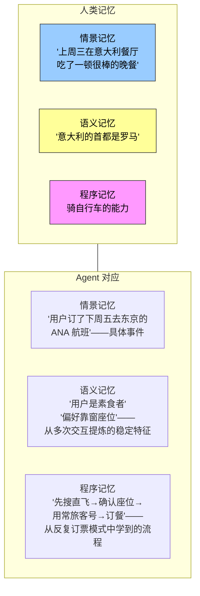
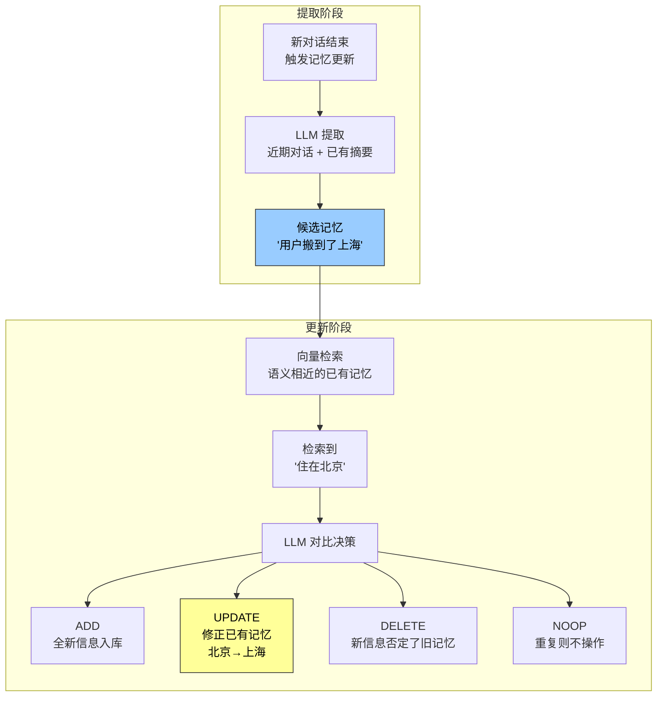
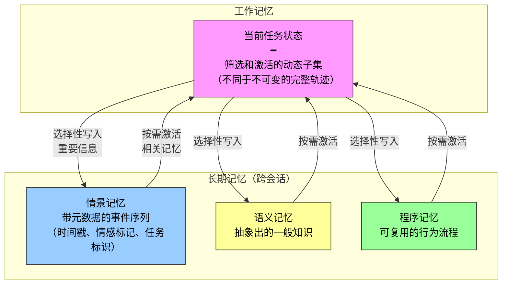

前一篇讨论了记忆的"怎么存"——四种存储格式在简单性与表达力之间的谱系。本篇从另一个维度补充：**存什么**——记忆内容的类型，以及开源框架如何将理论落地为工程。

---

## 认知科学视角：记忆存什么

认知科学把长期记忆划分为三种类型，每种在 Agent 中都有直接对应。这不是抽象的分类游戏——不同内容类型决定了检索方式、更新策略和使用场景的根本差异。

| 类型 | 本质 | Agent 例子 | 检索特征 |
|------|------|-----------|---------|
| **情景记忆** | 具体事件的时间、对象、细节 | 航班预订、购物记录、对话日志 | 按时间线、主题检索 |
| **语义记忆** | 从事件中抽象出的一般性知识 | 偏好、限制、身份信息 | 按实体、属性检索 |
| **程序记忆** | 可复用的行为模式和流程 | "先搜直飞 → 确认偏好 → 订餐" | 触发条件 → 执行模式 |

### 三套分类体系的关系

前面引入了三套正交的分类体系，它们之间是**独立维度、自由组合**的关系：

| 分类体系 | 回答的问题 | 具体类别 |
|---------|-----------|---------|
| **记忆层次** | 存在哪里？ | 轨迹（当前会话）、用户长期记忆（跨会话）、业务状态（任务阶段） |
| **存储格式** | 怎么存？ | Simple Notes / Enhanced Notes / JSON Cards / Advanced JSON Cards |
| **认知类型** | 存什么？ | 情景记忆 / 语义记忆 / 程序记忆 |

三套体系可自由组合。例如：一条"用户偏好靠窗座位"的语义记忆，可以用 Simple Notes 格式存在用户长期记忆中；一段"先搜直飞 → 确认座位 → 用常旅客号"的程序记忆，可以用 Advanced JSON Cards 存储。选择哪种格式取决于工程需求，选择存什么类型取决于业务场景。

---

## 记忆框架案例：两种设计理念

### Mem0：提取—对比—决策的两阶段流水线

Mem0 的核心是一条"提取—对比—决策"的记忆流水线，分两个阶段运转：

这条流水线的精髓在于**把"选择性提取"和"冲突解决"统一在同一个机制里**——记忆库中每一条记录都经过了与既有记忆的显式对账。

工程上，Mem0 通过高度模块化架构适应不同需求：嵌入（文本转向量）和存储相互分离，可独立优化和替换；通过抽象接口支持多种后端，插件机制使系统能灵活集成新模型。此外还提供了图记忆变体 Mem0-g，将记忆表示为实体—关系图，显式捕捉记忆之间的关联结构，改善多跳、时序类问题的表现。

### Memobase：用户画像加事件记忆

Memobase 的设计理念不同：**与其做通用的记忆流水线，不如聚焦"用户画像"这一具体形态。**

| 组件 | 存放内容 | 用途 |
|------|---------|------|
| **用户画像（Profile）** | 可配置的槽位，按主题—子主题两级组织（`basic_info→姓名`、`interest→游戏偏好`、`work→职位`） | 存放从对话中提取的稳定用户属性，开发者精确控制范围和粒度 |
| **事件记忆（Event Memory）** | 按时间线记录用户经历的事件 | 回答"我们上次讨论预算是什么时候"这类时间相关问题 |

工程上采用**缓冲批处理策略**：对话先在缓冲区累积，达到一定规模或时限后再统一触发记忆提取，摊薄 LLM 调用成本，同时让查询侧只需读取已整理好的画像和事件，保证低延迟。

### 两种框架的定位

| | Mem0 | Memobase |
|---|------|---------|
| **核心理念** | 通用记忆流水线 | 聚焦用户画像 |
| **记忆形态** | 事实条目（接近语义记忆）| 画像 + 事件（语义 + 情景） |
| **更新机制** | 两阶段 ADD/UPDATE/DELETE/NOOP | 缓冲批处理 |
| **适用场景** | 需全面记忆管理 | 需精确控制用户画像的应用 |

---

## 多类型记忆协同的参考架构

把视野放宽，可以设想一种多类型记忆协同的参考架构：

工作记忆与轨迹的关系：两者都为当前决策提供即时上下文，但**轨迹是不可变的完整事件序列**（按时间追加），而**工作记忆是经过筛选和激活的动态子集**（按相关性裁剪）。

需要强调的是，这是对设计空间的概括，并非某个具体项目的实现。实际框架往往只实现其中一两种类型——**按业务需要取舍，比追求"大而全"更符合工程现实。**

---

## 记忆压缩与整理：对抗记忆爆炸

随着交互持续，记忆系统面临存储空间和检索效率的双重挑战。简单的累积式存储会导致记忆爆炸——不仅消耗空间，还降低检索准确性。

### 第一层：重要性评分筛选

综合四个因素计算每条记忆的重要性得分：

| 因素 | 方向 | 例子 |
|------|------|------|
| **访问频率** | 越常被检索越重要 | 偏好类记忆每次会话都用到 |
| **时间衰减** | 越久远越容易被遗忘 | 三年前的航班预订信息价值低 |
| **情感强度** | 带强情感标记的更容易保留 | 用户明确表示"绝对不要"的偏好 |
| **信息独特性** | 重复信息降低重要性 | 多条记忆记录同一偏好 → 保留最新 |

低于阈值的记忆标记为可压缩或可删除。

### 第二层：聚类摘要

相似记忆分组，每组生成代表性摘要。多次天气对话 → 压缩为"用户经常询问天气，特别关心降雨"。原始详细记忆归档到二级存储。

### 第三层：抽象与泛化

从具体情景记忆中提取一般性规律，转化为语义或程序记忆。从多次购物对话中学习到"偏好性价比高的产品，重视用户评价"——这就是从情景到语义的升级。

### 冲突检测

采用**版本化方法**——保留历史版本同时标记最新版本。对于某些信息（如当前地址）只保留最新版，其他（如工作经历）保留完整历史。

### 与全书其他章节的边界

本节讨论的是**记忆存储层的整理算法**——哪些记忆该筛选、聚类、抽象成什么形态。第二章的上下文压缩解决的是单次会话内的窗口问题，两者层次不同。这些整理算法在生产系统中如何被触发（周期性、异步离线整合），将在第八章展开。

---

## 隐私保护：日志脱敏

构建用户记忆系统的核心安全挑战：**让 Agent 既能利用用户信息提供个性化服务，又不让敏感数据暴露在 LLM 上下文和系统日志中。**

### 实验 3-3：基于本地模型的智能日志脱敏

核心设计决策：**用本地部署的小模型（Ollama + Qwen3 0.6B）而非云端 API 做脱敏。** 原因很明确——日志本身可能包含敏感信息，发送到云端脱敏就违背了隐私保护的初衷。

| 能力 | 说明 |
|------|------|
| **结构化信息识别** | 身份证号、银行卡号 |
| **半结构化信息** | 地址 |
| **自然语言敏感内容** | "我的密码是 abc123" |
| **结构化输出** | JSON Schema 包含敏感信息类型、位置和置信度 |

相比传统正则表达式，基于 LLM 的脱敏召回率达 **95% 以上**，同时显著降低了假阳性。对于超高吞吐量场景可采用混合策略：正则快速过滤明显模式 → LLM 深度分析剩余文本。

---

## 总结

| # | 要点 |
|---|------|
| 1 | 认知科学三种记忆类型（情景/语义/程序）与记忆层次、存储格式是**正交维度**，可自由组合 |
| 2 | Mem0 的两阶段流水线把提取和冲突解决统一在一个机制里；Memobase 聚焦用户画像做更精确的控制 |
| 3 | 记忆压缩三层：重要性评分筛选 → 聚类摘要 → 抽象泛化。冲突用版本化处理 |
| 4 | 脱敏必须**本地模型**——日志含敏感信息，发到云端脱敏就本末倒置了 |
