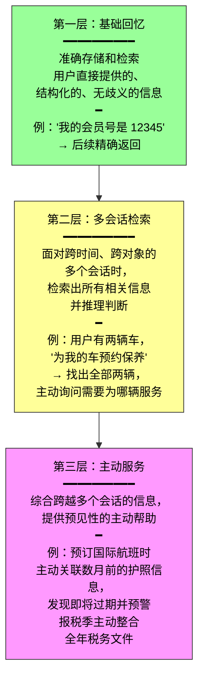
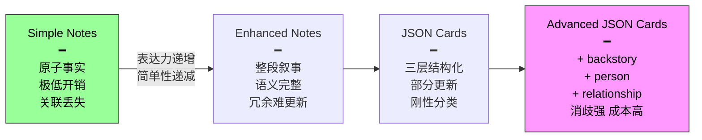

第二章解决了单次交互的上下文管理。第三章处理一个更难的问题：**如何让 Agent 在对话结束后仍然记住用户、记住知识。**

这种持久化的记忆体系分两个尺度。**用户记忆**针对单个用户——Agent 逐渐了解其偏好、习惯和需求，构建专属于该用户的知识模型。**知识库**面向所有用户共享的集体知识——行业法规、公司流程、技术文档。前者让 Agent 成为"懂你的助手"，后者让 Agent 成为"领域专家"。

两者共用许多底层技术——向量检索、知识压缩——也面临同样的麻烦：信息冲突、知识过期、检索不准。

---

## 记忆不只是"记住用户说了什么"

用户记忆系统不是一个日志记录器。它的本质是**一个主动的、持续的学习过程**，目标是构建一个关于用户的简洁而有效的预测模型。

```
原始对话（数百轮）→ 显式提取与压缩 → 结构化长期记忆
```

它投入额外的算力（专门的 LLM 调用来分析、总结和结构化信息），将分散在冗长对话历史中的关键信息做显式提取。与上下文学习的对比非常鲜明：

| | 上下文学习 | 用户记忆 |
|---|----------|---------|
| **持久性** | 临时，会话结束消失 | 持久，跨会话保留 |
| **可审查性** | 分散在原始对话中 | 结构化，可审计 |
| **成本** | 每次会话重新提供 | 一次提取，多次复用 |
| **本质** | 模式匹配 | 知识建模 |

### 一个具体的提取过程

用户在一次订票对话中透露了座位偏好、饮食限制和会员号。对话结束后，Agent 框架调用专门的 LLM 来分析并提取：

```
Extracted memories:
- User prefers window seats                    [偏好]
- User is vegetarian, needs special meals      [饮食限制]
- United MileagePlus number: 12345678           [账号信息]
- Has travel plans to Tokyo                    [近期活动]
```

注意这个过程的三个关键特征：

| 特征 | 做了什么 | 反例 |
|------|---------|------|
| **选择性** | 只保留对未来有用的事实 | 不记"搜索返回了 3 个选项"这种临时信息 |
| **抽象化** | "I prefer window seats"提炼为通用偏好 | 不绑定到这次具体航班 |
| **结构化** | 每条记忆标注类型（偏好、限制、账号） | 不做纯文本存储 |

> 下次用户订机票时，Agent 无需再问座位偏好和餐食需求——这些信息已经在记忆中了。

---

## 三层次评估框架：什么才算"好"的记忆系统？

在动手设计之前，先立评估标准。学术基准 LoCoMo 构造了平均约 300 轮、最多 35 个会话的超长多轮对话来考察长期对话记忆。在此基础上，本章设计了更贴合 Agent 场景的三层次框架：



第三层是衡量 Agent 是否达到"助理"级别最高标准的试金石。这种能力要求系统**在没有明确指令的情况下**，主动规避潜在问题和整合复杂信息——预订国际航班时主动检查护照有效期，手机损坏时主动整合所有保障方案（手机保修 + 信用卡附加保修 + 运营商保险），报税季主动搜寻并整合全年税务文件。

### 实验 3-1：评估集设计

每层各 20 个测试用例。第一层用例由单个会话构成，第二、三层由多个跨时间跨对象的会话构成（每个用例合计约 50 轮）。评估时，Agent 只能访问记忆、不可回看之前会话的原始对话。

---

## 记忆的层次结构：流水账 vs 档案

记忆系统的第一个设计维度是"放哪里"——就像人有短期工作记忆和长期记忆的区分：

| 层次 | 命名 | 性质 | 类比 |
|------|------|------|------|
| **轨迹（Trajectory）** | 单次会话的完整原始记录 | 只增不改（append-only），按时间顺序排列 | 流水账——"我刚才说了什么" |
| **用户长期记忆** | 跨会话提炼出的稳定信息 | 反复改写、合并、淘汰 | 档案——用户的偏好、习惯、关键事实 |
| **业务状态**（可选） | 高层状态抽象 | 开发者定义，表示任务逻辑阶段 | 状态指示灯——"等待付款""处理请求中" |

分层设计让 Agent 既保有当前的即时上下文（依赖轨迹），又具备跨会话的个性化能力（依赖长期记忆）。

---

## 四种存储格式：简单性与表达力的根本张力

同一条用户信息，可以用不同的粒度和结构来表示。四种格式代表了从简单到复杂的谱系：



### Simple Notes：极简主义

每条记忆是一个最小的、不可再分的事实。举例：`"用户邮箱：john@example.com"`。优势是 O(1) 操作、开销极低。但把"在 TechCorp 担任高级工程师负责推荐系统"拆成三个独立事实后，同一份工作的内在联系被割裂——查询需要综合多条信息时，系统只能靠关键词重叠拼凑碎片。

### Enhanced Notes：叙事完整性

每条记忆保存为带完整上下文的段落。语义完整、适合细微理解的场景。代价：存储冗余（相同信息在多个段落里重复）、更新困难（一个属性变化需要重写多个段落）、长段落不利于向量检索。

### JSON Cards：结构化

三层嵌套结构（`personal.contact.email`、`work.position.title`），支持部分更新（修改职位不影响公司名），可预测可扩展。但刚性结构假设信息可清晰分类——"周末用 Python 开发个人项目"同时涉及时间偏好、技术偏好和活动类型，强制归入单一类别会丢失多维性。

### Advanced JSON Cards：从信息存储到知识管理

这是范式转变。每个卡片不仅记录事实，还加入：

| 字段 | 含义 | 解决的问题 |
|------|------|-----------|
| **backstory** | 信息的获取上下文 | "为什么"存储这条信息 |
| **person** | 主体身份 | "为谁"存储 |
| **relationship** | 与用户的关系 | "张医生"是用户的牙医还是用户父亲的心脏病医生？ |
| **timestamp** | 时间戳 | 信息的时效性 |

当用户说"帮我安排家人的年度体检"时，系统可通过 relationship 识别所有家庭成员，通过 backstory 了解健康历史。代价是生成和维护成本明显更高。

### 实践选择标准

没有绝对优劣，取决于场景。成熟系统通常采用**混合模式**：

```
关键且少量的数据 → Advanced JSON Cards → 保证可检索性
大量非关键的对话事实 → Simple Notes → 降低成本
```

### 实验 3-2：四种模式对比

Experiment 3-2 在同一评估集上对比了四种模式。结论：

- **Simple Notes**：以最低成本通过第一层多数用例，但在需要综合多条信息、区分同名实体的第二、三层频繁失分
- **Advanced JSON Cards**：涉及消歧和跨会话关联的用例表现最好，但每次会话结束后的记忆维护调用明显更贵、更慢

---

## 总结：记忆让 Agent 从工具变成助理

| # | 要点 |
|---|------|
| 1 | 记忆是主动的学习过程，不是日志记录——选择性地提取、抽象化、结构化 |
| 2 | 三层次评估：基础回忆 → 多会话检索 → 主动服务。第三层是"助理"的试金石 |
| 3 | 分层存储：轨迹是流水账（当前会话），长期记忆是档案（跨会话） |
| 4 | 四种存储格式是简单性与表达力的谱系——**实践中用混合模式**：关键信息用 Advanced JSON Cards，大量事实用 Simple Notes |
