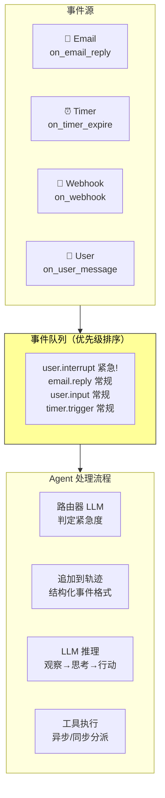
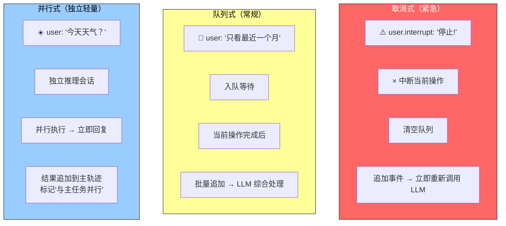

前面讨论的感知、执行、协作工具都由 Agent 主动调用。本节转向本章开头提出的第二个挑战：**Agent 如何管理耗时的任务、响应随时可能到达的外部事件？**

传统的同步 Agent 像一个只会排队的柜台——每次处理一个顾客，处理完才能叫下一个。真正的智能助手更像一个灵活的秘书——桌上摆着多个待处理事项，根据紧急程度决定先处理哪个，处理到一半有更紧急的事情也可以暂停切换。

---

## 根本矛盾：训练同步 vs 部署异步

异步架构面临一个根本矛盾：**LLM 的训练范式假设同步，真实部署却要求异步。**

```
训练时：发出工具调用 → 下一条消息必须是工具结果
部署时：工具未返回时用户突然打断 → 同步格式如何容纳？
```

这个矛盾贯穿本节讨论的所有工程取舍。解决思路分两个层面：首先是**架构层**——建立事件驱动的事件循环骨架；然后是**工程技巧层**——用占位符等权宜之计在同步格式中嵌入异步语义。

---

## 事件驱动架构：把所有输入统一为事件流

系统不再主动反复检查"有没有新消息"（轮询，效率低），而是新消息到达时自动触发处理逻辑。所有输入——用户消息、工具返回、外部回调、定时触发——统一建模为事件流。



### 从 OpenClaw 看现实需求

OpenClaw 通过 Gateway 控制平面接收多渠道消息并路由到 Agent 运行时，提供三种内置自动化机制：

| 机制 | 作用 | 局限 |
|------|------|------|
| **Hooks** | 响应会话创建、重置等生命周期事件 | 被动响应框架内部事件，不能引入外部世界新变化 |
| **Cron** | 按 cron 表达式执行周期性任务 | 时间驱动，无法即时响应外部事件 |
| **Heartbeat** | 每隔 N 分钟唤醒 Agent 检查是否有需要关注的事项 | 同样是时间驱动——延迟 = 心跳间隔 |

真正的短板：对于**内置渠道之外的任意第三方事件源**（新邮件到达、外部 API 回调推送），Agent 无法在事件发生的瞬间做出响应，只能等到下一个 Cron/Heartbeat 周期。

PineClaw（Pine AI 的 OpenClaw 插件）案例说明了这种延迟为何不可接受：

```
Pine AI 替用户打电话 → 客服要求验证身份 → 需要用户 OTP 验证码
                                         ↓
                    如果靠 Heartbeat（5 分钟间隔）→ 客服挂断、通话失败
                    引入 Channel 实时推送           → 秒级响应
```

> **真正的"主动服务"不仅需要 Agent 能定时检查世界，更需要世界能主动通知 Agent。**

---

## 事件触发工具：让世界唤醒 Agent

三类事件触发工具：

| 工具 | 作用 | 典型场景 |
|------|------|---------|
| **set_timer** | 在指定物理时间唤醒 | 一次性：下周一上午 10 点致电 DMV；循环：每小时检查服务器、每周五发送周报 |
| **monitor_shell** | 监控后台命令行任务的事件 | 长时间执行的任务出现新增输出或特定关键词时通知 |
| **connect_channel** | 把外部事件实时推送给 Agent | 新邮件到达、API 回调、IM 消息——PineClaw 的 Channel 就是典型实现 |

---

## 用户沟通工具：让"说话"成为显式工具调用

当 Agent 与用户的沟通从单一 session 内的一问一答扩展到多渠道异步消息时，"说话"需要成为显式工具调用，而非直接把 assistant 消息输出给用户。

| 能力 | 说明 |
|------|------|
| **异步消息** | 用户不一定在线，消息附带已读/未读状态 |
| **多渠道触达** | IM、短信、邮件、电话、推送，根据紧急程度和用户偏好选择 |
| **主动召回** | 长任务完成时主动通知；定期任务帮助建立固定交互习惯 |
| **多模态** | 结构化卡片消息、提醒邮件、生成式 UI（HTML 交互界面） |

---

## 虚拟身份与隔离执行环境

Agent 应该拥有**独立的虚拟身份**——如同秘书有自己的办公电话和邮箱——而非直接管理用户的个人账号。这需要落地在隔离的执行环境中：

| 环境 | 隔离内容 | 用途 |
|------|---------|------|
| **虚拟电脑（VM/容器）** | 操作系统级隔离：独立用户账号、家目录、登录凭证 | 桌面操作、文件处理 |
| **虚拟手机（Android 模拟器）** | 完整移动操作能力 | App 操作、移动端任务 |

所有操作可追溯、可审计，即使执行了错误操作也不影响宿主系统。

两个现实挑战：
- **反自动化**：数据中心 IP 易被 CAPTCHA 和 IP 信誉系统拦截 → 需配置住宅代理网络
- **用户真实账号访问** → Human-in-the-Loop 认证：通过 VNC/RDP 远程桌面让用户亲自登录，能看到 Agent 操作的完整界面

---

## 事件处理机制：三种策略按紧急度分级

事件循环的骨架：Agent 是一个长期运行的循环——每轮从队列取出事件，追加到轨迹，调用 LLM，执行工具，再回到循环开头。**事件只在每轮循环边界被消费**，不会在 LLM 推理或工具执行中凭空插入。



| 策略 | 适用 | 触发条件 | 做法 |
|------|------|---------|------|
| **取消式** | 紧急 | 用户中断、监督指令、Agent 间中断、系统告警 | 停止当前操作 → 清空队列 → 重新调用 LLM |
| **队列式** | 常规 | 用户补充信息、工具结果返回、定时器触发 | 放入队列 → 等当前操作完成 → 批量追加 |
| **并行式** | 独立轻量查询 | 与主任务无关、需快速响应、执行成本低 | 独立推理会话 → 并行执行 → 结果标注来源 |

**紧急度判定**建议用轻量级分类 LLM 作为事件路由器，在事件到达时快速决策应采取哪种策略。

---

## 工程权宜：五条规则让同步模型支持异步打断

核心思想：**常态下保持标准同步轨迹**（assistant-tool 严格配对），只在打断时才插入占位符修复格式。

| 规则 | 场景 | 做法 |
|------|------|------|
| **规则 1** | LLM 输出时 | 立即记录 assistant message（含 thinking、content、tool_calls） |
| **规则 2** | 工具调用完成时 | 记录 tool result。执行中轨迹处于"部分完成"状态 |
| **规则 3** | **工具执行中被打断** | 为未完成的工具生成占位符 tool result（"工具正在后台执行，请优先处理新事件"），追加打断事件，重新调用 LLM。LLM 看到的轨迹 assistant-tool 仍然配对完好 |
| **规则 4** | LLM 思考中被打断 | 直接丢弃当前思考，不写入轨迹，新事件追加后启动新一轮思考 |
| **规则 5** | 非打断事件 | 进入队列等待批处理，当前周期完成后一次性追加 |

```
示例：Agent 正在搜索联系人起草邮件 → 用户说"先帮我查天气"

轨迹演化：
  assistant: search_contacts(...)           ← 规则 1
  tool: [后台执行中]                          ← 规则 3 占位符
  user: "先帮我查天气"                        ← 打断事件追加
  → LLM 重新调用，看到完整的同步轨迹
  → 处理天气查询，回复用户
  → search_contacts 结果到达（规则 2），继续起草邮件
```

> 这套方案的优势：常态下轨迹完美同步，对 LLM 最友好。只在真正需要打断时才引入占位符——这个"必要的妥协"。

### 根本解法：将"启动"和"完成"解耦

更根本的策略是从工具接口设计层面拥抱异步语义。传统 `phone_call` 隐含"调用即完成"，应改为：

```
initiate_phone_call → 立即返回任务标识符
phone_call_connected → 事件通知
phone_call_ended → 事件通知
```

"启动"和"完成"分离后，Agent 不再需要同步等待——启动后继续处理其他事务，完成时通过事件通知自然回到任务。

---

## 总结

| # | 要点 |
|---|------|
| 1 | 事件驱动架构将一切输入统一为事件流——用户消息、工具返回、外部回调、定时触发 |
| 2 | LLM 训练同步 vs 部署异步是根本矛盾——工程解法：常态同步轨迹 + 打断占位符 |
| 3 | 三种处理策略：取消式（紧急中断）、队列式（常规批处理）、并行式（独立轻量查询） |
| 4 | 工具设计应将"启动"和"完成"解耦——这是比占位符更根本的异步解法 |
| 5 | OpenClaw + PineClaw 案例：实时 Channel 将响应延迟从分钟级降到秒级 |
