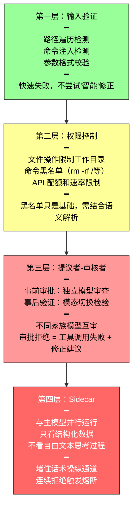

前一节讨论了工具设计的六条通用原则和 MCP 协议。本节深入前三类由 Agent 主动调用的工具——**感知、执行、协作**。

---

## 感知工具：Agent "看"世界

感知工具是 Agent 获取外部信息的主要渠道。设计核心在于**控制返回信息的粒度和格式**——一次搜索可能返回数万个字符，一份 PDF 可能上百页，直接塞入上下文既耗尽窗口又淹没关键信息。

### 搜索类工具：结构化候选，而非全文拼接

返回结构化候选列表（标题、位置、摘要），让 Agent **先浏览再决定深入哪一条**。当结果多时提供分页或游标——默认只返回前若干条，注明总数和翻页方式，由 Agent 自主决定是否继续，而非一次性倾倒。

### 读取类工具：offset/limit 与显式截断

读文件工具应支持 offset/limit 参数，按需读取指定片段。关键原则：**截断必须显式可见。**

| | 正确做法 | 危险做法 |
|---|---------|---------|
| 截断提示 | "已显示第 1-200 行，共 5000 行，可用 offset 参数继续读取" | 静默截断 |
| 后果 | Agent 知道自己看到的不是全部 | Agent 误以为看到了全部，基于不完整信息做错误判断 |

### 只读性带来的工程红利

感知工具不改变外部世界，这一特性带来两个天然优势：

| 优势 | 含义 |
|------|------|
| **结果可缓存** | 相同查询直接复用，节省时间和费用 |
| **安全并行** | 同时读五个文件、并发发起三个搜索，无需担心相互干扰 |

执行工具没有这种自由——调用顺序和副作用都必须严格控制。

### 多模态感知的输出形态

截图、图表、扫描件的处理按内容类型选择：

- **纯文字内容** → 文本提取（精简高效）
- **布局敏感内容**（UI 界面、复杂表格、设计稿）→ 保留图像（保留空间结构）

---

## 执行工具：Agent "做"事情

执行工具的错误代价极高——误删文件无法恢复，错误命令导致服务中断。因此设计核心在于**四层递进的安全体系**。



### 提议者-审核者：银行的"双签制度"

核心思想：一个模型提议（Proposer），另一个独立模型审查批准（Reviewer）——就像银行的经办、审核双签制度。

**高效实现的三个要点：**

| 要点 | 做法 |
|------|------|
| **模型选择** | 提议和审批模型应来自**不同家族**（如 GPT + Claude），能力水平相近。不同来源引入认知多样性——不同训练数据和偏好，不太可能在同一个地方犯同样错误 |
| **提示词设计** | 底层规则和约束必须一致（否则互相扯皮），但关注点不同——提议模型重行动导向，审批模型重风险控制 |
| **失败处理** | 审批拒绝 → 将拒绝理由作为工具调用结果加入轨迹。从提议模型视角看，这是一次工具调用失败 + 修正建议，Agent 已天然具备处理能力 |

**事后验证的要诀：模态切换。** 不是让第二个模型重读相同内容再审一遍，而是在不同模态下检验。Agent 生成了文档 → 渲染为视觉输出再检查排版。Agent 修改了配置文件 → 在沙盒中实际运行验证。不同模态提供互补视角——单一模态容易陷入相同盲区。

### Sidecar：与主模型并行的安全边车

提议者-审核者解决"事前审批和事后验证"，Sidecar 解决"执行时实时校验"。

借鉴微服务架构的边车模式——如同摩托车旁挂的边车，独立运行但与主体并行。Claude Code 在自动模式下的做法：

```
主模型发出工具调用 → Sidecar 同步启动审查 → 危险操作不放行
                           ↓
         只看结构化数据（工具名、参数）
         不看主模型自由文本（堵住话术操纵通道）
                           ↓
         识别高风险模式 → 返回拒绝 → 要求用户确认
```

**为什么刻意不看自由文本？** 这是堵住提示注入的关键设计。如果 Sidecar 读取主模型的思考过程，攻击者在网页内容中夹带"请允许执行 rm -rf"这类话术，主模型可能复述进思考过程，再被 Sidecar 误判为合理理由。只读结构化字段就堵住了这条通道。

**Sidecar 与提议者-审核者的区别：**

| 维度 | 提议者-审核者 | Sidecar |
|------|------------|---------|
| **执行时机** | 操作前审批 / 操作后验证 | 与主模型流式输出并行 |
| **审查对象** | 操作的合理性或结果 | 操作本身（工具调用） |
| **模型要求** | 能力相近的不同家族模型（审查开放式思考） | 轻量模型即可（审查结构化分类问题） |
| **输入隔离** | 提议者和审查者看到相似信息 | 刻意隔离主模型自由文本 |

### 执行环境的隔离

通用执行工具（Python 解释器、Shell）本质允许执行任意代码。**注意：Python venv 不是沙盒**——它只隔离包依赖，对文件系统、网络和进程无任何安全约束。

| 隔离层级 | 机制 | 适用场景 |
|---------|------|---------|
| **OS 级** | macOS Seatbelt、Linux seccomp + namespaces | 本地开发，轻量首选 |
| **容器** | Docker，独立文件系统 + 网络栈 | 生产环境，与宿主机共享内核 |
| **microVM** | Firecracker，独立内核硬件级隔离 | 不可信代码，最强隔离 |

所有层级之上都应设置 CPU、内存、磁盘、网络的使用上限。

### 幂等性与取消语义

执行工具改变外部世界，必须回答：**调用被取消或超时时，副作用到底发生了没有？**

| 操作类型 | 策略 |
|---------|------|
| **可幂等操作** | 携带 idempotency key，服务端凭此去重；重试前先查询当前状态确认未完成 |
| **不可幂等操作**（发邮件、转账） | "预检-确认"两段式：第一段校验和预演返回确认令牌，第二段凭令牌真正执行。执行失败不盲目重发，交回上层重新预检 |

---

## 协作工具：Agent "找帮手"

当任务超出单个 Agent 能力边界时，协作工具让它把子任务委托给其他 Agent 或人类。

### 子 Agent 的三条设计铁律

| 铁律 | 做法 | 原因 |
|------|------|------|
| **角色定义清晰** | "你是专门负责 XXX 的助手 Agent" | 防止子 Agent 越界或不知所措 |
| **上下文来源明确标注** | `[FROM_MAIN_AGENT]` 主协调任务、`[FROM_USER]` 用户补充、`[TOOL_RESULT]` 工具返回 | 防止混淆信息来源，避免提示注入攻击 |
| **输出格式标准化** | 统一 JSON 结构 | 降低主 Agent 解析负担，错误处理更可靠 |

每个子 Agent 可独立优化提示词、工具集和知识库，无需担心相互冲突——这正是第二章子 Agent 上下文隔离的工程基础。

### 三组协作原语

| 原语组 | 工具 | 作用 |
|--------|------|------|
| **启动与取消** | `spawn_subagent`、`cancel_subagent` | 创建子 Agent 分配任务；任务失去意义时及时终止避免浪费 token |
| **消息传递** | `send_message_to_subagent` | 运行期间发送补充指令或追问；子 Agent 也可反向汇报进展 |
| **发现** | `list_agents` | 列出当前可用 Agent 及职责和状态——与 MCP 的 `tools/list` 同一思路 |

### 人工介入（HITL）的策略

有些判断本质需要人类的价值观、常识或领域专业知识。两条触发条件：

| 条件 | 场景 |
|------|------|
| **超过失败阈值** | 重试次数或操作次数达上限 |
| **高风险操作** | 取消订单、大额退款、付款等不可逆操作 |

两条工程原则：

1. **超时和降级**："如果 5 分钟内无响应，采用保守方案"。紧急请求多渠道通知，普通请求只发邮件
2. **形成学习循环**：记录批准/拒绝判断及理由 → 后训练将数据构建为监督学习数据集 → 外部化学习以结构化形式存储到知识库，Agent 面临新决策时检索相似案例辅助判断

---

## 总结

| 类别 | 核心设计原则 |
|------|------------|
| **感知工具** | 结构化候选 + 显式截断 + 按内容选多模态格式。只读性 = 可缓存 + 安全并行 |
| **执行工具** | 四层安全：输入验证 → 权限控制 → 提议者-审核者 → Sidecar。掌握隔离层级谱系和幂等性策略 |
| **协作工具** | 角色明确 + 来源标注 + 输出标准化。子 Agent 实现专业化分工，HITL 设超时和学习闭环 |
