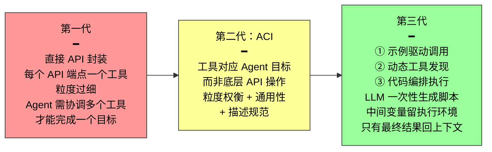
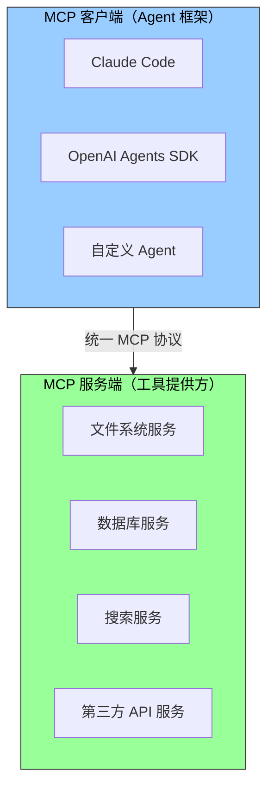

前一篇给五类工具分类建立了全局坐标系。在深入每一类之前，先回答一个更根本的问题：**不管哪类工具，设计它的通用原则是什么？**

这些原则适用于所有工具类型——感知的搜索、执行的文件操作、协作的子 Agent 调用——并且直接决定 Agent 的可靠性。一条最重要的调试铁律先行给出：

> **当 Agent 频繁选错工具时，优先检查工具描述而不是怀疑模型能力。修正工具描述的投入产出比，通常远高于更换一个更强的模型。**

---

## 专用工具还是 Skill + 通用执行器？

这是工具设计第一个需要回答的问题。Agent 的能力有两种基本表达形态：

| 形态 | 机制 | 优势 | 代价 |
|------|------|------|------|
| **专用代码工具** | 结构化函数调用，有明确的参数 schema | 确定性高、可测试、模型易理解 | 每个工具占数百 token，数量膨胀破坏 KV Cache |
| **Skill + 通用执行器** | 用自然语言 Skill 文档描述操作流程，Agent 通过终端或代码解释器执行 | 只需少量通用工具覆盖大量场景 | 对模型的指令遵循和执行能力要求更高 |

一个"部署应用"的 Skill 文档可能写成：

```
1. 运行 npm run build 构建项目
2. 运行 docker build -t app:latest . 打包镜像
3. 运行 kubectl apply -f deploy.yaml 部署到集群
```

Agent 通过 `bash` 工具逐步执行这些指令——**无需为"构建""打包""部署"各建一个专用工具。**

### 三维度决策框架

| 维度 | 偏向专用工具 | 偏向 Skill + 通用执行器 |
|------|------------|---------------------|
| **参数复杂度** | 嵌套对象、多字段联合校验、复杂类型约束 → schema 引导更可靠 | 参数简单 → CLI 传参同样可靠 |
| **变更频率** | 稳定的底层操作 → 一次建好长期使用 | 频繁变化的上层流程 → 改文本远比改代码、测试、部署轻松 |
| **模型能力** | 较弱模型需要结构化 schema 引导 | SOTA 模型可以用 Skill 表达更多能力、减少工具总数 |

> 这和第二章 Skills 与工具的关系一节形成呼应：**少工具、多 Skill** 的目标在这里找到了可操作的决策框架。

---

## 工具粒度的权衡：整合还是分离？

工具粒度过细 → 数量激增 → LLM 选择负担加重（超过 100 个工具后，最先进的模型也容易选错）。粒度过粗 → 单个工具过于复杂，参数语义模糊。

### 整合的核心标准

**功能相似性 + 使用场景的重叠度。**

```
❌ 分离的反模式：
  extract_pdf_text(file_path)
  extract_docx_content(file_path)
  extract_pptx_content(file_path)
  → 三个工具的共性：输入是文件路径，输出是文本字符串

✅ 整合后：
  read_document(file_path, file_type="pdf" | "docx" | "pptx")
  → LLM 只需记住'读取文档就用 read_document'
```

整合降低认知负担、描述更清晰、便于扩展（新格式只需加一个 `file_type` 值）。

### 分离的合理场景

不是所有相似功能都应整合。图片解析（OCR）和视频解析（关键帧提取）虽然都是"内容提取"，但参数形态、延迟特性差异很大，强行合并反而让接口语义模糊。当功能相似但参数集差异大、或某个功能使用频率极高时，保持独立更合理。

---

## 工具的通用性设计

> **通用工具优于专用工具，除非存在明确的安全、权限或性能理由。**

与其提供四则运算计算器 → 不如提供 `code_interpreter`，在沙盒环境中安装好 sympy、numpy、pandas 等库，让 Agent 通过执行 Python 代码完成任意数学计算。

背后的逻辑：LLM 本身具有强大的思考和代码生成能力，我们应该**利用这种能力而不是限制它**。一个 Python 解释器就可以代替数十个特定功能工具，还能处理预先没想到的边缘场景。

但通用性有边界。对于需要特殊权限、复杂配置或有安全风险的操作，封装良好的专用工具仍然是必要的——例如 Mac、Windows、Linux 上的 grep 语法各不相同，提供专门的 `grep` 工具比让 Agent 自由发挥更好。

---

## 工具描述的艺术

工具描述的质量直接决定 Agent 使用工具的准确性。三条核心原则：

### 原则一：描述"什么时候用"，不是"能做什么"

| ❌ 差 | ✅ 好 |
|------|------|
| "搜索相关内容" | "当需要获取实时信息或查找未知事实时使用" |
| 只描述功能，LLM 要自己判断何时调用 | 直接告诉 LLM 调用条件，帮它做决策 |

### 原则二：反例比正向描述更重要

文件搜索工具应明确说明它**只能基于文件名匹配，不能搜索文件内容**——缺少反例，LLM 就会去猜。大多数工具调用失败的根因不是模型不知道工具能做什么，而是**不知道工具不能做什么**。

### 原则三：参数用具体例子代替抽象规范

| ❌ 抽象规范 | ✅ 具体例子 |
|------------|----------|
| `timestamp: RFC3339 格式` | `timestamp: 例如 2024-03-15T14:30:00Z` |
| `phone: 使用 E.164 格式` | `phone: E.164 格式（国家代码+号码，无空格），例如 +8613888888888（中国）或 +12025551234（美国）` |

LLM 在专注处理一个问题时能理解抽象术语，但在执行复杂任务时——同时处理多个工具、从历史轨迹提取信息、权衡多个决策——确认参数格式只占其注意力的一小部分，就容易出错。**具体例子让 Agent 可以直接套用，无需额外的思考步骤。**

### 额外加分项

- **返回值描述**："返回 JSON 数组，每个元素包含 title、url、snippet 三个字段"——减少后续解析出错
- **执行代价标注**："此工具需下载完整网页，大型网站可能需要 5-10 秒；如只需元信息，请用 get_page_metadata"——帮助 LLM 合理规划调用顺序
- **调用示例**：为每个工具附带 1-5 个真实调用示例。JSON Schema 只能描述参数类型，无法表达调用方式和典型参数组合。加入示例后，工具调用准确率可从约 72% 提升到 90%

---

## 参数传递的保真性

一种比功能缺失更隐蔽的反模式：**静默输入转换**。

以 Cursor 2026 年初的某个版本为例。工具的参数传递层将中文弯引号（`""`）静默转换为英文直引号（`""`）。这导致了一个令模型极度困惑的失败模式：

```
模型读取文件 → 看到弯引号 → 将其原样传入 old_string 参数
    ↓
参数传递层静默转换 → 弯引号变直引号 → 与文件实际内容不匹配
    ↓
工具返回"未找到匹配"
    ↓
模型反复尝试、反复失败——它无法理解为什么明明看到的内容工具却找不到
```

同样的问题也出现在写入方向：模型写入弯引号，传递层替换为直引号，模型以为写入了符合中文排版的内容，但文件已被篡改。

> 这揭示了一条基础原则：**模型感知到的世界与工具操作的世界之间，不能存在系统性的偏差。** 工具的参数传递必须保持透明，不得在模型不知情的情况下修改输入或输出。如果确实需要规范化处理，必须在工具描述中说明，并在工具返回中明确告知模型。

否则，工具的"智能修正"非但没帮到模型，反而制造了一个**模型无法自行诊断的系统性故障**。

---

## 工具设计的演进：三代



第三代最值得关注的是**代码编排执行**：传统方式像每做完一步就写邮件汇报给领导，领导再回信告诉你下一步——这些"邮件"就是 token 消耗。代码编排则像领导一次性写好完整操作手册，你照着做，只汇报最终结果。

具体来说，LLM 一次性生成一段脚本，中间变量留在执行环境中，只有最终结果才返回 LLM。例如抓取多个网页再批量提取字段时，页面全文只存在于执行环境变量中，返回上下文的只有汇总后的结构化结果——token 消耗可降低**约两个数量级**。

---

## MCP：工具生态的"通用插座标准"

每个 Agent 框架定义工具的方式都不一样——OpenAI 的 function calling、Anthropic 的 tool use、LangChain 的 Tool 抽象——导致工具开发者需要为不同框架重复适配。就像每个国家的电源插座标准都不同。

**MCP（Model Context Protocol）** 是 Anthropic 于 2024 年底发布的开放标准，旨在统一 AI 模型与外部工具、数据源之间的通信协议——相当于为 AI 工具生态制定一个**通用的插座标准**。



采用客户端-服务器架构：工具开发者只需实现一次 MCP 服务端，所有支持 MCP 的 Agent 框架都能直接对接。第二章讨论过的 Skills 与工具定义的关系在这里也适用——MCP 工具的完整 schema 可以通过渐进式披露按需加载，而不必全部塞入静态前缀。

---

## 总结

| # | 原则 | 一句话 |
|---|------|--------|
| 1 | **选对表达形态** | 参数复杂/稳定 → 专用工具；频繁变化 → Skill + 通用执行器 |
| 2 | **粒度合适** | 功能相似 + 场景重叠 → 整合；参数差异大 → 分离 |
| 3 | **通用优于专用** | 一个 code_interpreter 代替数十个计算器。安全/权限场景除外 |
| 4 | **描述写调用条件** | "什么时候用"+"不能用什么"+"具体例子" 远比抽象规范有效 |
| 5 | **参数绝对保真** | 工具不得在模型不知情下修改输入输出——否则制造无法调试的系统性故障 |
| 6 | **修正描述 > 换模型** | Agent 频繁选错工具时，先查描述，再怀疑模型 |
