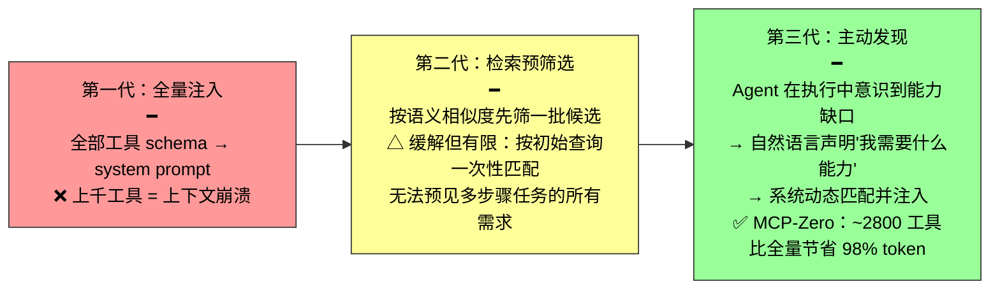
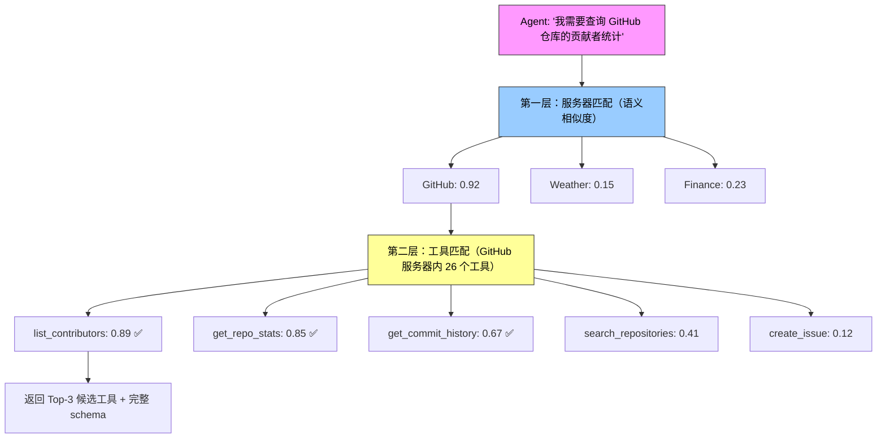
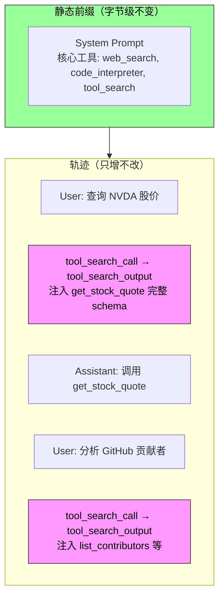

单个工具的设计原则和 MCP 生态讨论完了。现在面对一个更工程化的问题：**当可用工具从十几个增长到成百上千，如何从中高效找到当前需要的那一个？**

传统的做法是把所有工具 schema 一次性注入系统提示词。当工具数量上千时，上下文被"说明书"塞满，模型选择精度随之下降——更不必说对 KV Cache 的毁灭性影响。

---

## 三代演进：从被动选择到主动发现

第二代的根本局限：按用户的初始查询做一次性匹配。但"Debug the file"这种看似简单的请求，实际可能牵出文件访问、代码分析、命令执行等多步骤、跨领域的工具链——任务开始时无法预见所有需求。

第三代的核心转变：**从被动接受者变为主动发现者**。Agent 在执行过程中意识到能力缺口时，主动用自然语言声明"我需要什么能力"，系统动态匹配并注入。

---

## 层次化匹配：两层缩小搜索空间

高效匹配的关键在于工具按服务器分组（类似手机 App），匹配分两层：

把搜索空间从"数千个工具"缩小为"数十个服务器 × 每个服务器数十个工具"，既省算力也减少跨领域语义混淆。

如果两层匹配的候选相似度都低于阈值，应明确返回"未找到"，让 Agent 改写需求重试、用基础工具手工实现，或干脆创造新工具。

---

## 动态加载的 KV Cache 优化

主动发现有一个微妙的工程代价：**动态加载工具会破坏 KV Cache。**

| 方案 | 做法 | KV Cache 影响 |
|------|------|-------------|
| **朴素方案** | 工具 schema 全放进 system prompt | 每加载新工具 → 整个前缀失效 |
| **优化方案** | system prompt 只保留基础工具（~2K tokens） 新工具的完整 schema 追加到**上下文末尾** | 静态前缀不变 → KV Cache 完全复用 缓存命中率 ~95% |

一个重要澄清：**"追加到末尾"只在工具被发现的那一轮发生。** 此后这个 schema 块就固定在轨迹中的原位置，成为普通历史消息——后续轮次的新消息追加在它之后，它不是每轮都被重新搬运到最新末尾。

OpenAI（tool_search + defer_loading）、Anthropic（tool_reference blocks + 延迟加载）、Codex CLI（BM25 检索）都已原生支持这一模式。

### 代价

动态工具环境对模型能力要求更高——弱模型既难理解"工具定义出现在上下文中间"这种非标准位置，也容易生成非法调用格式（JSON 括号不匹配、参数缺失），往往需要强化学习专门训练。

---

## Skills：更轻量的工具发现范式

主动发现的"声明-匹配-注入"虽然有效，工程上相当繁琐：要维护嵌入索引、处理缓存失效、为弱模型做专门训练。Skills 换了一种更轻的思路。

**不再需要"预注册 + 语义匹配"的基础设施。** Agent 启动时只看到一份薄薄的目录（name + description，数百 token）。需要时用通用文件阅读能力翻阅 Skill 目录，顺着引用一层层查下去。

| | 传统工具发现 | Skills 式发现 |
|---|------------|-------------|
| **基础设施** | 嵌入索引 + 语义匹配 + 动态注入 | 通用文件阅读（grep、读取文件） |
| **匹配方式** | 任务开始时一次性预匹配 | 按当前上下文实际需要，用到哪条查哪条 |
| **类比** | 在数据库里搜索 | 查工具书或维基百科——顺着目录和索引精确查阅 |
| **KV Cache** | 需精心设计注入位置 | 同理追加到末尾。但 Skills 可更进一步：预编译 KV 表示，RoPE 重定位到任意上下文位置 |

这就把"工具选择"问题转化为了"知识检索"——后者正是 LLM 擅长的。用第二章的话说：**少工具、多 Skill。**

### 实验 4-6：小模型的救星

使用 Qwen3-4B 访问 120+ 工具。对照组一次性注入 50K+ token 的完整 schema → 4B 模型指令遵循能力严重退化，面对"查询股价"错选 Web Search 而非专用工具。实验组用主动发现 → 准确率和任务完成率显著提升。

主动工具发现不仅帮大模型应对万千工具，更让小模型在上百工具场景下保持可用。

---

## 总结

| # | 要点 |
|---|------|
| 1 | 全量注入在工具上千时崩溃——检索预筛选缓解但无法预见多步任务的全部需求 |
| 2 | 主动发现：Agent 声明缺口 → 两层层次化匹配 → 动态注入。比全量节省 98% token |
| 3 | 动态加载的 KV Cache 命门：schema 必须追加到末尾而非修改前缀 |
| 4 | Skills 是更轻的替代：不需要嵌入索引，用"查阅"替代"匹配"，用"知识检索"替代"工具选择" |
