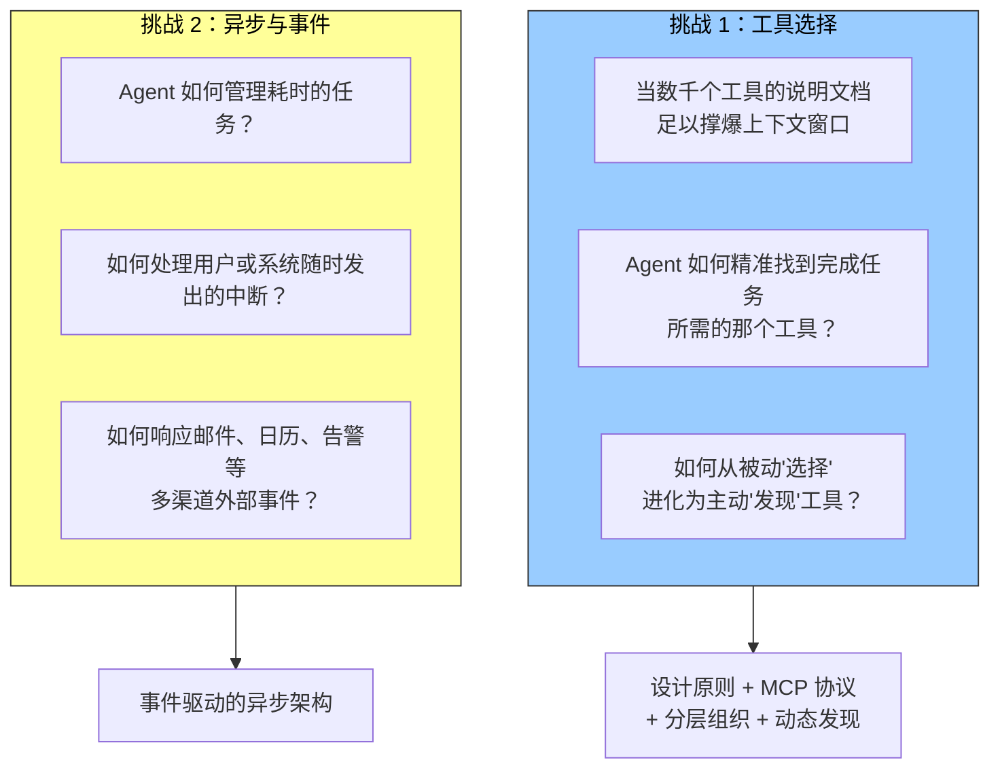
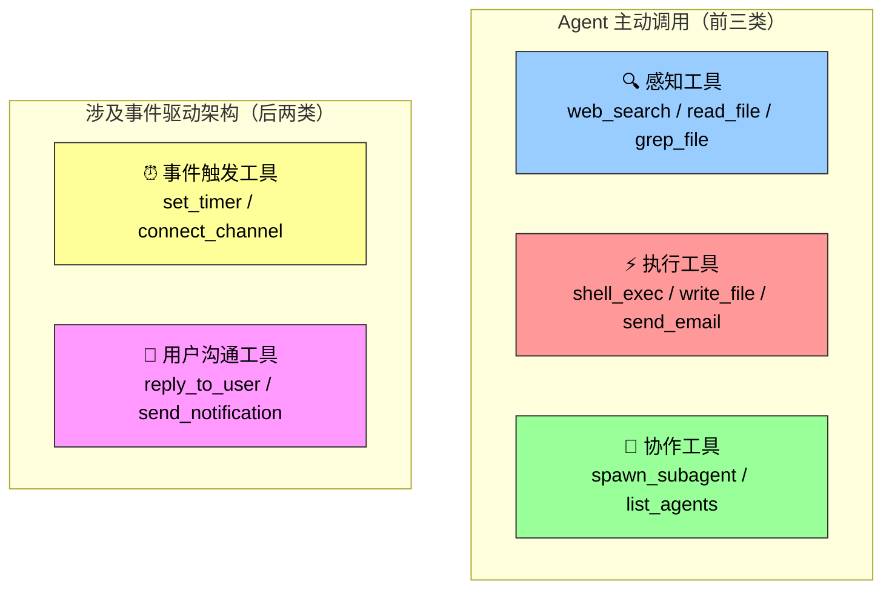

在科幻电影《Her》中，AI 助手 Samantha 能主动整理邮件、识别情感复杂的信件并提议润色回复，能代表主角处理出版事宜，还能在不同沟通渠道间无缝切换。她的智能之所以动人，是因为她拥有强大的工具——连接语言"大脑"与真实数字世界的"手脚和感官"。

第一章提出 Agent = LLM + 上下文 + 工具。前两章分别深入了 LLM（大脑）和上下文（眼睛）。本章聚焦第三个组件——**工具（手脚）**。

---

## 两大核心挑战

构建能像 Samantha 一样工作的 Agent，需要解决两个核心挑战：



本章围绕这两个挑战展开。先给出五类工具分类总览，然后讨论通用设计原则和 MCP 协议，再逐类深入，最后以"主动工具发现"回答规模化成百上千时的问题。

---

## 五类工具：调用方向与作用对象

第一章已介绍过五类工具。这里用一个更精炼的视角重新审视——从**调用方向**和**作用对象**两个维度快速定位每类工具的职责：

| 工具类型 | 调用方向 | 作用对象 | 一句话 |
|---------|---------|---------|--------|
| **感知工具** | Agent 主动调用 | 获取信息 | Agent "看"世界——搜索、检索、读文件 |
| **执行工具** | Agent 主动调用 | 改变世界 | Agent "做"事情——写文件、执行命令、发邮件 |
| **协作工具** | Agent 主动调用 | 驱动其他 Agent 或人类 | Agent "找帮手"——创建子 Agent、请求人类确认 |
| **事件触发工具** | Agent 注册，外部触发 | 驱动 Agent 开始执行 | Agent "被唤醒"——定时器、新邮件通知、Webhook |
| **用户沟通工具** | Agent 主动调用 | 向用户传递信息 | Agent "说话"——回复消息、发送通知 |



---

## 逐类展开

### 感知工具：Agent "看"世界的方式

```
网络搜索（web_search）
内部知识库检索（knowledge_base_search）
阅读网页（fetch_url）
搜索文件名（find_file）
搜索文件内容（grep_file）
读文件（read_file）
```

设计关键在于**粒度权衡和输出信息量控制**——返回太少信息不够判断，返回太多淹没上下文。第一章的实验 1-1 已证明工具执行结果的完整性和结构化对 Agent 决策至关重要。

### 执行工具：Agent "做"事情的方式

```
命令行（shell_exec）
代码解释器（code_interpreter）
写文件（write_file）
编辑文件（edit_file）
发送邮件（send_email）
```

与感知工具不同，执行工具的错误代价可能极高。**安全约束是其设计的核心**——一章讨论过的约束、验证、纠正三层保障机制，在执行工具上体现得最充分。

### 协作工具：Agent "找帮手"的方式

```
创建子 Agent（spawn_subagent）
给子 Agent 发消息（send_message_to_subagent）
取消子 Agent（cancel_subagent）
发现系统中的 Agent（list_agents）
```

Agent 需要协作有双层原因：

| 原因 | 场景 |
|------|------|
| **并行执行** | 同时调研多个创始人的背景——不相关任务天然可并行 |
| **专业化** | 不同 Agent 用不同的模型、工具、提示词和上下文执行不同任务——比一个 Agent 做所有事效果好 |

第二章末尾讨论的"子 Agent 上下文隔离"就是协作工具的实际应用：主 Agent 把海量搜索任务委派给子 Agent，主上下文只收几百 token 的结论。第十章将进一步展开多 Agent 架构。

### 事件触发工具：让 Agent 被世界"唤醒"

```
设置定时器（set_timer）
监控后台命令行任务（monitor_shell）
连接外部事件源（connect_channel）
```

这类工具涉及**两个时刻**：

- **注册时**：Agent 主动调用工具，声明自己关心什么事件
- **触发时**：外部事件异步回调，唤醒 Agent 开始处理

如果没有事件触发工具，Agent 只能在用户发起对话时被动响应——无法在指定时间自主行动，也无法对新邮件、系统告警做出反应。

### 用户沟通工具：Agent "说话"的方式

```
回复用户消息（reply_to_user）
发送结构化卡片消息（send_card_to_user）
发送通知提醒（send_user_notification）
```

当 Agent 与用户的沟通从单一 session 内的一问一答，扩展到多渠道的异步消息时，"说话"本身需要成为**显式的工具调用**。这意味着 Agent 可以决定何时主动联系用户，而不只是被动回复。

---

## 本章路线

前三类工具由 Agent 主动调用，将在后续逐类深入设计。事件触发和用户沟通工具依赖事件驱动的异步架构，将在"事件驱动的异步 Agent"一节展开。在此之前，下一节先介绍**适用于所有工具的通用设计原则和 MCP 协议**——这是工具设计的"基础设施"层。

---

## 总结

| # | 要点 |
|---|------|
| 1 | 五类工具按调用方向分：主动调用（感知/执行/协作）vs 事件驱动（事件触发/用户沟通） |
| 2 | 感知工具获取信息（设计重点：粒度控制），执行工具改变世界（设计重点：安全约束） |
| 3 | 协作工具让 Agent 并行执行和专业化分工——子 Agent 上下文隔离是其工程应用 |
| 4 | 事件触发工具弥补 Agent 的"被动性"——没有它，Agent 无法在无人对话时自主行动 |
