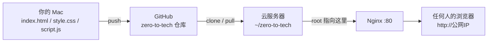

## 课时概要

把卡片页面真正发布到公网：服务器上配 SSH、clone 代码、逐段读懂 Nginx 配置、把 `root` 指到自己的目录、`reload` 后遇到预料中的 404，再用 `chmod o+x` 破案。走通「本地 → GitHub → 服务器 → 公网」的最后一公里。

> 以上为 UP 主的 B 站官方简介，非观看笔记；只有跟完这一节才算自己的理解。

**视频**：[【零到全栈】3.5-服务器部署与Nginx配置](https://www.bilibili.com/video/BV15P7y6cEzf/) ｜ 时长 38:09 ｜ 模块 3 · 前端基础

**讲义**：[模块 3.5：把网页发布到公网（李勃老师.com）](https://xn--ygr25xpohxwz.com/zero-to-fullstack/lessons/module-3-5/)

## 本节要点

- 上线 = 把三段拼起来：**你的电脑 →（push）→ GitHub →（pull）→ 云服务器 →（Nginx 80 端口）→ 任何人的浏览器**。
- 每台机器都要有**自己的一对 SSH key**：Mac 上那对不能搬到服务器，服务器上要重新 `ssh-keygen` 一遍、公钥再贴一次 GitHub。
- Nginx 启动只读 `nginx.conf` 一个文件，其他配置都是它 `include` 进来的；我们改的 `sites-enabled/default` 能生效，根源就是 `http {}` 里那句 `include sites-enabled/*`。
- 配置里**最关键的一行是 `root`**：把 `/var/www/html` 改成 `/home/ubuntu/zero-to-tech`，Nginx 就改去我们的目录找文件。
- 改完配置先 `sudo nginx -t` 校验，成功才 `sudo systemctl reload nginx`（reload 平滑加载、不断连接）。
- 第一次打开大概率 **404/403，而且是预料之中**：Nginx 以 `www-data` 身份读文件，而 `/home/ubuntu` 对 others 是 `---`，把它挡在门外；`sudo chmod o+x /home/ubuntu` 开一道「能穿过但看不了」的缝即可。
- 日常更新三段：本地 `add/commit/push` → 服务器 `git pull` → 浏览器刷新。

## 笔记正文（讲义整理）

### 这条链路长什么样

到这一节为止你手里有：本地三文件、GitHub 仓库、服务器上跑着的 Nginx（但还是 Welcome 页）。要接通的是中间两段——服务器从 GitHub 拉代码、Nginx 改指到我们的目录。



### 在服务器上重复一遍 SSH 配钥匙

SSH 登录服务器后，先确认 git 在，然后**在服务器上重新走一遍 3.4 的流程**（每台机器要有自己的 key）：

```
git --version
ssh-keygen -t ed25519 -C "你的邮箱"
cat ~/.ssh/id_ed25519.pub     # 复制 → GitHub 加 New SSH key，Title 写「云服务器」
ssh -T git@github.com         # 看到 Hi 用户名 即通
git clone git@github.com:你的用户名/zero-to-tech.git
```

注意两边路径对称：Mac 上是 `~/zero-to-tech`，服务器上也是 `~/zero-to-tech`，但真实路径不同（`/Users/你/` vs `/home/ubuntu/`）。

### 读懂 Nginx 配置（重点）

`nginx.conf` 是唯一入口，结构 = 全局指令 + `events {}` + `http {}`；`http {}` 最后两行 `include conf.d/*.conf` 和 `include sites-enabled/*` 把其他配置串进来。我们要改的 server 块里有六行关键：

| 配置行 | 作用 |
| --- | --- |
| `listen 80 default_server;` | 监听 80 端口（HTTP 默认） |
| `root /var/www/html;` | **最关键**：去哪找文件——这节课就改这一行 |
| `index index.html …;` | 访问目录时默认返回哪个文件 |
| `server_name _;` | 还没买域名，`_` = 什么域名都接 |
| `location / { try_files $uri $uri/ =404; }` | 先找文件、再当目录找、都没有返回 404 |
| `user www-data;`（在 nginx.conf 顶层） | Nginx 以谁的身份读文件——等下破案的关键 |

`sites-enabled/default` 其实是指向 `sites-available/default` 的软链接（快捷方式），改哪个都一样。

### 改 root、校验、reload

```
sudo vim /etc/nginx/sites-enabled/default
# / 搜索 root /var  → i 改成 root /home/ubuntu/zero-to-tech;  → Esc  → :wq

sudo nginx -t                 # 看到 syntax is ok 才继续
sudo systemctl reload nginx   # 没输出就是成功
```

### 404 破案（这节课最值的点）

浏览器打开公网 IP，大概率是 **404**。配置没错——是**权限**问题：Nginx 以 `www-data` 身份读文件，要逐层走进 `/ → home → ubuntu → zero-to-tech`，而 `/home/ubuntu` 的权限是 `drwxr-x---`，对 others 是 `---`，`www-data` 被挡在这道门：

```
ls -ld /home/ubuntu
drwxr-x--- 5 ubuntu ubuntu ... /home/ubuntu
```

修法只做一次：

```
sudo chmod o+x /home/ubuntu   # 给 others 一个「能穿过」的 x，但不给 r，所以看不了里面
```

刷新——浅灰背景、白色卡片、点按钮文字会变。**世界上任何人输入这个 IP 都能看到你的页面了。**


### 日常更新流程


原则：服务器上的代码目录是 GitHub 的镜像，**所有改动都在本地做**，服务器不要手改。

## 和 GFG / 课程笔记的连接

| 课程里做的 | 现实对应 |
| --- | --- |
| 服务器配 SSH key、clone 代码 | 和 2.4 租服务器、3.4 Mac 配 key 是同一套，只是换了台机器 |
| Nginx 当静态服务器、`root` 指目录 | 以后 FastAPI 写后端，Nginx 前面挡一层（反向代理），同一套 listen/server 概念 |
| `chmod o+x` | 2.2 学的权限位（rwx）第一次真的排上用场——读、写、执行三个位各管什么 |
| push/pull 接力 | 我们这个个人站现在就是：本地写 md → push → 部署端自动 pull（后面模块会讲自动化） |

## 关键概念

- **部署（deploy）**：把代码放到一台能被公网访问的服务器上、并让 Web 服务指过去。
- **`nginx.conf` / `sites-enabled`**：Nginx 唯一配置入口 vs Ubuntu 惯例的「启用站点」软链接目录。
- **`root` / `index` / `location`**：文件去哪找、默认页是谁、URL 怎么路由。
- **www-data**：Nginx 进程的运行身份，读文件时受这个用户的权限约束。
- **`chmod o+x`**：给「其他人」开「能穿过目录但不能列目录」的最小权限。
- **`nginx -t` / `reload`**：改配置后的语法体检 / 平滑重载。

## 代码 / 实操

```
# —— 在服务器上（SSH 登录后）——
git --version || sudo apt install -y git
ssh-keygen -t ed25519 -C "你的邮箱"
cat ~/.ssh/id_ed25519.pub     # 贴到 GitHub（Title: 云服务器）
ssh -T git@github.com
git clone git@github.com:你的用户名/zero-to-tech.git

sudo vim /etc/nginx/sites-enabled/default
# root /var/www/html;  →  root /home/ubuntu/zero-to-tech;
sudo nginx -t
sudo systemctl reload nginx

# 打开浏览器是 404 → 破案
ls -ld /home/ubuntu
sudo chmod o+x /home/ubuntu
# 刷新浏览器

# —— 以后每次更新 ——
# 本地：git add . && git commit -m "…" && git push
# 服务器：cd ~/zero-to-tech && git pull
# 浏览器：Cmd+Shift+R 强刷
```

## 我的收获

1. 「上线」不是神秘仪式，就是把 Mac、GitHub、服务器、Nginx 四个点用 push/pull 和 root 一行配置串起来。
2. 404 不一定是代码错——这节最大的教训是读懂「服务进程以谁的身份跑、文件目录权限放没放开」，`chmod o+x` 是最小够用的授权。
3. 模块 3 闭环了：本地开发 → Git 存档 → GitHub 托管 → 服务器部署 → 公网可见。这条链路比页面本身值钱。

## 待深入

*（待填：没听懂、想回头查的。）*
