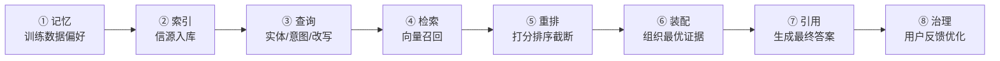
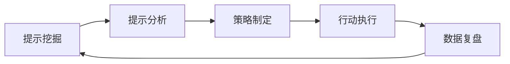

# 为什么企业做 GEO 第一时间没有看到效果：8 阶段管线 × 4 关漏斗 × 5/6/7 三道重排

> 核心答案：GEO 不是『做完即见效』的工具，而是『长期内容战略』。内容从发布到被 AI 引用，需经过一条 **8 阶段管线 + 4 关漏斗 + 5/6/7 三道重排**，每关都会过滤掉大部分内容。

企业做 GEO 经常踩的第一个坑是：**把内容发布当成交付**。但实际上，发完稿只走到了链路 ④「检索」，后面还有 ⑤ 重排 + ⑥ 装配 + ⑦ 引用三关才是 GEO 真正的工作量。

这篇文章想把这三件事讲清楚：

1. AI 引用内容到底要经过几条关卡
2. 为什么「上线 ≠ 被引用」
3. 真实的见效节奏应该是多长

---

## 一、AI 引用的 8 阶段管线：5/6/7 才是 GEO 主战场

真正由「内容质量」决定的是 **5 / 6 / 7 三个阶段**。前 4 阶段解决「有没有」，后 3 阶段解决「选不选、装不装、引不引」。

所以：**发完稿 ≠ 被引用**。「上线」只走到了 ④ 检索，后面 ⑤ 重排 + ⑥ 装配 + ⑦ 引用三关才是 GEO 真正的工作量。

---

## 二、内容侧的 4 关漏斗：每关都过滤大量内容

AI 引用内容前需经过一条完整链路：**抓取 → 解析 → 判断可信 → 引用**。每一关都过滤掉大部分内容：

| 失败环节 | 表现 | 常见原因 |
|---------|------|---------|
| 抓不到 | 内容从未进入索引 | JS 隐藏、登录墙、robots 误伤 |
| 解析不了 | 抓到但读不懂 | 无结构、文字在图片、chunk 边界混乱 |
| 不可信 | 读懂但不引用 | 单源、无背书、事实可疑 |
| 不可引用 | 引用了但位置差 | 缺乏结论前置、缺少可抽取 chunk |

即使内容被 AI 抓到，距离被引用还有 3 关。这解释了为什么「上线 ≠ 被引用」。

---

## 三、6 个关键数据（为什么「没效果」不是错觉）

| 数据点 | 值 | 含义 |
|--------|----|------|
| 被检索页面从未被引用比例 | **85%** | 内容上线 ≠ 被引用；需主动优化可引用性 |
| AI 每条回答平均引用品牌数 | **2.8 个** | 竞争极激烈，必须进入前 3 才有机会 |
| AI 引用存在事实错误比例 | **76.5%** | 内容须足够清晰无歧义，减少 AI 错误解读 |
| 引用漂移（数月内被替换） | **40–60%** | GEO 非一次性工作，需季度刷新机制 |
| 具体内容 vs 模糊内容引用率 | **+50%** | 结构化 = 具体性 |
| 第三方来源 vs 自有域名引用价值 | **6.5 倍** | 数字公关比自营销 ROI 高得多 |

> **85% 被检索的页面从未被引用**——这是 GEO 「没效果」的核心数据：不是你的内容不行，是 AI 引用筛选率本身就极低。

---

## 四、三阶段时间周期策略（GEO 见效的真实节奏）

GEO 改进是分阶段的，不同时间窗口需要不同的重点：

| 阶段 | 时间 | 重点 | 预期效果 |
|------|------|------|---------|
| 短期 | 1–3 个月 | 内容结构化 + 数据引用 | AI 抓取率提升，基础引用出现 |
| 中期 | 3–6 个月 | E-E-A-T 建设 + 外部信源背书 | 引用质量提升，SourceRank 改善 |
| 长期 | 6–12 个月 | 多层级信源矩阵建成 + 持续迭代 | 系统性 AI 可见度，抗波动 |

> 对比 SEO：SEO 效果周期 3–6 个月 / GEO 效果周期 1–3 个月——GEO 看似比 SEO 快，但「立刻」是误解。GEO 的「快」指相对，不是绝对。

---

## 五、5 个底层原因（GEO 延迟生效的根因）

| # | 原因 | 解释 |
|---|------|------|
| ① | AI 抓取有延迟 | AI 爬虫抓取 + 索引需要时间（爬虫调度、向量入库） |
| ② | 索引 ≠ 引用 | 进了索引库 ≠ 能被引用（候选集 ≠ 引用集，候选 12 个里只引 1–3 个） |
| ③ | 信任需要累积 | AI 对品牌/作者的信任是渐进的，需要 E-E-A-T 信号累积 |
| ④ | 引用有漂移 | 40–60% 的引用数月内会被替换——不是一劳永逸 |
| ⑤ | 平台规则不一 | 不同 AI 平台的抓取频率、引用机制不同，单平台见效 ≠ 全平台见效 |

---

## 六、11 个误区中的核心 3 个（解释「为什么没效果」）

| # | 误区 | 正确认知 |
|---|------|---------|
| 4 | 做完就立刻有效 | 持续优化，不保证即时被抓取/展示 |
| 5 | 铺量就行 | 不是堆量，是结构/实体/数据/可引用性 |
| 11 | 引用越多越好 | 信源权威性比引用数量更重要；一个 L1 引用胜过十个 L5 |

> GEO 不是「AI 版 SEO 小技巧」，而是品牌在 AI 答案层争夺可见性、解释权和信任度的长期内容战略。

---

## 七、真实案例的见效时间（行业数据）

| 行业 | 见效时间 | 效果 |
|------|---------|------|
| 金融科技（高净值财富管理） | 6 个月 | 280% AI 引用率提升 + 210% AI 摘要展示 + 60% 品牌搜索量 + 55% CTR 提升 + 47.5% 获客成本降低 |
| 医药（专项） | 3 个月见效 | 200% 引用率提升 + 42% 获客成本降低 |
| 制造业（精密轴承） | 9 个月 | 85% 引用率提升 + 42% 技术询盘增长 |
| IIoT（工业物联网）B2B | 9 个月 | 线索增长 +180%，AI 线索占比 &lt;10% → 40%，决策周期缩短 25% |
| MYPOSTER（定制海报，西方案例） | 48 小时首批引用，4 周 192 条 | 高权重媒体软文含具体产品参数和使用场景 |

> 对比：西方案例 MYPOSTER 通过「高权重媒体软文 + 具体数据」实现 48 小时首批引用，但这是少数。大多数行业案例需要 **3–12 个月** 才稳定见效。

---

## 八、增长飞轮逻辑：GEO 是迭代系统而非一次性工程

核心理念：**GEO 不是一次性项目，而是快速迭代的飞轮**。每轮迭代都让品牌在 AI 能见度上往前一步。

> 关键：GEO 的「效果」不是「启动即见效」，而是「每轮迭代后效果递增」。这是与传统营销「投放即见效」逻辑的根本差异。

---

## 九、给企业的 4 条务实建议

| # | 建议 | 说明 |
|---|------|------|
| 1 | **调整预期** | 把 GEO 当作 **6–12 个月**的长期投资，而非 1–2 周的营销活动 |
| 2 | **设 KPI** | 用 GEO 评估指标体系（4 层 20+ KPI）量化过程，而非只看最终引用率 |
| 3 | **季度复盘** | 因 40–60% 引用漂移率，必须每季度刷新增量内容 |
| 4 | **多渠道并行** | GEO 1–3 个月见效依赖 SEO 基础（Google 索引 + 外链），单独做 GEO 必然延期 |

---

## 十、一句话总结

> GEO「第一时间没效果」是必然现象——内容要先被 AI 抓取（爬虫调度），再被理解（结构化），再被信任（E-E-A-T 累积），再被选中（重排胜出），最后才被引用进答案。这是一场「过 5 关」的马拉松，不是「按一下开关」的即时生效。**理解这个机制，就不会在第 1 个月就放弃。**