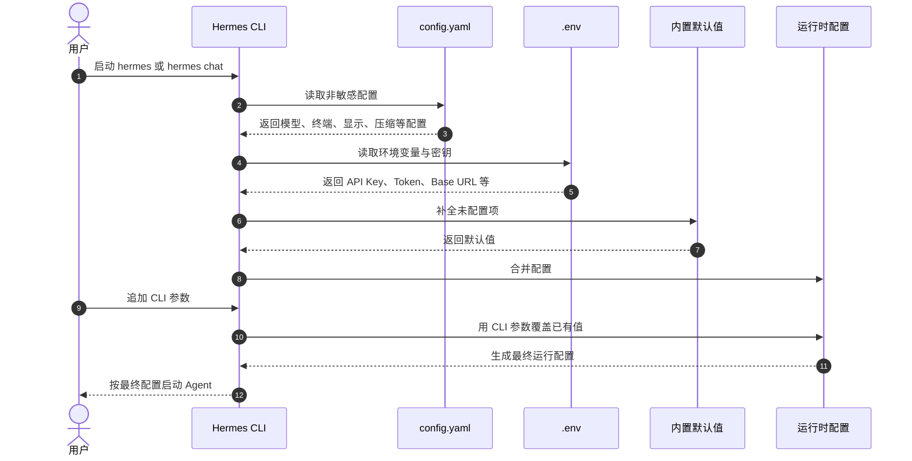
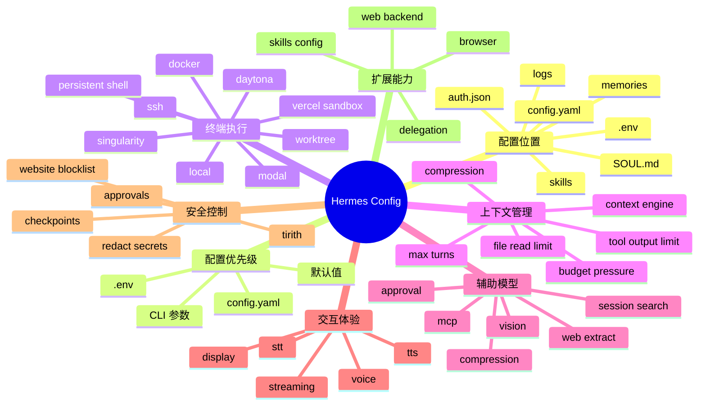

# Hermes Agent Configuration 配置体系整理

Hermes Agent 的配置体系并不是由单一的 `config.yaml` 决定，而是由多层配置共同组成。

要真正理解 Hermes 的配置机制，重点不是死记每一个参数，而是掌握两个问题：

```text
配置应该放在哪里？
不同配置之间谁的优先级更高？
```

Hermes 的最终运行行为，通常由以下几类配置共同决定：

```text
CLI 启动参数
~/.hermes/config.yaml
~/.hermes/.env
内置默认值
```

简单来说：

```text
临时覆盖，用 CLI 参数；
长期配置，用 config.yaml；
敏感信息，用 .env；
没有配置的部分，由内置默认值补齐。
```

---

## 一、Hermes 的核心配置目录

Hermes 的主要配置都集中在用户目录下的 `~/.hermes/` 中。

典型结构如下：

```text
~/.hermes/
├── config.yaml
├── .env
├── auth.json
├── SOUL.md
├── memories/
├── skills/
├── cron/
├── sessions/
└── logs/
```

可以这样理解每个文件和目录的职责：

```text
config.yaml：非敏感配置
.env：敏感信息
auth.json：OAuth 登录凭证
SOUL.md：Agent 的人格底座
memories/：长期记忆
skills/：技能目录
cron/：定时任务
sessions/：会话记录
logs/：运行日志
```

其中最重要的是 `config.yaml` 和 `.env`。

`config.yaml` 适合存放模型、终端后端、压缩、显示、浏览器、工具行为等非敏感配置。

`.env` 适合存放 API Key、Token、密码、Base URL 等敏感信息。

---

## 二、配置优先级

Hermes 的配置解析优先级可以理解为：

```text
CLI 参数
  ↓
~/.hermes/config.yaml
  ↓
~/.hermes/.env
  ↓
内置默认值
```

优先级最高的是 CLI 参数。

这意味着，如果你在启动时通过命令行传入了某个参数，它会覆盖配置文件中的对应值。

因此，最实用的经验是：

```text
临时测试：使用 CLI 参数
长期使用：写入 config.yaml
密钥凭证：写入 .env
默认行为：由系统内置默认值补齐
```

这套机制可以让 Hermes 同时兼顾灵活性和稳定性。

---

## 三、配置加载流程

Hermes 启动时，大致会经历以下配置加载过程：



这也解释了一个常见问题：

```text
为什么我明明配置了某个值，但运行结果不是那个值？
```

通常原因是更高优先级的配置覆盖了它，尤其是 CLI 参数或环境变量。

---

## 四、常用配置管理命令

Hermes 提供了一组配置管理命令：

```bash
hermes config
hermes config edit
hermes config set KEY VAL
hermes config check
hermes config migrate
```

常用场景如下：

```text
hermes config：查看当前配置
hermes config edit：直接编辑 config.yaml
hermes config set KEY VAL：快速修改某个配置项
hermes config check：检查配置是否完整
hermes config migrate：交互式迁移和补齐配置
```

其中，`hermes config set` 很实用。

它会根据配置类型自动选择写入位置：

```text
API Key、Token 等敏感值：写入 .env
普通配置项：写入 config.yaml
```

这样可以减少把密钥误写入 `config.yaml` 的风险。

---

## 五、环境变量替换

`config.yaml` 支持通过 `${VAR_NAME}` 引用环境变量。

例如：

```yaml
auxiliary:
  vision:
    api_key: ${GOOGLE_API_KEY}
    base_url: ${CUSTOM_VISION_URL}
```

这种方式适合以下场景：

```text
团队共享同一份 config.yaml
不同机器使用不同密钥
本地环境和服务器环境分开管理
一套配置适配多个部署环境
```

需要注意：

```text
只支持 ${VAR} 形式
不支持裸 $VAR
未定义的变量会保留原样，不会自动替换
```

因此，使用环境变量时，最好配合 `hermes config check` 检查配置是否完整。

---

# 终端执行后端

## 六、终端后端是 Hermes 最关键的配置之一

Hermes 的 Agent 能力很大程度取决于终端后端。

终端后端决定了 Agent 在哪里执行命令、拥有什么权限、是否隔离，以及是否适合长期运行。

Hermes 支持多种终端执行后端：

```text
local
docker
ssh
modal
daytona
vercel_sandbox
singularity
```

最基础的配置结构如下：

```yaml
terminal:
  backend: local
  cwd: "."
  timeout: 180
```

---

## 七、如何选择终端后端？

可以按照使用场景来理解：

```text
local：最简单，适合个人开发机
docker：适合需要隔离的本地开发
ssh：适合远程开发机、服务器和算力机
modal / daytona / vercel_sandbox：适合云端隔离执行
singularity：适合 HPC 或集群环境
```

初学者最值得优先掌握的是：

```text
local
docker
ssh
```

这三个后端已经能覆盖大多数个人开发和团队开发场景。

---

## 八、本地模式：local

本地模式配置最简单：

```yaml
terminal:
  backend: local
```

它的特点是：

```text
配置最少
启动最快
没有隔离
Agent 直接使用当前用户权限
```

适合：

```text
个人电脑
快速上手
本地项目调试
低风险任务
```

但需要注意，本地模式没有额外安全边界。Agent 执行命令时，理论上拥有当前用户的权限。

因此，如果项目涉及重要文件、生产配置或敏感目录，不建议无保护地长期使用本地模式。

---

## 九、Docker 模式：更推荐的安全起点

Docker 模式更适合长期使用。

示例配置：

```yaml
terminal:
  backend: docker
  docker_image: "nikolaik/python-nodejs:python3.11-nodejs20"
  docker_mount_cwd_to_workspace: false
  docker_forward_env:
    - "GITHUB_TOKEN"
  docker_volumes:
    - "/home/user/projects:/workspace/projects"
  container_cpu: 1
  container_memory: 5120
  container_disk: 51200
  container_persistent: true
```

Docker 模式的优势是：

```text
隔离边界更清晰
可以限制 CPU、内存和磁盘
可以控制哪些目录挂载进容器
可以控制哪些环境变量传入容器
适合长期稳定使用
```

尤其要关注三个关键配置：

```text
docker_volumes：决定哪些主机目录共享给容器
docker_forward_env：决定哪些凭证可以进入容器
docker_mount_cwd_to_workspace：决定是否自动挂载当前启动目录
```

如果你希望 Agent 有能力执行任务，但又不希望它直接接触主机全部文件，Docker 是更安全的选择。

---

## 十、SSH 模式：远程开发与算力机

SSH 模式适合将命令执行放到远程机器上。

基础配置：

```yaml
terminal:
  backend: ssh
  persistent_shell: true
```

同时需要配置环境变量：

```bash
TERMINAL_SSH_HOST=my-server.example.com
TERMINAL_SSH_USER=ubuntu
```

SSH 模式适合：

```text
远程开发机
GPU / 高性能服务器
云服务器
长时间运行任务
团队统一开发环境
```

对于远程开发，`persistent_shell` 非常有价值。

---

## 十一、持久化 Shell

默认情况下，每条命令通常会作为独立子进程执行。

开启持久化 Shell 后，一些状态可以保留，例如：

```text
cd 后的目录
export 设置的环境变量
shell 变量
临时命令状态
```

配置方式：

```yaml
terminal:
  persistent_shell: true
```

这个配置尤其适合 SSH 后端，因为它可以减少重复建连和上下文丢失，提高远程任务的连续性。

---

# 上下文管理

## 十二、上下文压缩是长期会话的关键

Hermes 会在会话过长时自动压缩上下文，避免把模型上下文窗口打满。

推荐先掌握这组配置：

```yaml
compression:
  enabled: true
  threshold: 0.50
  target_ratio: 0.20
  protect_last_n: 20

auxiliary:
  compression:
    provider: "auto"
    model: "google/gemini-3-flash-preview"
```

几个参数的含义如下：

```text
enabled：是否启用压缩
threshold：上下文达到多少比例时开始压缩
target_ratio：压缩后保留多少比例
protect_last_n：最近多少条消息不参与压缩
auxiliary.compression：指定压缩任务使用哪个辅助模型
```

实战建议：

```text
主模型价格较高时，压缩模型应使用便宜快速的模型
压缩模型的上下文窗口最好不小于主模型
长会话、复杂调试和编程任务建议开启压缩
```

---

## 十三、上下文引擎与预算压力

Hermes 不只会压缩上下文，还会提醒两类压力：

```text
上下文压力：会话快到压缩阈值
迭代预算压力：Agent 快达到最大轮数
```

常见配置：

```yaml
context:
  engine: "compressor"

agent:
  max_turns: 90
  api_max_retries: 2
```

其中，`max_turns` 很重要。

它决定了 Agent 在一轮任务中最多可以执行多少轮思考、工具调用和修复。

如果你处理的是复杂编程、排障、长链路工具调用，`max_turns` 需要适当提高；如果你担心成本失控，则应该控制这个值。

---

## 十四、辅助模型是 Hermes 的副驾驶

Hermes 会为一些边缘任务调用辅助模型，而不是全部交给主模型。

常见辅助任务包括：

```text
视觉分析
网页提取
会话搜索
上下文压缩
标题生成
审批分类
MCP 派发
```

通用配置模式如下：

```yaml
auxiliary:
  vision:
    provider: "auto"
    model: ""
    base_url: ""
  web_extract:
    provider: "auto"
    model: ""
  session_search:
    provider: "auto"
    model: ""
    max_concurrency: 3
```

可以这样理解：

```text
provider：使用哪个服务商或路由
model：具体使用哪个模型
base_url：自定义 OpenAI 兼容接口地址
```

实战上，推荐采用这种思路：

```text
主对话模型：使用强模型
压缩、网页提取、会话搜索、视觉等辅助任务：使用便宜快速模型
```

这样可以在保持体验的同时控制成本。

---

# 技能、文件与工具输出

## 十五、技能配置

技能的非敏感配置可以写入：

```yaml
skills:
  config:
    myplugin:
      path: ~/myplugin-data
```

也可以通过命令修改：

```bash
hermes config set skills.config.myplugin.path ~/myplugin-data
```

这一块适合管理：

```text
插件路径
知识库目录
领域参数
偏好设置
技能运行配置
```

如果后续需要自己开发 Hermes Skills，这个命名空间会非常常用。

---

## 十六、文件读取与工具输出限制

Hermes 提供了一组配置用于限制文件读取和工具输出，避免上下文被大文件污染。

示例配置：

```yaml
file_read_max_chars: 100000

tool_output:
  max_bytes: 50000
  max_lines: 2000
  max_line_length: 2000
```

可以这样理解：

```text
file_read_max_chars：单次最多读取多少字符
tool_output.max_bytes：工具输出最多保留多少字节
tool_output.max_lines：工具输出最多保留多少行
tool_output.max_line_length：单行最长保留多少字符
```

这些配置在处理以下内容时非常重要：

```text
大型日志
压缩后的 JS 文件
大型 CSV / JSON
训练数据
长报错信息
爬虫输出
```

如果限制过小，Agent 可能看不到关键信息；如果限制过大，又会造成上下文污染和成本增加。

---

# 交互体验

## 十七、显示、流式输出与成本展示

常见显示配置如下：

```yaml
display:
  tool_progress: all
  compact: false
  resume_display: full
  bell_on_complete: false
  show_reasoning: false
  streaming: false
  show_cost: false
```

可以这样理解：

```text
tool_progress：是否显示工具调用进度
compact：是否使用紧凑显示
resume_display：恢复会话时显示多少历史
bell_on_complete：任务完成后是否响铃
show_reasoning：是否显示推理相关内容
streaming：是否流式输出
show_cost：是否显示成本
```

实战建议：

```text
学习阶段建议打开 show_cost
长任务可以打开 bell_on_complete
CLI 使用者可根据偏好开启 streaming
默认不建议展示过多推理过程，以免干扰阅读
```

---

## 十八、语音配置：TTS、STT 与 Voice

Hermes 的语音能力大致分为三块：

### TTS

```yaml
tts:
  provider: "edge"
  speed: 1.0
```

### STT

```yaml
stt:
  provider: "local"
```

### Voice

```yaml
voice:
  record_key: "ctrl+b"
  max_recording_seconds: 120
  auto_tts: false
```

如果你主要在 CLI 中使用语音输入或语音播报，这三块配置需要一起看。

---

# Web、Browser 与安全

## 十九、Web 搜索后端

Hermes 支持多种 Web 搜索后端：

```yaml
web:
  backend: firecrawl
```

常见可选项包括：

```text
firecrawl
parallel
tavily
exa
```

不同后端在搜索质量、速度、价格和可用性上会有差异。

---

## 二十、Browser 配置

Browser 配置用于控制浏览器自动化行为：

```yaml
browser:
  inactivity_timeout: 120
  command_timeout: 30
  record_sessions: false
  cdp_url: ""
  dialog_policy: must_respond
```

常见含义：

```text
inactivity_timeout：浏览器无操作多久后超时
command_timeout：单条浏览器命令超时时间
record_sessions：是否记录浏览器会话
cdp_url：Chrome DevTools Protocol 地址
dialog_policy：遇到弹窗时如何处理
```

---

## 二十一、安全配置

安全配置示例：

```yaml
security:
  redact_secrets: false
  tirith_enabled: true
  tirith_fail_open: true
```

其中，`redact_secrets` 用于控制是否对敏感信息进行脱敏。

Hermes 还支持 URL 封锁能力：

```yaml
security:
  website_blocklist:
    enabled: true
    domains:
      - "*.internal.company.com"
      - "admin.example.com"
```

这类配置适合：

```text
企业内网
管理后台
敏感业务系统
不希望 Agent 访问的域名
```

安全配置不应该被视为高级选项，而应该是常规配置的一部分。

---

# 审批、检查点与委派

## 二十二、审批模式

Hermes 支持审批模式配置：

```yaml
approvals:
  mode: manual
```

常见可选值：

```text
manual：手动审批
smart：智能审批
off：关闭审批
```

建议初学者和生产环境优先使用 `manual` 或 `smart`。

不要在不了解风险的情况下直接关闭审批。

---

## 二十三、检查点

检查点配置：

```yaml
checkpoints:
  enabled: true
  max_snapshots: 50
```

检查点的价值是：在文件改动前后保留快照，方便回滚。

对于编程任务、重构任务和高风险修改，非常建议开启。

---

## 二十四、子 Agent 委派

委派配置：

```yaml
delegation:
  max_concurrent_children: 3
  max_spawn_depth: 1
  orchestrator_enabled: true
```

适合处理：

```text
复杂任务拆分
多子任务并行
研究与开发分工
测试与修复分工
```

需要注意，委派能力越强，成本和复杂度也越高。初学阶段不建议一开始就开太多并发子任务。

---

## 二十五、Worktree 隔离

如果你需要并行运行多个 Agent，建议开启 Worktree：

```yaml
worktree: true
```

开启后，Hermes 会为每个 CLI 会话创建独立的 Git worktree。

这样可以避免多个 Agent 同时修改同一个仓库工作区，导致文件冲突或状态污染。

---

# 记忆与人格

## 二十六、记忆配置

Hermes 的记忆配置示例：

```yaml
memory:
  memory_enabled: true
  user_profile_enabled: true
  memory_char_limit: 2200
  user_char_limit: 1375
```

可以这样理解：

```text
memory_enabled：是否启用通用长期记忆
user_profile_enabled：是否启用用户画像记忆
memory_char_limit：MEMORY.md 的字符上限
user_char_limit：USER.md 的字符上限
```

Hermes 的记忆系统强调"小而精"，不鼓励把大量历史信息都塞进长期记忆。

---

## 二十七、身份与上下文文件

Hermes 会识别多种上下文文件：

```text
SOUL.md
.hermes.md
AGENTS.md
CLAUDE.md
.cursorrules
```

可以这样理解：

```text
SOUL.md：定义 Agent 是谁
AGENTS.md：定义项目怎么做事
CLAUDE.md：兼容 Claude Code 项目规则
.cursorrules：兼容 Cursor 项目规则
.hermes.md：Hermes 项目级上下文
```

其中，最值得优先理解的是：

```text
SOUL.md：人格底座
AGENTS.md：项目规则
```

---

# 配置结构思维导图



---

# 推荐优先掌握的五组配置

如果不想一次性掌握所有配置，建议先学下面五组：

```text
1. config.yaml 与 .env 的职责分工
2. terminal.backend 与 Docker / SSH 后端选择
3. compression 与 auxiliary.compression
4. display、streaming、show_cost、show_reasoning
5. approvals、checkpoints、worktree
```

这五组配置基本覆盖了：

```text
配置管理
执行环境
上下文成本
交互体验
安全边界
```

---

# 三套实用起手配置

## 1. 本地开发机起手版

```yaml
terminal:
  backend: local

compression:
  enabled: true
  threshold: 0.50

display:
  tool_progress: all
  show_cost: true

approvals:
  mode: manual

checkpoints:
  enabled: true
```

适合：

```text
个人开发
快速上手
本地项目调试
低风险任务
```

---

## 2. Docker 安全版

```yaml
terminal:
  backend: docker
  docker_mount_cwd_to_workspace: false
  docker_volumes:
    - "/home/user/projects:/workspace/projects"
  docker_forward_env:
    - "GITHUB_TOKEN"
  container_persistent: true

approvals:
  mode: smart

checkpoints:
  enabled: true

security:
  redact_secrets: true
```

适合：

```text
需要隔离执行环境
不希望 Agent 直接访问主机全盘
希望限制可访问目录和凭证
长期稳定使用 Hermes
```

---

## 3. 远程开发服务器版

```yaml
terminal:
  backend: ssh
  persistent_shell: true

worktree: true

delegation:
  max_concurrent_children: 3

display:
  bell_on_complete: true
```

适合：

```text
远程算力机
云服务器开发
并行复杂任务
长时间运行任务
```

---

# 总结

Hermes 的配置体系可以用四句话概括：

```text
非敏感配置进 config.yaml；
敏感信息进 .env；
执行环境先选 backend；
长会话必须考虑压缩和辅助模型。
```

进一步来说：

```text
安全能力不是附属项，而是常规配置项；
成本控制不是后期优化，而是配置阶段就要考虑；
Agent 能力不是只由模型决定，也由执行后端、上下文管理、审批机制和工具边界共同决定。
```

如果只记住一个原则，那就是：

```text
Hermes 配置的核心，不是把所有参数都打开，而是让 Agent 在正确的环境、正确的权限、正确的成本边界内工作。
```
