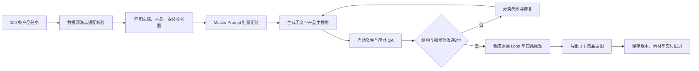

## 第二十四节：提示词工程化与模板系统（Prompt Engineering System）

GPT 生图从 0 到 1 · 第 24 课 · Master Prompt、变量槽位、JSON Schema、批量生成、版本管理、质量验收与 Prompt Library

前二十三节，我们已经系统学习了如何通过提示词控制图片的构图、镜头、光影、色彩、材质、主体一致性、商业表现以及参考图风格。

但如果我们要为一个品牌制作 100 张商品主图，会遇到一个新的问题：

难道要手动写 100 次提示词、上传 100 次参考图、检查 100 次输出，再逐张修改吗？

显然，这不是理想的商业生产方式。

第二十四节，我们要将生图提示词从一段自然语言，升级成一套可管理的工程系统：

Prompt Template + Product Data + Reference Assets + Generation + QA + Version Control

本节我们将完成以下学习目标：

- 建立可复用的 Master Prompt。
- 将固定规则与可变内容分离。
- 使用 JSON Schema 约束输入数据。
- 理解批量生图的任务调度和状态管理。
- 建立提示词版本控制机制。
- 设计自动化与人工结合的质量验收。
- 建立可检索、可复用的 Prompt Library。
- 最终完成一个 100 张新能源汽车商品主图的工程案例。

### 24.1 为什么普通 Prompt 不适合规模化生产？

首先对比两种工作方式。

传统手工生图

编写提示词

上传参考图片

生成、修改、保存

每个 SKU 都重新操作，容易出现规则遗漏和文件混乱。

工程化生图

统一 Master Prompt

产品数据 + 参考素材

批量生成 + 质量验收

统一规则、独立变量、可追溯版本和可重试任务。

工程化的目的不是让所有生成步骤都完全自动化，而是减少重复工作、降低错误概率，并提高结果的可追溯性。

### 24.2 第一部分：提示词系统的八大组成模块

PROMPT ENGINEERING SYSTEM · 8 MODULES

01 · Master Prompt

主提示词

全局视觉规范和基础要求

02 · Variable Slots

变量槽位

车型、颜色、产品、比例

03 · Reference Assets

参考素材管理

Logo、车辆、产品、背景

04 · Schema Validation

数据结构校验

检查字段、类型和必填项

05 · Batch Orchestration

批量任务调度

队列、并发、重试、状态

06 · Version Control

模板版本管理

变更记录和回退

07 · Quality Assurance

质量验收

尺寸、文字、结构和人工复核

08 · Prompt Library

模板知识库

检索、复用和持续改进

这八个模块并不一定要依靠大型软件平台实现。最初可以使用 Markdown、JSON、CSV 和简单的 Python 脚本搭建，后续再接入自动化系统。

### 24.3 第二部分：Master Prompt 主提示词

Master Prompt 是整个系统的核心。

它负责存储批量生产中相对稳定的规则，例如：

- 画面背景。
- 品牌视觉规范。
- 构图方式。
- 光影风格。
- 产品真实性要求。
- Logo 和文字的处理规则。
- 最终验收标准。

#### 一个重要原则：Master Prompt 不应该包含每个商品独有的数据

例如：

“展示问界 M9”应该是变量，而不是写死在用于所有车型的模板中。

#### Master Prompt 示例

## MASTER PROMPT · Automotive Product Image V1.0

### 角色

你是一名专业汽车配件商业视觉设计师。

### 任务

根据输入的车型、产品信息和参考素材，制作汽车配件电商商品主视觉。

### 全局设计规范

- 使用白色至浅灰色渐变背景
- 采用高端汽车商业摄影风格
- 画面简洁、干净，具有轻微科技感
- 产品或车辆为唯一主要视觉主体
- 保持充足留白
- 光线柔和、真实、自然
- 不添加无关场景或物体

### 参考素材职责

车辆参考图：控制车型外观。

产品参考图：控制产品结构与材质。

安装参考图：控制产品安装位置。

品牌 Logo：仅用于最终设计合成，不由生成模型重新绘制。

### 产品结构要求

保持参考产品的主要结构、颜色和材质。

禁止擅自改变产品型号、结构或品牌标识。

涉及车型适配时，以已经核实的产品适配资料为准。

### 图像输出

目标画幅由输入变量指定。

主体应完整进入画面。

为后续标题和商品卖点保留安全区域。

### 文字与品牌处理

优先生成无文字主视觉。

精确标题、参数、价格、Logo 和二维码使用独立图层完成合成。

### 验收规则

P0：车型和产品 SKU 对应正确，结构与关键品牌信息无误。

P1：构图、材质、光照、透视和安装关系合理。

P2：背景与非关键氛围细节可调整。

发现 P0 错误时，不进入正式交付。

在工程实践中，可以将主提示词视为一个稳定的模板文件，而不是每次生成时都手动复制修改。

### 24.4 第三部分：变量槽位（Variable Slots）

变量槽位是将同一个 Prompt 复用到不同产品的关键。

例如：

```
`{{PRODUCT_NAME}}`
`{{VEHICLE_MODEL}}`
`{{BODY_COLOR}}`
`{{PRODUCT_REFERENCE}}`
`{{ASPECT_RATIO}}`
`{{CAMERA_ANGLE}}`
```

每次生产时，系统从产品数据表中读取相应字段，将它们填入模板。

#### 变量分类

| 类型     | 示例             | 作用                 |
| -------- | ---------------- | -------------------- |
| 主体变量 | 车型、商品型号   | 控制生成对象         |
| 外观变量 | 颜色、材质、款式 | 控制主体外观         |
| 镜头变量 | 正面、侧面、3/4  | 控制摄影方式         |
| 布局变量 | 1:1、3:4、16:9   | 控制目标构图         |
| 素材变量 | 车辆图、产品图   | 提供参考依据         |
| 业务变量 | SKU、商品名称    | 将图片绑定到业务数据 |

#### 变量不一定越多越好

假设一个商品系列需要固定摄影角度，那么 `CAMERA_ANGLE` 可以写在 Master Prompt 中，不一定需要作为每个 SKU 的独立变量。

稳定的规则应尽量固定，只有真正需要变化的内容才成为变量。

#### 交互演示：变量替换

车型变量

产品变量

电动踏板

车身颜色

图片比例

1:13:416:9

变量替换后的最终 Prompt

生成一张 1:1 的高端汽车配件电商商品主视觉。 车辆：问界 M9。 产品：电动踏板。 车身颜色：金属蓝。 使用白色至浅灰色摄影棚背景，三分之四侧前视角，光线柔和，主体完整，四周留白。 车辆与产品的真实外观以当前 SKU 对应的参考图为准。未经核实不得自行推断产品适配或安装结构。 不生成精确文字、Logo 或二维码，预留后期排版区域。

 复制提示词

这里需要说明：变量替换只是完成提示词组装，不代表已完成参考图绑定、产品适配核验或实际图片生成。

### 24.5 第四部分：使用 JSON Schema 规范输入数据

当我们需要处理几百款商品时，不能只依赖散乱的文字描述。

例如同一个字段，有人写：

```
车辆：问界 M9
```

另一个人写：

```
车型名称：M9
```

还有人写：

```
适用车型：问界M9
```

人类能理解这些描述，但自动化程序未必知道它们是否代表同一个字段。

所以我们需要制定统一的数据结构。

#### 24.5.1 什么是 JSON Schema？

JSON 是一种用于表达结构化数据的格式。

JSON Schema 则用于定义数据应该包含哪些字段、字段属于什么类型、是否必填，以及允许哪些取值。

例如，一条商品任务数据可以写成：

```
{
  "task_id": "IMG-0001",
  "sku": "STEP-M9-001",
  "product_type": "electric_running_board",
  "vehicle": {
    "brand": "问界",
    "model": "M9",
    "year": 2026
  },
  "body_color": "metallic_blue",
  "aspect_ratio": "1:1",
  "camera_angle": "front_three_quarter",
  "references": {
    "vehicle_image": "assets/vehicles/m9.png",
    "product_image": "assets/products/step-001.png",
    "installation_image": "assets/fitment/m9-step.png"
  },
  "fitment_verified": true
}
```

以上 SKU、年份和素材路径均为示例数据，不表示实际存在或已验证适配。

#### 24.5.2 用 Schema 检查字段

```
{
  "$schema": "https://json-schema.org/draft/2020-12/schema",
  "type": "object",
  "required": [
    "task_id",
    "sku",
    "product_type",
    "vehicle",
    "aspect_ratio",
    "references",
    "fitment_verified"
  ],
  "properties": {
    "task_id": {
      "type": "string",
      "minLength": 1
    },
    "sku": {
      "type": "string",
      "minLength": 1
    },
    "product_type": {
      "type": "string",
      "enum": [
        "electric_running_board",
        "forged_wheel",
        "underbody_guard"
      ]
    },
    "vehicle": {
      "type": "object",
      "required": ["brand", "model"],
      "properties": {
        "brand": {"type": "string"},
        "model": {"type": "string"},
        "year": {"type": "integer"}
      },
      "additionalProperties": false
    },
    "aspect_ratio": {
      "type": "string",
      "enum": ["1:1", "3:4", "16:9"]
    },
    "references": {
      "type": "object",
      "required": ["vehicle_image", "product_image"],
      "properties": {
        "vehicle_image": {"type": "string"},
        "product_image": {"type": "string"},
        "installation_image": {"type": "string"}
      }
    },
    "fitment_verified": {
      "type": "boolean"
    }
  }
}
```

Schema 只能检查数据结构和声明的约束，不能判断某款产品是否真的适配某辆车。

例如 `fitment_verified: true` 只表示数据中存在这一声明；它是否有可信依据，需要进一步检查适配记录、负责人和证据来源。

因此，工程系统通常需要两层校验：

Schema Validation（格式正确） + Business Validation（业务事实正确）。

### 24.6 第五部分：参考素材管理（Reference Asset Management）

生图模板只是指令的一部分。

对于商业产品，参考图片本身也必须进行规范管理。

假设系统有 100 个车型任务，每个任务需要：

- 车辆原图。
- 产品实拍图。
- 已核实的安装参考图。
- 品牌 Logo。
- 可选的风格参考图。

如果这些素材只放在一个混乱文件夹中，很容易发生 SKU 对错、重复引用或使用过期素材。

#### 建议的素材目录

```
assets/
├── brand/
│   ├── lanhui-logo.svg
│   └── brand-colors.json
│
├── vehicles/
│   ├── m9/
│   │   ├── front-3q.png
│   │   └── side.png
│   └── l9/
│       └── front-3q.png
│
├── products/
│   ├── STEP-001/
│   │   ├── product-front.png
│   │   └── product-detail.png
│   └── WHEEL-001/
│       ├── wheel-front.png
│       └── wheel-angle.png
│
├── fitment/
│   └── verified/
│
└── style-references/
    └── studio-white-v1.png
```

#### 素材应当具有元数据

| 字段                | 用途                   |
| ------------------- | ---------------------- |
| asset_id            | 唯一素材编号           |
| sku                 | 关联真实商品           |
| asset_role          | 车辆、产品、安装或风格 |
| source              | 素材来源               |
| verification_status | 审核状态               |
| checksum            | 判断文件是否发生变化   |
| updated_at          | 素材更新时间           |

对于真实商品图片，建议使用 SHA-256 等哈希值记录原始素材文件。这样即使文件名不变，也能发现文件内容被替换。

一个高级生图任务应该绑定到具体的素材版本，而不是只记录“使用某张轮毂图片”。

### 24.7 第六部分：模板组装与生图任务管线

当模板、变量和素材都准备好后，就可以进行任务组装。


这里有三个重要的工程原则。

第一，业务数据不完整的任务不进入生成阶段。 例如安装参考不存在，就不应该生成一张自称真实适配的安装示意。

第二，生成和验收分离。 生成模型返回图片，不代表这张图符合业务要求。

第三，失败要分类。 图片接口超时、文件损坏、商品结构错误是三种不同的问题，不能采用同样的重试策略。

### 24.8 第七部分：批量生图（Batch Generation）

假设我们现在要生产 100 张商品主图。

可以将一个商品记录转换成一个任务：

```
Task 001 → 商品 A → 生成 → 验收
Task 002 → 商品 B → 生成 → 验收
Task 003 → 商品 C → 生成 → 验收
...
Task 100 → 商品 Z → 生成 → 验收
```

每个任务都应维护明确的生命周期。

批量任务状态机

PENDING

任务已创建，等待执行

VALIDATING

校验数据与素材

GENERATING

正在执行图片生成

QA_REVIEW

等待质量验收

APPROVED

人工验收通过

REJECTED

质量不合格

RETRY_WAIT

等待符合策略的重试

DELIVERED

已导出并交付

#### 批量生产不能简单地无限并发

需要结合实际服务的速率限制、并发限制、费用和失败率设置任务队列。

例如，系统可以支持：

- 最大并发数配置。
- 请求超时。
- 指数退避重试。
- 重试次数上限。
- 任务断点续跑。
- 同任务防重复提交。
- 每张图的实际成本记录。

这些配置应根据实际图像生成服务的接口能力确定，不能假设所有服务都支持相同的种子、批处理或图像编辑参数。

#### 为什么需要幂等性（Idempotency）？

假设 `TASK-0025` 已经成功生成，但客户端因为超时没有及时收到成功响应。

如果重新提交，可能产生重复图片和重复费用。

因此，应为任务建立稳定的内部 ID、请求记录和结果记录，尽量避免重复处理。是否能够利用服务端幂等机制，则取决于具体服务是否提供对应支持。

### 24.9 第八部分：失败重试（Retry Strategy）

不要把所有失败都理解为“重新生成一次”。

| 失败类型 | 例子                 | 推荐处理                |
| -------- | -------------------- | ----------------------- |
| 技术失败 | 超时、临时服务错误   | 有上限地重试            |
| 数据失败 | SKU 不存在、字段缺失 | 修复数据后重新校验      |
| 素材失败 | 参考图片损坏或丢失   | 补充素材                |
| 结构失败 | 轮毂辐条改变         | 回到原始参考并调整方法  |
| 排版失败 | 中文乱码、Logo 变形  | 独立文字/Logo 合成      |
| 审美失败 | 构图不平衡、光影普通 | 针对具体维度修改 Prompt |

最需要注意的是：P0 结构错误不能简单依赖盲目重试解决。

例如轮毂辐条连续三次生成错误，应当重新评估技术路径：是否需要原图抠图、精确遮罩或三维模型，而不是无限增加“绝对不能改变辐条”的文字。

### 24.10 第九部分：Prompt 版本管理（Version Control）

工程化生图必须能够回答：

“这张图是用哪个版本的提示词生成的？”

例如：

| 版本   | 主要变化                 | 影响               |
| ------ | ------------------------ | ------------------ |
| V1.0.0 | 初始白底商品主图规范     | 建立基础模板       |
| V1.1.0 | 新增明确的安装参考职责   | 提高适配任务可控性 |
| V1.1.1 | 修正产品名称变量替换错误 | 修复程序缺陷       |
| V2.0.0 | 重新设计整体主图排版规范 | 产生明显视觉变化   |

#### 推荐使用语义化版本号

```
MAJOR.MINOR.PATCH
```

- MAJOR：不兼容的重大规则或结构变化。
- MINOR：向后兼容地增加功能或配置。
- PATCH：不改变接口契约的缺陷修复。

这是对语义化版本思想的工程应用，不是生图领域的强制标准。

#### 一条任务建议记录哪些信息？

```
{
  "task_id": "IMG-0001",
  "sku": "STEP-M9-001",
  "template_id": "automotive-product-main",
  "template_version": "1.1.0",
  "model": "configured-image-model",
  "model_parameters": {},
  "reference_asset_ids": [
    "VEHICLE-001",
    "PRODUCT-001"
  ],
  "assembled_prompt_hash": "example-hash",
  "attempt": 1,
  "status": "QA_REVIEW",
  "output_file": "IMG-0001-v1.png"
}
```

这里的模型名称、参数与哈希值均为占位示例，实际应记录真实调用时使用的值。

如果某次生成的图片质量发生下降，我们就可以追踪是模板、产品素材、数据还是模型配置发生了变化。

#### Git 管理与图片素材管理

Git 适合管理 Markdown、JSON、Schema 和程序代码。

对于大量高分辨率图片，可以根据团队规模考虑 Git LFS、对象存储或独立资产管理系统。

不建议把所有生成图和中间文件毫无区分地提交到普通代码仓库。

### 24.11 第十部分：质量验收（Quality Assurance）

这是整个商业生图系统最关键的环节。

我们继续使用前面建立的 P0、P1、P2 方法。

P0

关键正确性

SKU 对应正确、产品结构准确、车型适配经过核实、精确品牌文字无误。

P1

视觉与技术质量

画幅、构图、透视、光照、材质、清晰度及背景合理。

P2

细节优化

非关键反射、轻微背景纹理、装饰间距与氛围细节。

#### 自动化 QA 与人工 QA 的边界

| 检查项目            | 自动检查         | 人工检查                   |
| ------------------- | ---------------- | -------------------------- |
| 输出文件存在        | 可以             | 通常不需要                 |
| 文件可解码          | 可以             | 通常不需要                 |
| 图片宽高与比例      | 可以             | 抽查                       |
| 文件格式与大小      | 可以             | 抽查                       |
| 必填参考素材关联    | 可以检查记录     | 核对业务依据               |
| Logo 是否使用原文件 | 可以检查合成流程 | 视觉复核                   |
| 辐条是否完全正确    | 可辅助图像比较   | 需要产品或设计人员验收     |
| 安装位置是否合理    | 可辅助异常检测   | 需要可靠适配资料和专业判断 |
| 整体审美            | 有限辅助         | 人工为主                   |

注意，自动化 QA 并不是调用一个视觉模型，让它说“合格”就结束。

如果是高风险的结构正确性要求，应该采用程序规则、可靠业务数据、图像比对和人工复核组合。

#### QA 记录示例

```
{
  "task_id": "IMG-0001",
  "checks": {
    "file_valid": true,
    "aspect_ratio_valid": true,
    "source_assets_present": true,
    "sku_match_reviewed": true,
    "product_geometry_approved": false,
    "brand_overlay_valid": true
  },
  "decision": "REJECTED",
  "reason": "产品参考图与生成图的结构不一致",
  "next_action": "REBUILD_FROM_MASTER"
}
```

这里即使其余检查全部通过，只要关键产品结构未通过，也不能交付。

### 24.12 第十一部分：成本管理与生成策略

真正生产 100 张图片时，成本不能只按成功交付的张数计算。

还需要记录：

- 生成请求成本。
- 失败重试成本。
- 素材整理成本。
- 人工验收成本。
- 修复与后期合成成本。

#### 一个简单的成本模型

`C_total = C_generation + C_retry + C_QA + C_editing + C_storage`

其中，生成接口的单次价格不是固定不变的，应使用实际服务的当前计费方式和任务记录计算。

批量生图成本估算器

目标交付图片数量

100 张

单次生成假设成本

¥0.20

每张交付图的平均生成次数

1.2 次

每张图人工验收与修图假设成本

¥1.00

预估生成费用

## ¥24.00

合计估算

## ¥124.00

以上单价完全是可调整的教学假设，不代表任何图像服务的实际报价。合计暂不包含存储、开发、数据清洗及其他固定成本。

如果发现某种任务持续失败，与其不断重试，不如改变生产方式。例如从 AI 重绘产品本体，改成使用真实产品素材进行背景合成。

### 24.13 第十二部分：Prompt Library 模板知识库

Prompt Library 不应该只是一堆文本文件。

它应该是一套能够根据需求快速检索的模板资产库。

例如：

| 模板 ID | 名称               | 场景           |
| ------- | ------------------ | -------------- |
| P-001   | 白底汽车商品图     | 电商主图       |
| P-002   | 锻造轮毂棚拍       | 产品展示       |
| P-003   | 电动踏板安装效果   | 使用场景       |
| P-004   | 人物角色一致性     | 动漫与写真     |
| P-005   | 参考风格逆向       | 广告设计       |
| P-006   | 3:4 教学信息图     | 博客与社交内容 |
| P-007   | 局部编辑与背景替换 | 图片精修       |
| P-008   | 网站 Hero 背景     | 网站视觉       |

每个模板最好保存：

```
模板 ID、名称、用途、版本、需要的输入字段、参考素材职责、示例图、合格案例、失败案例、适用模型、最后验证时间。
```

#### 检索方式

可以按多个维度检索：

- 按用途：电商 / 网站 / 博客 / 人像。
- 按主体：汽车 / 轮毂 / 踏板 / 人物。
- 按画幅：1:1 / 3:4 / 16:9。
- 按展示方式：棚拍 / 安装 / 微距 / 信息图。
- 按质量要求：概念图 / 真实产品 / 精确合成。

后续接入 Agent 时，就可以先检索最合适的 Prompt 模板，再组装实际任务，而不必让 Agent 从零撰写所有指令。

### 24.14 完整案例：100 张新能源汽车配件商品主图

现在我们把整节知识组合起来。

#### 业务目标

为不同车型与配件建立统一的 1:1 商品主图。

固定：

- 品牌视觉规范。
- 白色至浅灰背景。
- 图片画幅。
- 商品信息层级。
- 质量验收规则。

变化：

- 车型。
- 车身颜色。
- 产品 SKU。
- 产品参考图。
- 适配与安装信息。

100 张商品图生产架构



#### 推荐采用两阶段生产

第一阶段：生成主视觉

AI 主要负责摄影棚氛围、背景、光影和允许变化的视觉效果。真实产品可使用原图抠图或核验后的三维素材合成。

第二阶段：精确设计合成

通过稳定的排版模板加入：

- `LANHUI 蓝辉轻改` 原始 Logo。
- 车型名称。
- 商品类别。
- 已核实的卖点文案。
- 必要的产品说明。

这样不需要让图像模型在 100 次生成中都准确绘制相同的中文标题和品牌标识。

#### 推荐的工程目录

```
automotive-image-system/
├── README.md
├── config/
│   ├── brand.json
│   └── generation.json
│
├── prompts/
│   ├── master/
│   │   └── product-main-v1.md
│   └── templates/
│       ├── wheel.md
│       ├── running-board.md
│       └── underbody-guard.md
│
├── schemas/
│   └── product-task.schema.json
│
├── data/
│   ├── products.csv
│   └── tasks.json
│
├── assets/
│   ├── vehicles/
│   ├── products/
│   ├── installation/
│   └── brand/
│
├── scripts/
│   ├── validate.py
│   ├── assemble.py
│   ├── generate.py
│   ├── qa.py
│   └── export.py
│
├── outputs/
│   ├── raw/
│   ├── approved/
│   └── final/
│
└── reports/
    ├── manifest.json
    └── qa-report.md
```

这套结构能够与现有的 Python 脚本、Next.js 后台、飞书多维表或 AI Agent 协作，但需要根据实际使用的生成接口实现相应的调用和文件处理。

### 24.15 如何从 0 到 1 落地？

不要一开始就直接跑满 100 张图片。

更稳妥的方式是分阶段验证。

1. 阶段一：完成一张标准图

   确认品牌布局、产品素材、背景风格、标题和输出规范。

2. 阶段二：制作 5 张测试图

   选择不同车型和配件，测试模板的通用性和结构保持能力。

3. 阶段三：扩展至 20 张

   引入批量任务、失败记录、自动检查和人工审核。

4. 阶段四：规模化到 100 张

   固定合格模板版本，形成任务清单、质量报告和最终交付目录。

#### 什么时候进入下一阶段？

可以设立明确的阶段门槛：

| 阶段        | 通过条件                                        |
| ----------- | ----------------------------------------------- |
| 1 张标准图  | 视觉规范、产品结构和排版均经过确认              |
| 5 张测试图  | 主要产品类型可以稳定执行，重大问题已记录并处理  |
| 20 张试生产 | QA 流程、版本管理、成本记录、失败恢复已实际运行 |
| 100 张生产  | 逐张有状态、有参考素材、有验收结果和交付记录    |

不要因为“5 张看起来都不错”，就假设后续 100 张一定能够保持相同质量。

商品类型、车型复杂度和参考素材质量都会影响结果。

### 24.16 第二十四节博客教学配图规划

这一节我们继续沿用此前的统一视觉规范：白底、深蓝色标题、科技蓝流程框、红色错误标注以及清晰的教学信息层级。

| 编号  | 教学图片                    | 推荐布局           |
| ----- | --------------------------- | ------------------ |
| 24-01 | 手工 Prompt vs 工程化系统   | 左右流程对比       |
| 24-02 | Prompt Engineering 八大模块 | 八模块框架图       |
| 24-03 | Master Prompt 与变量槽位    | 左侧模板＋右侧变量 |
| 24-04 | JSON Schema 与任务数据      | 数据结构拆解信息图 |
| 24-05 | 批量生图任务管线            | 横向或纵向流程图   |
| 24-06 | 模板版本、重试与回退        | V1→V2＋失败分支    |
| 24-07 | 自动 QA 与人工 QA           | 双通道检查示意     |
| 24-08 | 100 张汽车商品主图生产系统  | 综合工程架构图     |

其中重点推荐 24-03、24-05、24-07 和 24-08。

尤其是 24-08，建议作为本节的核心教学图，使用中央主流程与周围模块注释的形式，完整展示：

```
产品数据 → 素材匹配 → Prompt 组装 → 生图 → QA → 品牌合成 → 最终交付
```

可以在每个节点旁用红色小字标注常见风险，例如：

- 产品数据错误。
- 参考素材错配。
- 产品结构漂移。
- 图片比例不符。
- 中文文字不准确。
- 失败重试造成重复成本。

这样的信息图不仅适合博客，也能够作为内部 AI 生图生产流程的培训材料。

### 24.17 本节总结

本节最核心的公式是：

Prompt Engineering System = Master Prompt + Variables + Assets + Schema + Orchestration + Versioning + QA + Library

我们需要掌握五个关键原则：

第一，Prompt 应该成为可维护的模板，而不是每次重新编写的一段文字。

第二，变量必须与真实业务数据和参考素材建立关联。 仅仅把车型名称替换正确，不代表生成的产品已经适配这辆车。

第三，批量生产必须有任务状态、失败处理和版本记录。 这样才能排查问题并控制成本。

第四，质量验收不能完全依赖 AI 自评。 对于真实商业产品，程序校验、可靠资料与人工判断需要协作。

第五，系统的价值在于持续复用。 每一次合格生成、失败案例与模板调整，都可以成为 Prompt Library 的一部分，减少未来项目的重复试错。

至此，我们已经从第 1 节的单张图片比例，逐步学习到了第 24 节的工程化视觉生产体系。

#### 下一节：第二十五节——多模态生图 Agent 与自动化工作流（Image Generation Agent）

第二十四节解决的是模板和生产规则。

第二十五节，我们将继续研究如何让 AI Agent 自动协调这些模块：

用户需求理解 → 产品知识库检索 → 选择 Prompt 模板 → 匹配参考图片 → 调用图像模型 → 自动 QA → 人工确认 → 导出交付。

我们还会研究 Skill、Tool、MCP、Agent、RAG 在生图流程中的不同职责，以及如何设计一个真正可以执行任务、控制成本、追踪失败并管理结果的商业生图 Agent。
