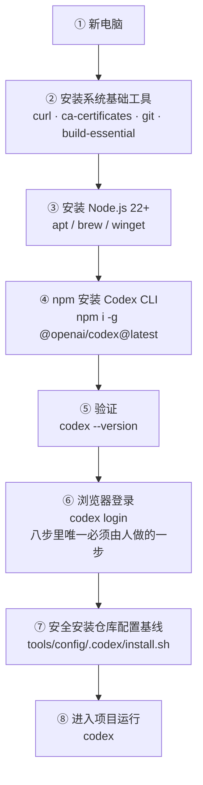
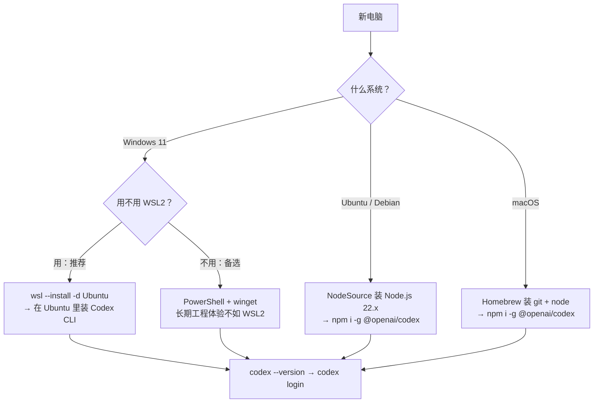
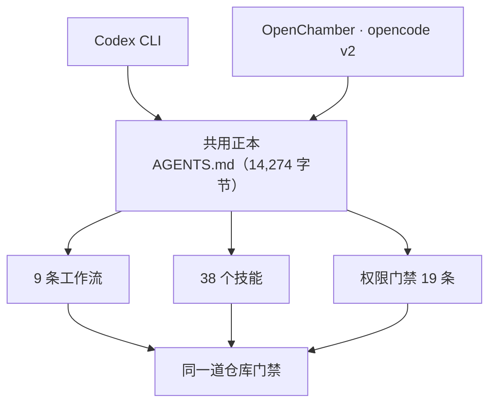

## 课时概要

**核心概念** · 官方索引里的定位：Codex CLI 默认路线与 OpenCode 备选路线。

官方原文：

> 默认 AI CLI 路线：假设你拿到的是一台全新电脑，从 0 安装系统依赖、Node.js、Codex CLI，然后用浏览器完成 Codex 登录。

**原文**：[CLI 配置](https://github.com/tradecatlabs/vibe-coding-cn/blob/develop/docs/getting-started/cli-setup.md) ｜ 15,251 字节 / 505 行 ｜ 第 3 讲（P03）

> 本篇是仓库里的**文档正文**，不是视频。上面写的是**可核对的定位信息**（官方索引原文 + 原文引言 + 实测篇幅），不是内容摘要。

## 本节要点

一句话：**这篇讲的是怎么把 CLI 装进一台新电脑，但它真正花力气的地方是「装完之后谁去配剩下的环境」——原文把配置工作本身委派给了刚装好的 Agent。**

官方立场很明确：**Codex CLI 是默认路线，OpenCode 只是备选。**

> Codex CLI 是本教程默认推荐的 AI CLI。它适合承担从需求拆解、代码修改、命令执行、测试验证到 Git 提交的主流程。
>
> OpenCode CLI 只作为备选方案保留在本文底部：当你暂时无法使用 OpenAI / Codex CLI，或只想接入免费、本地、多模型实验入口时，再使用 OpenCode。

注意第二条那半句「**暂时**无法使用」——这篇里「默认」和「备选」的分界线不是能力高低，而是账号与环境是否可用。

### 一、总流程：八步，只有一步必须由人做

原文把安装路径写成一条八步链：

```text
新电脑
  -> 安装系统基础工具
  -> 安装 Node.js 22+
  -> npm 安装 Codex CLI
  -> codex --version 验证
  -> codex login 浏览器登录
  -> 安全安装本仓库 Codex 配置基线
  -> 进入项目运行 codex
```



八步里唯一必须由人动手的是第六步——它要开浏览器、要授权、可能要输密码。原文据此写了下一段：把第七步之后的活委派出去。这条判断很关键：**安装流程里的人机分工，是按「是否需要授权」切的，不是按「难不难」切的。**

### 二、装完之后：把剩余的配置交给 Agent

原文给了一段可以直接复制到项目里用的委派提示词，前提写得很清楚：

- 我已经能运行 Codex CLI。
- 我已经完成 Codex 登录。
- 当前仓库是 vibe-coding-cn。
- 请尽量主动完成配置，除非遇到**必须由我授权、输入密码、网页登录、购买订阅、处理敏感凭证或执行不可逆操作**的步骤。

最后那串「除非」是整篇最有价值的一句：它把授权边界写进了提示词本身，等于同时定义了 Agent 的主动范围与停止条件。原文对目标的要求是「读取 `docs/getting-started/README.md`，根据我的系统环境，自动检查并配置 Git、Node.js、Python、包管理器、编辑器建议、项目依赖、测试命令和 Git 工作流」，五条要求里前三条都是纪律：

1. 先检查当前系统，不要猜。
2. 能自动执行的就自动执行。
3. 需要我操作的，只输出最小步骤。
4. 每完成一步都运行验证命令。
5. 最后输出已完成项、未完成项、风险和下一步。

### 三、不会操作时的两条求助路径

原文另外准备了两段给网页版 AI 的提示词，分别对应「还不知道该执行哪一段」和「已经报错了」。

第一段的要求有六条，其中两条最有用：**每一步只做一件事**；**每一步执行后都给一个验证命令或验证方法**。同时明确要求「不要假设我已经安装任何前置依赖；按新电脑处理」。

第二段是排错用的，原文在这里给了一条很实用的纪律：

> 如果安装过程中已经报错，不要只复制最后一行错误。请把「你执行的命令 + 完整报错 + 本文档全文」一起发给 AI。

**不要只复制最后一行**——最后一行通常是症状，不是原因。

### 四、四条平台路线，其中一条是备选

原文给了推荐优先级：Windows 11 优先 WSL2 + Ubuntu；Linux 按 Ubuntu / Debian 路线；macOS 用 Homebrew 装 Node.js；Windows 原生 PowerShell 可用，但**长期工程体验不如 WSL2 稳定**。



三条非 Windows 原生路线的差别主要在包管理器，不在 Codex 本身。macOS 那条有一处容易踩的细节：Homebrew 的 `shellenv` 路径分两种架构，Apple Silicon 是 `/opt/homebrew/bin/brew`，Intel Mac 是 `/usr/local/bin/brew`。

### 五、配置基线与启动方式

原文所说的「安全安装本仓库 Codex 配置基线」，指的是仓库里已经准备好、并且**可回滚**的一组文件：

- `tools/config/.codex/config.toml`
- `tools/config/.codex/config.power.toml`
- `tools/config/.codex/AGENTS.safe.md`
- `tools/config/.codex/AGENTS.md`
- `tools/config/.codex/install.sh`

安装、升权和回滚各有一条命令：

```bash
# 从远端安装
curl -fsSL https://raw.githubusercontent.com/tukuaiai/vibe-coding-cn/develop/tools/config/.codex/install.sh | bash

# 已 clone 仓库时
bash tools/config/.codex/install.sh

# 显式安装高权限 power profile
bash tools/config/.codex/install.sh --profile power

# 恢复最近一次安装前的配置
bash ~/.codex/backups/vibe-coding-cn/LATEST/restore.sh
```

日常启动方式是：

```bash
codex --search -m gpt-5.5 -c model_reasoning_effort="xhigh"
```

原文还给了一对别名（Linux / WSL / macOS 用 `~/.bashrc`，macOS 默认 zsh 换成 `~/.zshrc`）：`c` 对应日常启动，`cy` 对应加了 `--dangerously-bypass-approvals-and-sandbox` 的高权限版本。原文对它的警告只有一句，但很重要：**「高权限模式会放开确认与沙箱限制，只能在你确认可信的目录中使用。」**

API Key 模式被明确标成可选，且给了一条容易忽略的提醒：默认推荐浏览器登录，**不要把占位 API Key 写进环境变量，否则可能干扰认证排查**。

### 六、OpenCode 备选路线的最小集

原文给 OpenCode 的篇幅不长，但关键信息齐了。

**什么时候切过去**（三条）：没有可用的 OpenAI / Codex CLI 账号或环境；需要接入 Z.AI、MiniMax、Hugging Face、本地 Ollama 等模型；想保留一条不依赖单一模型提供商的备份路线。

**安装**四条路：一键脚本 `curl -fsSL https://opencode.ai/install | bash`、npm、Homebrew（`brew install anomalyco/tap/opencode`）、Windows 的 Scoop 或 Chocolatey。

**模型**用会话内命令接入：`/connect` 添加提供商，`/models` 切换模型。

| 命令 | 功能 |
| --- | --- |
| `/models` | 切换模型 |
| `/connect` | 添加 API Key |
| `/init` | 初始化项目，生成 AGENTS.md |
| `/undo` | 撤销上次修改 |
| `/redo` | 重做 |
| `/share` | 分享对话链接 |
| `Tab` | 切换 Plan 模式 |

**配置文件**三个位置：全局 `~/.config/opencode/opencode.json`、项目 `./opencode.json`、认证 `~/.local/share/opencode/auth.json`。原文还建议先用 Plan 模式让 AI 规划，确认方案后再执行。

### 七、我们的实况：两个都是主力，分工不同

按本项目实际情况对照一遍（下列数字都是本机实测）：

| 维度 | Codex | OpenChamber · opencode v2 |
| --- | --- | --- |
| 本机版本 | `codex-cli 0.146.0` | `opencode v2.0.15` + OpenChamber.app 2.0.0 |
| 命令位置 | `~/.local/bin/codex` | `~/.local/bin/opencode` |
| 登录状态 | `codex login status` → Logged in using ChatGPT | 无需登录态 |
| 全局配置 | `~/.codex/config.toml` | `~/.config/opencode/opencode.json` |
| 项目配置 | `.codex/prompts/` | `.opencode/{skills,commands,agents,plugins}` + `opencode.json` |
| 本机模型设置 | `model = "gpt-6-astra"`，`model_reasoning_effort = "medium"` | 未在项目里写死 |

两处和原文不一样的地方值得单独说。

**一是「备选」这个词在我们这里不成立。** 官方给 OpenCode 的触发条件是「Codex CLI 暂时不可用」，但我们两个都在用：Codex 承担需求拆解、改代码、跑验证这一路，OpenChamber 承担带界面的日常开发与技能调度。这不是把备选扶正，而是**同一个项目的两个入口**——两个入口能共存而不打架，靠的是下面第二点。


这张图把这一讲压成一屏：中间是八步流程，徽标标出**唯一必须由人做的那一步**，底部两条分别是原文给的四条平台路线与我们自己的实况。注意力该落在那个徽标上——安装流程里的人机分工，是按「是否需要授权」切的，不是按「难不难」切的。


**二是我们给 opencode 侧补了原文明说没有的那一层。** 原文对 OpenCode 的描述停在 `/init`、`/models` 和三个配置文件位置；我们这边的项目里，`.opencode/` 下面还长出了四个目录，另有一个 13,903 字节的 `harness.ts` 插件把两条能力挂进 opencode 的生命周期：



这张图是这一段和上一段的分界：**两个入口之所以不变成两套标准，是因为正本只有一份。** 三个可直接核对的证据：

1. **9 条工作流在三个工具目录下逐字节相同。** `.codex/prompts/`、`.opencode/commands/`、`.claude/commands/` 里各 9 个文件，同名的三个文件 sha256 完全一致（实测 `build.md` / `plan.md` / `ship.md`）——一份正本，三处投影。
2. **技能只有一份。** `.agent-skills/` 下 39 个目录、38 个含 `SKILL.md`，opencode 通过 `.opencode/skills` 软链读它，不复制副本。
3. **门禁分两层，写法不同但意图一致。** 项目 `opencode.json` 里有 10 条静态权限规则（`*.env`、`*.pem`、`*.key` 读与改都 deny，`*.env.example` 放行），另有 3 个 agent 各自 3 条把 `git push*`、`git reset --hard*`、`git clean*` 标成 `ask`。这正好补上原文没写的一段：**高权限不是靠一个全局开关给的，而是靠规则逐条划界。**

这套配置现在的自检结果是 **PASS=14 / FAIL=0**（`bash agent-kit/scripts/verify-opencode-harness.sh`）。

## 关键概念

| 术语 | 原文里的意思 |
| --- | --- |
| 默认路线 | Codex CLI，承担从需求拆解、代码修改、命令执行、测试验证到 Git 提交的主流程 |
| 备选路线 | OpenCode，只在 Codex CLI 暂时不可用、或需要接入免费 / 本地 / 多模型时启用 |
| 委派提示词 | 给本地 Agent 的配置指令：先检查系统不猜、能自动就自动、需人操作只给最小步骤、每步验证 |
| 配置基线 | 仓库自带的 Codex 配置与 AGENTS 文档（含 safe 与 power 两份）+ 可回滚的安装脚本 |
| power profile | 高权限配置档次，需显式 `--profile power` 安装，会放开确认与沙箱限制 |
| 设备码登录 | 无桌面服务器上的登录方式：按终端输出的设备码或链接，在本机浏览器完成授权 |
| 环境变量占位 Key | 原文明确不建议写入的项，理由是它会干扰认证问题的排查 |

## 原文与路径

- 仓库内路径：`docs/getting-started/cli-setup.md`
- 在线原文：[tradecatlabs/vibe-coding-cn/blob/develop/docs/getting-started/cli-setup.md](https://github.com/tradecatlabs/vibe-coding-cn/blob/develop/docs/getting-started/cli-setup.md)
- 所属板块：快速开始
- 下一篇：[开发环境搭建](https://github.com/tradecatlabs/vibe-coding-cn/blob/develop/docs/getting-started/development-environment.md)

## 我的收获

1. **这篇的「默认」与「备选」是可用性排序，不是能力排序。** 官方给 OpenCode 的触发条件是「**暂时**无法使用 OpenAI / Codex CLI」，判断依据是账号与环境，不是谁更强。所以这个词在这里是降级预案的意思，读成「OpenCode 不行」就错了。
2. **整篇最贵的一句是那串「除非」。** 「必须由我授权、输入密码、网页登录、购买订阅、处理敏感凭证或执行不可逆操作」——六类事情列清楚，Agent 的主动范围和停止条件就同时定义完了。这比任何「你要小心」的劝告都有效，因为它可执行。
3. **「不要只复制最后一行错误」是一条零成本的排错纪律。** 最后一行通常是症状，原因在更上面；原文要求的「命令 + 完整报错 + 文档全文」三件套，本质是把上下文一次给够，省掉来回追问。
4. **我们自己的实测补了一条原文没有的经验：多入口不打架，靠的是「正本只有一份」。** 9 条工作流在三个工具目录下 sha256 一致、38 个技能只有一份、门禁规则集中写在项目配置里——有了这三条，多装一个 CLI 就只是多一个入口，而不是多一套标准。

## 待深入

- 原文给了 safe 与 power 两档基线，但没有说明两档的**差别边界**在哪、什么情况下该从 safe 升到 power。它只说详细说明在 `tools/config/.codex/README.md`，正文里没有给判据。
- 高权限启动只给了一条约束——「只能在你确认可信的目录中使用」——但没有给「可信」的判定方法。我们的做法是把危险动作（`git push`、`reset --hard`、`clean`）在项目配置里标成 `ask`，而不是靠整个会话的高权限开关，这是原文没覆盖的另一条路。
- 「换 OpenCode」的触发条件写的是「暂时无法使用 Codex CLI」，但没有说怎么判断是**暂时**还是长期，也没有给「切回来」的流程。这条在实际中会出问题：一个纯检查类脚本在冷启动第一次会报 FAIL、立刻连跑第二遍就是 PASS（后端还没起来）——如果按单次结果判定「Codex 不可用」而切到备选，就会误切。原文没给「重试几次算不可用」的口径。
