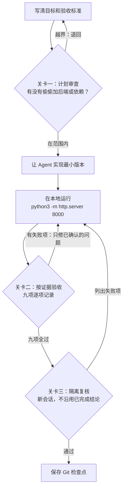

## 课时概要

**核心概念** · 官方索引里的定位：用本地待办清单走通需求、实现、验收和 Git 保存。

官方原文：

> 用一个不依赖框架、不需要账号、可以在本地打开的待办清单，把“想法 → 需求 → 计划 → AI 执行 → 本地运行 → 验收 → Git 保存”完整走一遍。

**原文**：[第一个项目：完成一次可验证闭环](https://github.com/tradecatlabs/vibe-coding-cn/blob/develop/docs/getting-started/first-project.md) ｜ 12,928 字节 / 310 行 ｜ 第 6 讲（P06）

> 本篇是仓库里的**文档正文**，不是视频。上面写的是**可核对的定位信息**（官方索引原文 + 原文引言 + 实测篇幅），不是内容摘要。

## 本节要点

一句话：**练手项目故意做得小到几乎没有技术含量——这一讲要练的不是写代码，而是走完一次有证据的闭环。**

原文开头的四条摘要定了这一讲的基调：

- 本教程的目标不是做出生产级产品，而是亲手完成第一次可验证的状态转移。
- 项目使用原生 HTML、CSS 和 JavaScript，不安装 npm 包，不接入数据库，不调用外部 API。
- AI 负责读取上下文、提出计划和修改文件；你负责确认范围、观察结果和判断是否通过。
- 每一步都有成功判断；没有通过验收时，不进入下一步，也不提交 Git。

最后一条是全文的纪律：**没通过验收，就不进入下一步，也不提交 Git。**


这张图是这一讲的全景：中间横向一条是六步顺序，下面两条是边界（只动四个文件、明确不做），最底下那行是交付时要留下的证据。注意力应该落在最后那行——**「验收结果」和「已知限制」都要写进去**，那才是这一讲唯一承认的完成标准。

### 一、六步闭环，以及它的三道关卡和两条回边

原文把全过程拆成六步：写清目标和验收标准 → 让 Agent 实现最小版本 → 在本地运行 → 按证据验收 → 进行一次隔离复核 → 保存 Git 检查点。

顺序之外，真正决定成败的是挂在这条链上的三道关卡——每一道都可能把人退回上一步。



两道回边的方向不一样：**计划越界是退回第一步重写目标，验收失败是退回修复而不是退回重做。** 原文对失败的处理写得很具体——「如果某项失败，不要直接让 Agent 全部重写」，先记录操作、预期、实际结果、浏览器控制台错误和涉及文件。第三道关卡不修东西，它只判断。

### 二、项目范围：七项做，四类不做，四个文件

要做的是一个离线待办清单，七项范围：

1. 新增一条非空任务。
2. 显示任务列表和空状态。
3. 标记任务已完成或恢复未完成。
4. 删除任务。
5. 使用浏览器 `localStorage` 保存任务，刷新页面后数据仍然存在。
6. 为输入框、按钮和任务状态提供清晰的文字或无障碍标签。
7. 在窄屏幕下仍然可以操作。

同样重要的是四类「明确不做」：不做登录、注册、用户权限和云同步；不做后端、数据库、支付和部署；不引入 React、Vue、Tailwind、构建工具或第三方 CDN；不把任何 Token、密码、个人信息或真实服务地址写入项目。

预期产出只有四个文件：

```text
first-todo/
├── index.html
├── style.css
├── app.js
└── README.md
```

原文在文件清单后面补了一句值得照抄的态度：**「文件数量不是目的；如果 Agent 提出新增依赖或额外目录，先要求它说明理由，不要默认接受。」**

### 三、第 1 步：不要说「帮我做一个好看的待办应用」

原文的劝告很直接：不要一上来就提这种要求，要把目标、边界和证据写成 Agent 可以执行的要求。给 Agent 的那段提示词有三个设计值得学：

- **先不动手。** 开头就写「请先不要修改文件，只阅读当前目录并输出实现计划」，结尾再钉一次：「在我确认计划前，不要创建、删除或修改任何文件。」
- **要它先交五样东西。** 文件职责、数据结构和状态变化、交互流程、验收清单、可能的风险和最小测试方式。
- **把范围写进提示词。** 「必须创建或修改的文件只有」四个，「明确不做」列了八项。

拿到计划后按五问审：它是否仍是本地静态页面、有没有偷偷引入后端或依赖安装？是否覆盖新增、完成、恢复、删除、刷新持久化和空输入？是否说明了**如何验证**，而不是只描述「看起来正常」？是否只触及约定的四个文件？是否把不确定的产品决策列出来，而不是替你猜？

计划越界时原文给了一句现成的回复：`请缩回到最小范围，不增加依赖和后端，并重新列出计划。`

### 四、第 2 步：执行约束六条

计划确认之后才发执行指令，六条约束逐字如下：

1. 只在当前目录工作，只创建或修改 `index.html`、`style.css`、`app.js`、`README.md`。
2. 不安装依赖，不调用网络，不使用外部 CDN，不写入 Token、密码或个人信息。
3. 先实现可用功能，再做有限的样式整理；不要顺手重构或增加未确认功能。
4. 对空输入、重复点击、任务不存在和 `localStorage` 数据损坏等边界情况给出稳定行为。
5. `README.md` 必须写清本地运行命令、功能、验收步骤和已知限制。
6. 完成后列出实际修改的文件、未完成事项和建议的验证命令；**不要声称「已通过」而不提供证据**。

第 6 条和第 3 条是这一讲里最容易被违反的两条：一个管「别多说」，一个管「别多做」。

### 五、第 4 步：按证据验收，九项逐项记录

原文的开头是一句提醒：**「不要只看页面是否漂亮。」** 九项验收每一行都是「操作 → 通过标准」：

| 验收项 | 操作 | 通过标准 |
| --- | --- | --- |
| 初始状态 | 第一次打开页面 | 有清晰标题、输入入口和空状态；控制台没有明显错误 |
| 新增任务 | 输入「学习 Git」，提交一次 | 列表出现对应任务，输入框恢复可用 |
| 空输入 | 不输入内容直接提交，或只输入空格 | 不新增空任务，并给出可理解的提示 |
| 完成与恢复 | 点击任务完成控制，再点击一次 | 状态可在已完成与未完成之间切换，视觉和文字状态一致 |
| 持久化 | 刷新页面 | 「学习 Git」仍然存在且状态正确 |
| 删除 | 删除该任务 | 任务从列表消失；页面回到正确的空状态 |
| 键盘操作 | 只用键盘聚焦输入框并提交 | 基本流程不依赖鼠标；焦点位置可辨认 |
| 窄屏 | 缩窄浏览器窗口或使用移动设备模拟 | 文本、按钮和输入框不重叠，仍可完成新增和删除 |
| 范围与隐私 | 查看源文件和浏览器网络面板 | 没有外部请求、凭据、个人信息或未确认功能 |

最后一项最特别：它验的不是功能，是**边界**。一个功能全对但偷偷发了一次外部请求的实现，在这一项上是不通过的。

### 六、第 5 步：隔离复核

原文用一句话说清了为什么要多做这一步：**「同一个 Agent 既生成又宣布通过，证据强度较弱。」** 注意它说的是证据强度，不是诚信——同一个主体不能既是执行者又是验收者。

复核的做法是把项目目录和一段复核要求交给新会话，要求它「把当前项目当作一个不可信的候选实现」，并且「不沿用任何已完成结论」，先输出通过项、失败项、证据和风险，不要修改文件。

修复时也有两条约束：只修已确认的失败项，不增加新功能，不改变已通过行为；以及一句收尾——**「如果没有可靠证据，请明确写「未验证」。」**

原文还钉了一句底线：**「不要用 Agent 的一句「应该可以」替代浏览器验证。」**

### 七、第 6 步：Git 检查点与完成证据

验收通过之后才初始化 Git，顺序是七条命令：

```bash
git init
git status --short
git add index.html style.css app.js README.md
git diff --cached --check
git commit -m "feat: create first todo project"
git status --short
git rev-parse --short HEAD
```

三个成功判断：`git diff --cached --check` 没有输出错误；commit 成功并返回短提交号；最后的 `git status --short` 看不到未提交的四个项目文件。原文另加了两条安全线——不要把 Token、密码或临时配置文件加入 Git；如果 commit 报「无法识别作者」，先回去配置 Git 用户信息，而不是关掉检查。

最后要留下这份记录：

```text
项目目录：first-todo
本地地址：http://127.0.0.1:8000/
验收结果：新增 / 空输入 / 完成恢复 / 刷新持久化 / 删除 / 键盘 / 窄屏
提交号：<git rev-parse --short HEAD 的输出>
已知限制：仅本地保存，无登录、后端和云同步
```

原文对它的定义是全文最关键的一句：**「这份记录就是本次状态转移的证据」**——它说明从哪个目录、经过哪些动作、以什么标准、到达了什么结果。后面还跟了一句纪律：失败项也应记录，**不要为了「看起来完成」而删除**。

## 关键概念

| 术语 | 原文里的意思 |
| --- | --- |
| 可验证闭环 | 想法 → 需求 → 计划 → AI 执行 → 本地运行 → 验收 → Git 保存，全程留下可复查证据 |
| 成功判断 | 每一步末尾的通过标准；没通过就不进入下一步，也不提交 Git |
| 计划审查 | 拿到计划后先审五件事，重点查有没有偷偷引入后端、依赖或超出四个文件 |
| 最小版本 | 先可实现功能、只做有限样式整理，不准顺手重构或增加未确认功能 |
| 按证据验收 | 九项逐项记录操作与结果，不看页面是否漂亮，最后一项验的是边界与隐私 |
| 隔离复核 | 换新会话、把实现当不可信候选重新检查，因为执行者不能同时当验收者 |
| 未验证 | 复核与修复时允许并要求的诚实标注：没有可靠证据就写「未验证」 |
| Git 检查点 | 验收通过后才提交；提交前用 `git diff --cached --check` 与 `git status` 双重确认 |
| 完成证据 | 目录、地址、验收结果、提交号、已知限制五类信息，失败项也要留着 |

## 原文与路径

- 仓库内路径：`docs/getting-started/first-project.md`
- 在线原文：[tradecatlabs/vibe-coding-cn/blob/develop/docs/getting-started/first-project.md](https://github.com/tradecatlabs/vibe-coding-cn/blob/develop/docs/getting-started/first-project.md)
- 所属板块：快速开始
- 上一篇：[CLI 配置](https://github.com/tradecatlabs/vibe-coding-cn/blob/develop/docs/getting-started/cli-setup.md)

## 我的收获

1. **项目选得这么小是有意的。** 待办清单本身没有技术含量，价值在于它小到能把注意力全放在闭环上——如果练手项目是「做一个商城」，学到的会是「怎么被复杂度拖死」，而不是「怎么用证据确认结果」。
2. **「先不要修改文件，只输出计划」是全篇最便宜的一条。** 它把 AI 的输出从代码换成计划，审查成本随之下一个量级；而审查五问的第一问正好是查它有没有偷偷引入后端或依赖——**先在便宜的地方拦，就不用在不便宜的地方返工**。
3. **隔离复核那句「证据强度较弱」说得很准。** 它没有假设 Agent 会撒谎，而是指出同一个主体既执行又验收这件事本身的证据价值低。这跟 P08 的「AI 说完成了不是证据」是同一句话的两种说法：问题不在诚实与否，在于自述天然不算证据。
4. **失败项也要记录，是这篇最有工程味的一句。** 「不要为了看起来完成而删除」把证据和结论分开了：证据是「操作 + 预期 + 实际」，结论才是通过与否。只留结论不留过程，下一个接手的人就得从头再验一遍。

## 待深入

- 原文说复核要「开启新的会话，或至少明确要求 Agent 暂时不相信上一轮结论」，但没给后者的有效性判据。换会话的代价是上下文全丢；而「让它不信自己」到底有没有用，原文没有验证口径。我们实测过的一点是：换会话复核确实会指出前一轮的问题，但那只能证明它会重新读文件，不能证明它真的独立。
- 九项验收里有好几项的标准是定性的，比如「基本可用」「可理解的提示」「视觉和文字状态一致」。对没有前端经验的人来说，这一项反而最难判。原文给的是操作步骤，没有给「判到什么程度算过」的口径。
- 「不要为了释放端口而结束你不认识的进程」是一条安全纪律，它和「端口被占用就换 8080」放在一起时留了个空白：如果占用 8000 的其实是**这个项目自己**上一次没退干净的服务器进程，换端口只会让两个实例同时在跑。原文没给区分方法。我们这边确实踩过同类问题——一个后台没退干净的本地服务器，会让下一次的检查结果变得不可信。
