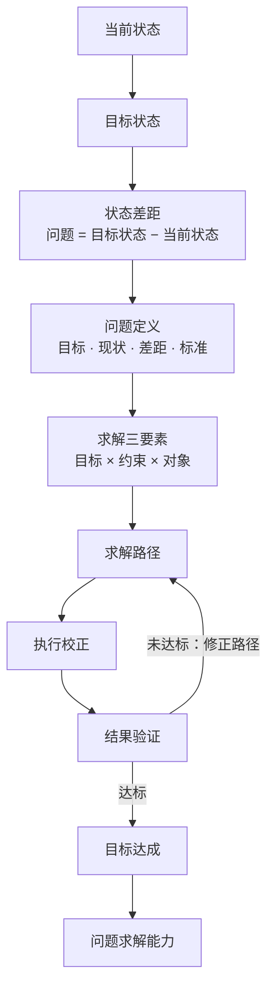
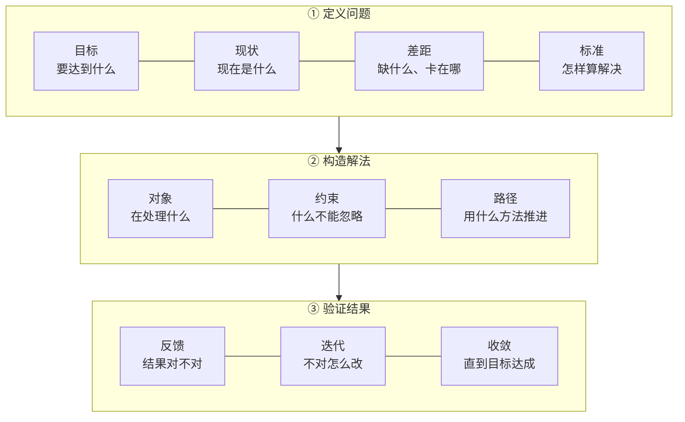
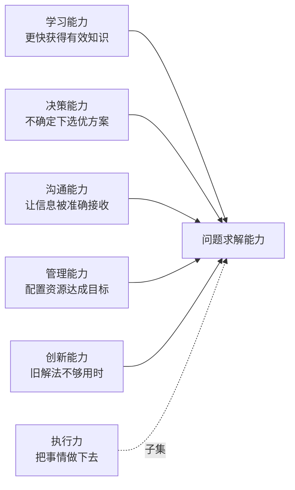

## 课时概要

**核心概念** · 官方索引里的定位：用目标、现状、差距、标准、约束、对象和路径定义问题。

官方原文：

> 目标、现状、差距、标准、约束、对象与路径。

**原文**：[问题求解](https://github.com/tradecatlabs/vibe-coding-cn/blob/develop/docs/concepts/problem-solving.md) ｜ 17,262 字节 / 581 行 ｜ 第 7 讲（P07）

> 本篇是仓库里的**文档正文**，不是视频。上面写的是**可核对的定位信息**（官方索引原文 + 原文引言 + 实测篇幅），不是内容摘要。

## 本节要点

一句话：**把「当前状态」推进到「目标状态」，就是问题求解；这门课后面所有概念都建在这一个模型上。**

### 一、完整链条

原文把它压成一条链，并且明确指出**求解不是一次完成的，靠反馈收敛**：

这张图让人看到两件事：**前半段是「定义」，后半段是「收敛」**；而 `结果验证 → 求解路径` 那条回边才是整条链的关键——没有它，链条只是一次性的计划加执行。原文对这条回边的原话是：**问题求解不是「计划 → 执行 → 结束」，而是「计划 → 执行 → 反馈 → 修正 → 再执行」。**

### 二、三层压缩

同一套东西可以压到一个公式，再展开回三块：

原文给出的压缩路径是 **问题求解 = 定义问题 × 构造解法 × 验证结果**，其中定义问题对应「目标、现状、差距」，构造解法对应「对象、约束、路径」，验证结果对应「反馈、迭代、收敛」。

编号 ①②③ 是原文压缩出来的三段，顺序就是它们串起来的顺序。同一张图也说明了**为什么先定义问题**：三段是串联的，第一段错了，后面两段做得再好也是在解错题。原文的判断是「如果这四件事不清楚，后面所有努力都可能是在解错题」。

### 三、求解三要素决定路径

方案不是凭空来的，是由三个因素共同决定的。原文对每一项都给了落点，这里用表格说清，不再单独出图：

| 要素 | 它决定什么 | 原文给的典型落点 |
| --- | --- | --- |
| 目标 | 方向 | 先能用 → 最简可行方案；做到最优 → 比较与优化；短期见效 → 先打关键瓶颈；长期稳定 → 建系统与机制 |
| 约束 | 边界 | 时间、资源、成本、风险、规则、能力上限、外部环境。**没有约束的方案往往只是空想** |
| 对象 | 方法 | 信息 → 筛选辨别整理；人 → 动机沟通协作；系统 → 结构流程反馈；资源 → 配置优先级效率；环境 → 适应利用改条件 |

### 四、五种能力都是它的场景化展开

这是原文外延最远的一段：很多看起来不同的能力，本质是同一个能力在不同场景里的表现。

图里虚线那条值得单独看一眼：**执行力是问题求解能力的一部分，不是全部**。原文的提醒很直白——一个人执行力强，但问题定义错了，可能会高效率地走向错误方向。

### 五、原文列的三个常见误区

| 误区 | 原文的判据 | 修正方向 |
| --- | --- | --- |
| 把「现象」当成「问题」 | 「我效率低」只是现象 | 重写成「我每天有 3 小时学习时间，但有效专注不到 1 小时，导致一周后无法完成计划」——这样才有目标、现状和差距 |
| 一上来就找方法 | 「有没有什么技巧？」 | 先定义问题，再寻找方法。有些问题真正缺的不是方法，而是目标不清、约束没看见、对象判断错了、验证标准缺失 |
| 只执行，不校正 | 很努力但长期没结果 | 补上反馈系统。原因可能不是不够勤奋，而是没有反馈 |

### 六、原文的结构（581 行怎么走）

这篇其实是**一个框架 × 九种切入角度**，按「学习闭环」排的。知道这个结构，读起来会快很多：

| 节 | 它在做什么 |
| --- | --- |
| 1 接触 | 先给一句话：问题求解能力就是把当前状态推进到目标状态的能力 |
| 2 浏览 | 把框架看成一张「解决问题的地图」，五步走 |
| 3 记忆 | 抽关键词，压成公式（问题 = 目标状态 − 当前状态） |
| 4 理解 | 用「导航」做类比：光输入终点不够，还要知道路况、交通方式、走错能不能重规划 |
| 5 搭建体系 | 全文主干，问四件事：问题从哪来、如何被定义、如何被求解、如何收敛 |
| 6 应用 | 三个场景：提高学习效率、推进工作项目、个人决策（要不要换工作） |
| 7 思辨 | 三个误区 + 一个易混点（问题求解 vs 执行力）+ 三个值得思考的问题 |
| 8 创新 | 四个迁移方向：学习系统、个人成长、创新能力、AI 时代 |
| 9 内化 | 收成四问 + 两条可立即执行的行动建议 |

原文对 AI 时代那句落点值得记住：**AI 可以帮忙生成方案，但人仍然要判断问题是否定义正确、目标是否值得追求、约束是否被遗漏、结果是否真的有效。**

## 关键概念

| 术语 | 原文里的意思 |
| --- | --- |
| 当前状态 / 目标状态 | 现在在哪 / 要去哪里。问题的两端 |
| 状态差距 | 目标状态与当前状态之间的差，**问题就出现在这里** |
| 问题定义 | 回答四件事：目标、现状、差距、判断标准。四件事不清楚，后面都是解错题 |
| 求解三要素 | 目标、约束、对象。方案由这三者共同决定，不是凭空来的 |
| 求解路径 | 从现状走到目标的走法：拆解、排序、试错、反馈、修正 |
| 反馈迭代 | 执行、对比目标、发现偏差、修正路径、再执行。求解靠它收敛 |
| 收敛 | 「直到目标达成」这件事本身，不是一步到位的 |
| 问题求解能力 | 准确定义问题，并在目标、约束、对象之下，设计并执行有效求解路径的能力 |

## 原文与路径

- 仓库内路径：`docs/concepts/problem-solving.md`
- 在线原文：[tradecatlabs/vibe-coding-cn/blob/develop/docs/concepts/problem-solving.md](https://github.com/tradecatlabs/vibe-coding-cn/blob/develop/docs/concepts/problem-solving.md)
- 所属板块：核心概念

## 我的收获

1. **「问题 = 目标状态 − 当前状态」这个减法，把「我有个问题」从情绪变成了结构。** 说不清是哪两项在相减，就还没到能求解的程度。
2. **前半段是定义，后半段是收敛。** 而回边（结果验证 → 修正路径）是唯一让链条能真正抵达目标的东西，少了它就是一次性计划。
3. **执行力是子集而不是同义词。** 原文那句「高效率地走向错误方向」比任何「要努力」的劝告都更有说服力。

## 待深入

- 原文把公式写成「问题求解 = 定义问题 **×** 构造解法 **×** 验证结果」，用的是乘法号。从上下文看更像三段串联，但在原文里没有解释为什么是乘而不是加。乘法意味着任何一项为零则整体为零，这个更强的含义是有意的吗？
- 「标准：怎样算解决」被列在定义问题里，但验证结果那一块也在讲「对比目标」。当目标本身可量化程度很低时（比如「让文章更有说服力」），标准该定在目标这一层还是单独拆出来？
- 原文第 8 节把迁移延伸到「AI 时代」，说法是人负责判断问题定义、目标、约束、结果、现实这五件事。这五件事和前面「定义问题 + 验证结果」是同一套吗，还是 AI 时代多出来了一项？
