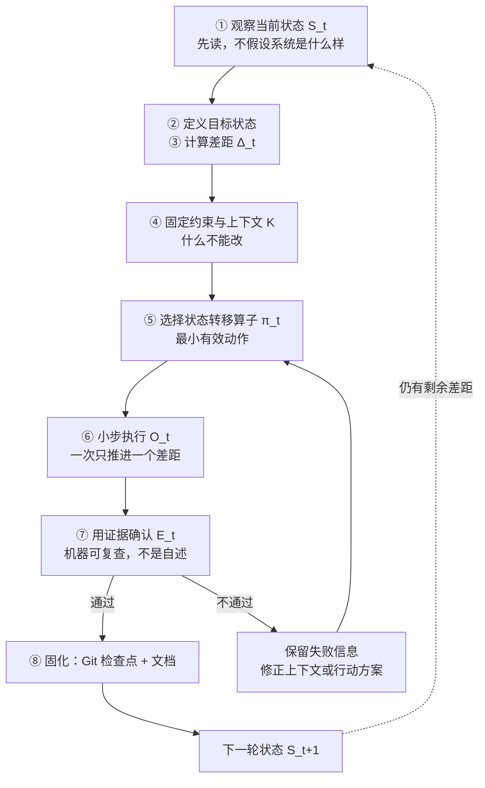
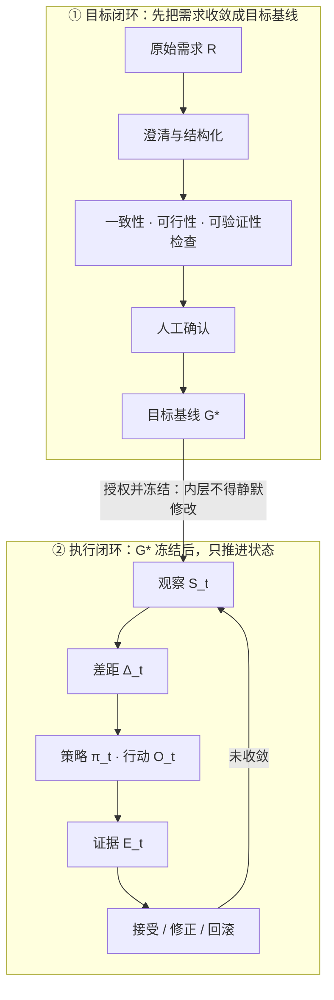
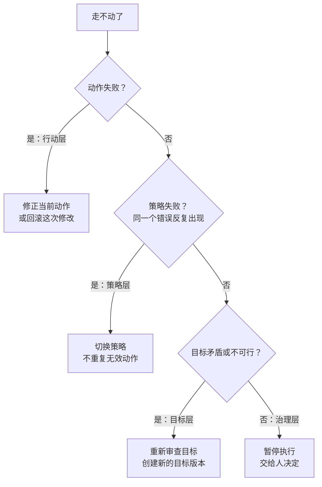

## 课时概要

**核心概念** · 官方索引里的定位：用固定目标、可变策略和分层反馈统一理解 Vibe Coding。

官方原文：

> 在约束下，通过 AI 和工具，把系统从当前状态推进到目标状态，并用证据确认结果。

**原文**：[Vibe Coding 状态转移闭环](https://github.com/tradecatlabs/vibe-coding-cn/blob/develop/docs/concepts/vibe-coding-state-transition.md) ｜ 16,061 字节 / 353 行 ｜ 第 8 讲（P08）

> 本篇是仓库里的**文档正文**，不是视频。上面写的是**可核对的定位信息**（官方索引原文 + 原文引言 + 实测篇幅），不是内容摘要。

## 本节要点

一句话：**Vibe Coding = 人定义并授权目标，Agent 选择并执行行动，工具改变状态，验证器提供反馈，Git 固化历史。**

原文还顺手做了一个区分：OpenSSF 对「纯 Vibe Coding」的定义是**接受 AI 代码但不阅读、不理解、不审查**；这篇把它升级成了工程化版本——人必须负责目标、边界和验收，AI 输出必须经过验证。

### 一、一轮状态转移怎么走



这张图让人看到三件事：**前四步都在「说清楚」，只有第 5 步之后才开始动手**；`证据不通过` 有一条明确的回边，而不是继续往前；以及链尾那条虚线——一轮结束不等于任务结束，只要还有差距就回到观察。

三处原文写得很硬的判据：第 1 步的纪律是「**不直接假设系统是什么样**」；第 6 步要求「一次只推进**一个**可以验证的差距」；第 7 步那句是全文最扎的一句——「**『AI 说完成了』不是证据**」，证据应尽量来自机器或可复查记录。

### 二、两个嵌套闭环：目标在外，执行在内



图里那条从上往下的边是整篇的枢纽：**目标基线是内层的输入，也是内层的不变量。** 执行闭环里可以换策略、可以回滚，但目标基线不被静默改动。

原文特意澄清了两个容易读歪的词：

| 词 | 不是这个意思 | 原文的准确含义 |
| --- | --- | --- |
| 固定目标 | 目标永远不能变 | **未经授权不能被执行者静默改变**；合法变化必须创建新的目标版本 |
| 收敛 | 保证每一步都成功 | 在验证、回滚、尝试上限和退出机制约束下，**进入并保持在目标验收集合中** |

### 三、九个符号就是这套系统的全部词汇

原文把整套模型压成九个符号，并且给每个符号配了「核心问题」：

| 符号 | 名称 | 核心问题 | 在 Vibe Coding 中的表现 |
| --- | --- | --- | --- |
| `R` | 原始需求 | 用户最初想解决什么 | 想法、对话、Issue、业务请求和问题描述 |
| `G*` | 目标基线 | 这一轮必须达到什么 | 目标、约束、非目标、验收条件和证据要求 |
| `S_t` | 当前状态 | 现在是什么情况 | 需求、代码、文件、环境、测试、版本和运行结果 |
| `Δ_t` | 状态差距 | 还缺什么 | 尚未满足的功能、信息、能力、证据和修复项 |
| `K` | 约束与上下文 | 什么不能改变 | 规则、预算、技术栈、权限、安全、文档和边界 |
| `π_t` | 当前策略 | 采用什么路线 | 任务拆解、技术方案、工具选择和验证方案 |
| `O_t` | 行动与工具 | 实际做什么 | Prompt、Skill、Agent、脚本、编辑器、测试和部署工具 |
| `E_t` | 证据与验证 | 怎么证明结果 | 测试、审查、类型、schema、运行结果、指标和验收记录 |
| `H` | 固化与反馈 | 如何保存并进入下一轮 | Git commit、版本、日志、复盘、回滚和新的差距清单 |

两处定义值得单独记住：**「状态」不只是代码**，也包括需求、上下文、环境、质量、版本和交付条件；**「差距」不是数值相减**，而是当前状态与目标状态之间尚未满足的结构化条件。

目标验收集合写成：

```text
A(G*, K) = 满足目标基线 G* 且不违反约束 K 的所有可接受状态
```

所以收敛**不要求唯一实现**——只要状态进入 `A(G*, K)`，并在重新验证后保持稳定，这一轮就算达成。

### 四、走不动的时候，往哪一层升级



原文把这一层写成一句「**低层负责做事，高层负责纠偏**」，四层各自负责什么、失败时怎么做：

| 层级 | 负责什么 | 失败时怎么做 |
| --- | --- | --- |
| 行动层 | 执行命令、修改文件、运行测试 | 修正当前动作或回滚当前修改 |
| 策略层 | 任务拆解、技术方案、工具和验证路线 | 切换策略，不重复无效动作 |
| 目标层 | 需求、范围、约束和验收标准 | 重新澄清目标，创建新的目标版本 |
| 治理层 | 权限、风险、预算和最终取舍 | 暂停执行、人工接管或终止任务 |

这张决策树真正立住的是那条纪律：**要先排除「动作本身错了」，才允许往上走**。原文同时划了权限边界——Agent 可以发现问题、提出策略、建议目标变更，**但不能自行批准目标变更**。

### 五、什么算收敛，什么算「没有进展」

原文两份清单都值得对照着用。**同时满足**才可标记完成：

- 目标基线 `G*` 明确，没有未处理的关键冲突
- 当前状态已满足 `A(G*, K)`
- 测试、运行结果或人工验收提供了**可复查证据**
- 独立复核没有发现关键回归、范围漂移或安全问题
- 目标、约束和验收标准**没有被静默修改**
- 已保存 Git 检查点，并且知道失败时如何回滚

以下情况应判定为「没有进展」，**而不是继续盲目重试**：

- 连续若干次动作没有减少状态差距
- 同一个错误反复出现
- 修改越来越多，但验收结果没有改善
- 每次修复都引入新的同等或更严重的问题
- **Agent 开始修改目标、降低标准或扩大范围来「制造通过」**

最后一条是全文最值得警惕的失败模式：它不是做错了，而是**把尺子改了**。

### 六、原文的结构（353 行怎么走）

| 节 | 它在做什么 |
| --- | --- |
| 结论 | 一句话定义 + 11 步主链 + 压缩成「人、Agent、工具、验证器、Git」五个角色 |
| 为什么需要这个模型 | 只把 Vibe Coding 当「让 AI 写代码」会漏掉哪五件事 |
| 总模型 | 两个嵌套闭环 + 九符号表 + 验收集合 `A(G*, K)` |
| 一轮状态转移怎么进行 | 全文主干，8 步逐条给判据和输出要求 |
| 分层反馈、策略切换与升级 | 四层责任表 + 升级判断顺序 + 权限边界 |
| 什么情况下算收敛 | 收敛六条件 + 「没有进展」五情形 |
| 成熟框架如何映射 | Double Diamond / Scrum / NASA V&V / NIST SSDF / DORA / PDCA 各覆盖哪一段 |
| 项目能力在总模型中的位置 | 10 个项目资产各自在状态转移里干什么 |
| 必学核心与暂时忽略 | 9 条必学 + 5 类可以先放下的东西 |
| 推荐学习顺序 | 9 步主线 |
| 学习 Vibe Coding 本身也是状态转移 | 把同一闭环套在学习者身上 |
| 常见失败模式 | 把生成当完成 / 只给目标不给边界 / 一次推进太大 / 用工具列表代替模型 / 没有历史和回滚 |
| 适用边界 | 能统一开发·学习·研究·文档·自动化·协作，但**不能替代领域专业知识，也不能保证目标本身正确** |

## 关键概念

| 术语 | 原文里的意思 |
| --- | --- |
| 目标基线 `G*` | 当前版本的目标契约：目标、约束、非目标、验收条件、证据要求、未决假设和变更授权 |
| 状态转移闭环 | 在约束下把系统从当前状态推进到目标状态，并用证据确认结果 |
| 验收集合 `A(G*, K)` | 满足目标基线且不违反约束的所有可接受状态。收敛是进入并保持在它里面 |
| 状态差距 `Δ_t` | 尚未满足的**结构化条件**，分需求／知识／代码／环境／测试／交付六类 |
| 状态转移算子 | 根据差距选出的最小有效动作：理解、规划、实现、验证、复用 |
| 分层反馈 | 行动 / 策略 / 目标 / 治理四层，低层做事、高层纠偏 |
| 静默修改 | 未经授权改变目标基线。这是被明令禁止的动作，是合法变更的反面 |
| 固化与反馈 `H` | Git commit、版本、日志、复盘、回滚，以及新的差距清单 |
| 收敛 | 不要求唯一实现；进入验收集合并通过重新验证后保持稳定 |

## 原文与路径

- 仓库内路径：`docs/concepts/vibe-coding-state-transition.md`
- 在线原文：[tradecatlabs/vibe-coding-cn/blob/develop/docs/concepts/vibe-coding-state-transition.md](https://github.com/tradecatlabs/vibe-coding-cn/blob/develop/docs/concepts/vibe-coding-state-transition.md)
- 所属板块：核心概念

## 我的收获

1. **「固定目标」真正约束的不是目标本身，而是「谁能改它」。** 原文那句「未经授权不能被执行者静默改变」，把「目标漂移」从一个模糊的感觉变成了一个可以判定的违规——有版本、有差异、有授权，就合法；没有，就是静默修改。
2. **「AI 说完成了不是证据」这句话，把验证从「信任」挪到了「可复查记录」。** 证据要来自机器或可复查记录，而不是来自执行者的自述——执行者同时也是被验收方，它的自述天然不是证据。
3. **收敛不等于「达成」。** 原文的定义是「进入并保持在验收集合」，并且明确不要求唯一实现。这解释了一件事：为什么同一件事可以有多种正确做法——只要它们都落在 `A(G*, K)` 里，就没有谁更「对」。

## 待深入

- 验收集合写成「**可接受**状态的集合」，但「可接受」由谁判定？收敛条件里有一条是「独立复核没有发现关键回归」——独立复核本身也得有一个标准，这个标准属于目标基线 `G*` 的一部分，还是属于治理层？
- 原文给了九个符号（`R` `G*` `S_t` `Δ_t` `K` `π_t` `O_t` `E_t` `H`），但「分层反馈」的四层（行动／策略／目标／治理）没有出现在符号表里，也没有和 `π_t`／`H` 对齐。四层是第九个符号之外的第十个维度，还是能映射进去？
- 原文既要「任何层级都设置尝试上限和退出路径」，又要「目标涉及价值取舍或无法判断 → 交给人决定」。人不在场时这两条会打架：尝试上限到了，但目标还没人裁决，系统应该停在哪个状态？
