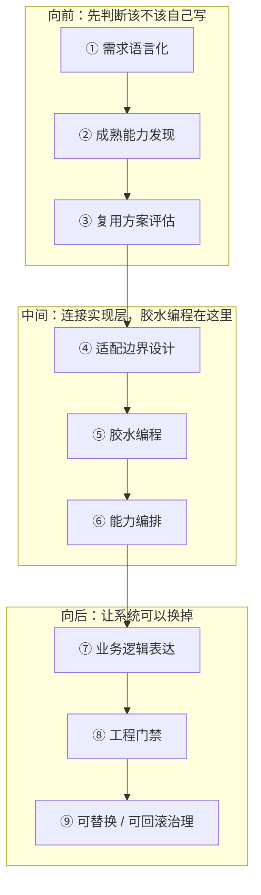
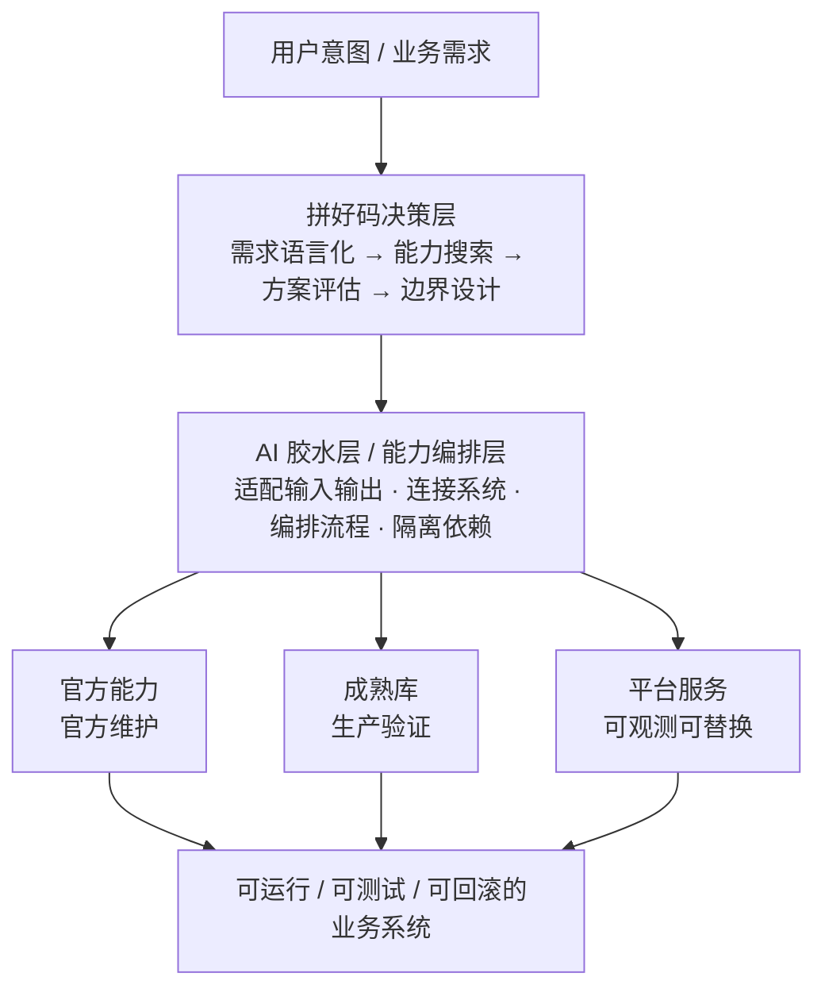
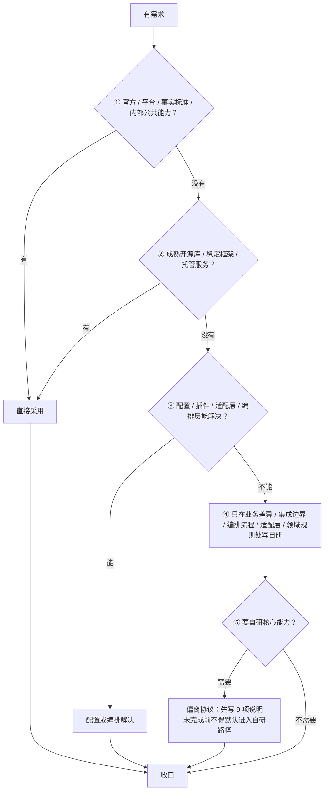

## 课时概要

**核心概念** · 官方索引里的定位：复用成熟能力，用胶水代码连接、编排、适配业务流程。

官方原文：

> 成熟能力解决通用问题，胶水代码连接业务流程，自研只服务真正不可替代的差异。

**原文**：[拼好码](https://github.com/tradecatlabs/vibe-coding-cn/blob/develop/docs/concepts/glue-coding.md) ｜ 20,728 字节 / 510 行 ｜ 第 10 讲（P10）

> 本篇是仓库里的**文档正文**，不是视频。上面写的是**可核对的定位信息**（官方索引原文 + 原文引言 + 实测篇幅），不是内容摘要。

## 本节要点

一句话：**默认答案不是「我来实现」，而是「有没有成熟能力可以直接接上」。** 自研从默认选项变成需要举证的例外选项，这是原文里唯一一处真正改变工程判断方向的机制。

原文把这个立场写成了一个加法定式：

```text
拼好码 = 需求语言化
       + 成熟能力发现
       + 复用方案评估
       + 适配边界设计
       + 胶水编程
       + 能力编排
       + 业务逻辑表达
       + 工程门禁
       + 可替换/可回滚治理
```

九项里只有第五项是「写代码」，其余八项都在做判断、划边界、设门禁。下面这张图是它的比喻形态：成品模块不是我们造的，我们要造的只是那道薄薄的接缝。


图里每一块都是成品件，形状、材质和来源各不相同，把它们连起来的只有一条细缝。原文给这条缝定了硬约束——**胶水代码应该短、薄、清晰、可测试、可删除**，它越像业务编排层而不是底层框架，越符合拼好码。

### 一、拼好码不是胶水编程的替代，而是它的超集

原文的定位很清楚：**胶水编程关注「如何用最少胶水代码把成熟模块连接起来」，拼好码在此基础上向前、向后各扩一段。**

- 向前：从用户意图出发，先判断需求能否被成熟能力覆盖。
- 中间：选择成熟方案，设计适配边界，用胶水代码完成连接与编排。
- 向后：把业务流程做成可运行、可验证、可替换、可回滚的系统。



九环里被原文明确称为「层」的只有第五环：胶水编程是拼好码里的**连接实现层**，不是拼好码的全部。前后两段——先判断该不该自己写、让系统可以换掉——是胶水编程没有覆盖的部分，也是拼好码真正加出来的东西。

### 二、四次范式转移，一行一次

原文用四行对比交代了这件事的来路：

```text
传统编程：人写代码
Vibe Coding：AI 写代码，人审代码
胶水编程：AI 连接代码，人审连接
拼好码：AI 搜索/评估/连接/编排能力，人审目标/边界/门禁/取舍
```

四行连起来看，移动的其实只有两件事：**AI 的职责从「写」一路后移到「查、评、接、编排」，人的职责从「审代码」一路前移到「定目标、划边界、设门禁、做取舍」。**

原文在范式转移那一节补了七条，其中三条是明确的禁令：不再默认让 AI 从零生成底层能力；不再重复造轮子；不再把「自己写」当作更可控。另外四条各自指派了职责——优先复用经过生产验证的官方能力、平台能力、开源项目和事实标准；AI 负责理解意图、查找能力、评估方案、生成适配层、编排流程；人负责说清目标、设定边界、审查取舍、设计门禁；机器门禁负责把自然语言验收标准变成测试、CI、schema、类型、脚本和检查清单。

### 三、架构哲学：意图在上，胶水在中，成熟能力在下

原文给了一张五层分层图，把「谁在上、谁在下、谁可以被换掉」画清楚了。



值得看的是第三层下方那个三岔：胶水层挂着的不是「一个后端」，而是三类可以各自独立替换的能力来源，而且三类并列，原文没有给任何一类特权地位。原文还给这套结构配了五个抽象：

| 抽象 | 原文里的定义 |
| --- | --- |
| 实体 | 成熟的开源项目、官方 SDK、平台能力、托管服务、内部公共能力 |
| 连接 | AI 生成或辅助生成的胶水代码，负责数据流转、接口适配和流程编排 |
| 边界 | 隔离第三方模型、SDK、API 与核心业务模型 |
| 门禁 | 测试、类型、schema、lint、CI、脚本和审查清单 |
| 目标 | 可运行业务流程和可替换业务系统 |

### 四、三个老问题，换了三次答案

原文把「为什么有效」拆成三个具体问题，每个问题的答案都不是「让 AI 更聪明」，而是改变任务形态。

| 老问题 | 原文的答案 | 机制 |
| --- | --- | --- |
| 幻觉 | 从「发明」转向「核验」 | 缩小发明空间：先找真实存在的成熟能力，再读官方文档、README、示例和类型定义，再生成适配层，最后用测试、运行结果和 CI 校验 |
| 复杂性 | 转交给成熟生态 | 复用生态已经支付过的试错成本、测试成本、维护成本和生产验证成本 |
| 门槛 | 从底层实现转向业务编排 | 不必自己实现认证、支付、调度、日志、存储、解析、渲染和监控，只需说清目标、选能力、划边界、编排流程 |

三条之后原文补了一句判断：**「这要求的不是低水平，而是更高水平的工程判断。」** 幻觉那条尤其值得记：减少幻觉的办法不是相信模型更可靠，而是把它的任务从「发明底层能力」换成「理解、连接、转换和验证」。

### 五、决策顺序：五步走到底，走不到就写偏离说明

原文给了五步决策顺序，前四步按顺序扩大搜索范围，第五步是自研的唯一合法入口。



这张图真正立住的是一条顺序纪律：**先官方、再生态、再配置，最后才轮到自研**，而且自研还分成两种——业务差异处的薄胶水可以直接写，核心能力必须有偏离说明。原文对最后一步的措辞是「未完成偏离说明前，不得默认进入自研核心能力实现路径」。

不过「成熟」不等于「随便用」。原文另给了一套判断标准，五条缺一不可：

- 是否由官方、主流社区、头部厂商或长期稳定组织维护。
- 是否有清晰文档、版本记录、测试覆盖、安全更新和活跃维护。
- 是否被真实生产环境广泛使用。
- 是否与当前技术栈、团队能力、部署环境和合规要求兼容。
- 是否具备可观测、可测试、可回滚、可替换和边界隔离能力。

接着是一句全文最容易被跳过、但分量很重的话：**「成熟方案不等于盲目依赖。没有边界、不可替换、不可回滚的复用，会从效率优势变成锁定风险。」**

### 六、胶水代码的合理边界

原文用两份清单把自研范围切开了。**可以做**的七件事：

- 连接不同系统。
- 封装业务流程。
- 适配输入输出。
- 组合已有能力。
- 隔离第三方依赖。
- 表达项目特有业务规则。
- 实现成熟方案确实无法覆盖的差异化核心能力。

**禁止做**的六件事：

- 重复实现已有成熟框架。
- 重复实现通用基础设施。
- 无理由重写稳定库。
- 为了控制感、安全感或技术偏好制造私有轮子。
- 在未调研成熟方案前直接进入自研实现。
- 让第三方 SDK、外部 API 或平台私有模型污染核心业务模型。

原文把最后一条阵营背后的心理写得很直白：**「拼好码反对的是工程中的控制幻觉」**——开发者常把「自己写」误认为更可控、更安全、更优雅，但真实世界里，自研通常意味着更高缺陷率、更高维护成本、更弱生态支持和更差长期稳定性。

### 七、实践流程：七个步骤，每步都有要问的问题

原文把整条路径写成了七步，每一步配一组自问：

| 步骤 | 要问的问题 |
| --- | --- |
| 一 · 明确目标 | 要实现什么业务结果？输入是什么？输出是什么？验收标准是什么？ |
| 二 · 寻找成熟能力 | 有没有官方能力、平台能力、内部公共能力？有没有事实标准、成熟框架、开源库、托管服务？ |
| 三 · 评估可复用方案 | 维护状态、许可证、安全风险、生产案例、团队熟悉度如何？是否可观测、可测试、可替换、可回滚？ |
| 四 · 设计适配边界 | 外部 SDK 和 API 如何隔离？核心业务模型如何保持干净？失败、限流、重试和回滚怎么处理？ |
| 五 · 编写胶水代码 | A 的输出如何变成 B 的输入？如何封装流程、转换数据、组合能力？ |
| 六 · 设计工程门禁 | 测试、类型、schema、lint、CI、脚本和检查清单如何覆盖验收标准？ |
| 七 · 形成可替换系统 | 如果第三方方案失效，替换路径是什么？如果本次选择失败，如何回滚？ |

第四步和第七步是这条流程里最不像「写代码」的两步，也是最容易在赶进度时被省掉的两步。而原文把「可替换」和「可回滚」直接放进了拼好码的九项加法定式里，说明它们不是收尾工作，是交付内容的一部分。

原文还附了一个把需求翻译成生态关键词的提示词模板，做法是让 AI 先分析需求涉及哪些成熟能力领域，再推荐 GitHub Topics、官方能力和主流开源项目，最后逐个评估成熟度、维护状态、许可证、替换风险和接入成本。它给了一张示例对照：Telegram Bot 对应官方 Bot API 与 `telegram-bot` topic；数据分析对应 pandas、polars、duckdb；AI Agent 对应官方 SDK 与主流编排框架；CLI 工具对应 cli framework 与 argparse/click/typer；Web 爬虫则是官方 API 优先，其次才是 playwright 和 scrapy。

### 八、经典案例与三个常见场景

原文给了一个完整案例和三个场景，都是同一套动作的不同外观。

**Polymarket 数据分析 Bot** 的拆法是：成熟能力 1 用 Polymarket 官方或主流 SDK 拿数据，成熟能力 2 用 pandas、polars 或 duckdb 做分析，成熟能力 3 用 python-telegram-bot 推送，成熟能力 4 用 cron、workflow 或 queue 做调度；胶水代码只负责拉数据、转成统一内部结构、调用分析函数、生成消息、推送、记日志和重试。原文的结论是：关键不是自己造一个 Polymarket SDK，而是把成熟能力拼成可运行、可替换、可观测的业务流程。

| 场景 | 错误路径 | 拼好码路径 |
| --- | --- | --- |
| 登录认证 | 自己设计密码加密、Token 签发、OAuth 流程、验证码和权限基础设施 | 优先评估云厂商认证服务、Auth0、Firebase Auth、Keycloak、企业统一身份系统或框架内置认证模块 |
| AI 客服 | 从零训练模型、写向量数据库、写知识库检索、写对话管理、写监控系统 | 优先使用成熟大模型 API、向量数据库、RAG 框架、客服平台和日志监控工具 |
| 订单流程 | 自己写完整调度系统、消息队列、重试机制、状态机、通知系统 | 优先使用成熟消息队列、任务调度平台、工作流引擎、云函数、监控告警服务 |

三个场景分工一致：外部能力承担通用复杂度，胶水代码只做业务接缝——把认证结果接进业务用户体系、把外部用户 ID 映射到内部用户模型、把业务知识整理成检索输入、把订单状态变化串成触发链。

### 九、偏离协议：自研要先申请

拼好码不禁止自研，但它要求自研有理由，而且理由要成文。偏离胶水原则时，必须说明九件事：

- 偏离原因。
- 已评估的成熟方案。
- 为什么成熟方案不能满足关键约束。
- 自研范围和边界。
- 维护成本。
- 安全风险。
- 供应商锁定或私有实现锁定风险。
- 测试策略。
- 替换、删除或回滚路径。

九项里有一半是成本与风险，另一半是退出路径。原文的措辞是「未完成偏离说明前，不得默认进入自研核心能力实现路径」——注意是「不得默认」，不是「不得」。

### 十、胶水原则之禅，与四组容易混淆的概念

原文最后用一份 26 条的清单收束，写法接近格言，其中 22 条是「A 优于 B」的取舍式：

> 成熟方案优于自研实现。官方能力优于私有轮子。事实标准优于个人偏好。复用优于重写。编排优于重造。适配优于侵入。连接优于耦合。资源整合优于单打独斗。薄胶水优于厚平台。业务逻辑优于基础设施。平台能力优于底层代码。稳定生态优于新奇技术。长期维护优于短期快感。可替换优于强绑定。可回滚优于不可逆。可验证优于想当然。少写代码优于多造代码。必要自研优于盲目复用。明确边界优于隐式依赖。充分理由优于控制幻觉。

另有三条是禁则加一条结论：偏离必须说明；自研必须克制；能复用时，不要重造；能编排时，不要发明；能适配时，不要入侵；如果成熟方案能可靠满足需求，它就应该是默认答案。

一个概念要跟四组相近说法区分开：

| 对比 | 原文的切分 |
| --- | --- |
| 拼好码 vs 胶水编程 | 胶水编程是「把轮子粘起来」；拼好码是「先判断该用哪些轮子，再设计边界、粘起来、验证它、让它可替换」 |
| 拼好码 vs 低代码 | 低代码是用平台快速搭应用，可以是拼好码的一种工具，但拼好码不等于低代码 |
| 拼好码 vs 微服务 | 微服务是系统拆分架构，拼好码是复用优先的工程哲学；微服务如果盲目自研基础设施，反而违背拼好码 |
| 拼好码 vs 自研平台化 | 平台化追求沉淀公共能力，拼好码警惕「厚平台」；只有公共能力确实稳定、复用频繁、边界清晰时，平台化才有价值 |

### 十一、原文的结构（510 行怎么走）

| 节 | 它在做什么 |
| --- | --- |
| 关系定位与一句话定义 | 拼好码 = 胶水编程的超集；九项加法定式 |
| 颠覆性宣言 | 四类痛点各自对应「胶水编程的解法」与「拼好码的扩展」 |
| 核心理念与范式转移 | 四种编程形态的职责对比；七条职责指派 |
| 架构哲学与核心链路 | 五层分层图 + 五个抽象 + 九个节点的主链 |
| 为什么有效 | 幻觉、复杂性、门槛三个问题的答案 |
| 胶水原则与决策顺序 | 默认答案的定义 + 五步决策顺序 |
| 成熟方案判断标准 | 五条硬指标 + 锁定风险警告 |
| 胶水代码的能与不能 | 七条合理边界 + 六条禁止事项 |
| 实践流程 | 七步流程 + 每步自问 + GitHub Topics 检索模板 |
| 经典案例与常见场景 | Polymarket Bot + 登录认证、AI 客服、订单流程 |
| 偏离协议 | 自研前必须说明的九项 |
| 胶水原则之禅 | 26 条取舍格言 |
| 与相近概念的区别 | 对比胶水编程、低代码、微服务、自研平台化 |
| AI 时代的拼好码与内化 | AI 适合生成哪八类代码；从「我来实现」到「该不该自己写」 |
| 延伸阅读 | 语言层要素、胶水开发提示词库 |

## 关键概念

| 术语 | 原文里的意思 |
| --- | --- |
| 拼好码 | 以「胶水原则」为核心的工程方法：优先复用成熟方案，只写必要的连接、编排、适配、隔离与业务代码 |
| 胶水原则 | 最高级别的「不重复造轮子」：能复用成熟方案就不自研底层能力，默认答案不是「我来实现」 |
| 成熟能力 | 官方能力、平台能力、事实标准、主流框架、成熟库、稳定工具、开源仓库、内部公共能力 |
| 胶水代码 | 负责连接、编排、适配、隔离和表达业务逻辑的薄代码；标准是短、薄、清晰、可测试、可删除 |
| 适配边界 | 隔离第三方模型、SDK、API 与核心业务模型的那一层 |
| 工程门禁 | 把自然语言验收标准变成测试、类型、schema、lint、CI、脚本和检查清单 |
| 偏离协议 | 自研前必须完成的九项说明；未完成前不得默认进入自研核心能力实现路径 |
| 控制幻觉 | 把「自己写」误认为更可控、更安全、更优雅的心理倾向，原文点名反对 |
| 可替换 / 可回滚治理 | 让第三方方案失效时可换、本次选择失败时可退的那套设计 |

## 原文与路径

- 仓库内路径：`docs/concepts/glue-coding.md`
- 在线原文：[tradecatlabs/vibe-coding-cn/blob/develop/docs/concepts/glue-coding.md](https://github.com/tradecatlabs/vibe-coding-cn/blob/develop/docs/concepts/glue-coding.md)
- 所属板块：核心概念

## 我的收获

1. **这篇真正的新东西是把举证责任倒置了。** 原文那句「自研不是默认选项，而是需要证明合理性的例外选项」，改变的不是「少写代码」这个风格偏好，而是「谁需要解释自己」——以前是复用者要解释为什么不自己写，现在是自研者要解释为什么不能复用。
2. **幻觉治理在这里被换成了任务形态问题，而不是模型能力问题。** 四步顺序（先找真实存在的能力、再读官方文档与类型定义、再生成适配层、最后用测试和 CI 校验）里，三步都在缩小 AI 的发明空间。这解释了为什么同一句提示词在「从零实现」和「接入现成能力」两种任务下出错率差那么多——前者要求它发明，后者只要求它连接。
3. **「能复用时，不要重造。能编排时，不要发明。能适配时，不要入侵。」这三句各划一条边界。** 第三句最容易被忽略：适配而不是入侵，意味着第三方 SDK 的字段名、错误码和分页约定不许渗进核心业务模型。一旦渗进去，将来替换就不是换一个依赖，而是重写业务层——原文把这种状态叫「锁定风险」，也解释了为什么「隔离第三方依赖」被列为胶水代码的合法职责之一。
4. **「薄胶水优于厚平台」是一条平台化的刹车。** 它承认平台化有价值，但加了三个前置条件：公共能力确实稳定、复用频繁、边界清晰。少了任何一个，平台就从资产变成负债——而平台是自己造的，正好落在这篇文档反对的那类自研里。

## 待深入

- 原文说「成熟方案能以**可接受的**成本、风险和复杂度可靠满足需求时，它就是默认答案」，但全文只给了「成熟」的五条判据，没有给「可接受」的判据或阈值。当两者冲突时——比如一个库极其成熟、但接入成本很高——该按哪一条裁决？这个空白正好落在最需要判断的地方。
- 偏离协议的九项说明由谁来审定？原文只写「未完成偏离说明前，不得默认进入自研核心能力实现路径」，没有写「完成后需要谁批准」。按 P08 的目标变更规则，改目标需要人工授权；那么自研核心能力的授权层级，是写到纸面即可，还是要过一道人？
- 薄胶水层的总量会随接入的成熟能力数量增长。接入 20 个第三方服务时，「薄」还成立吗？这一层本身由谁维护、要不要也画边界？原文给了胶水代码「应该做什么」的清单，但没有给这一层的**规模上限**或**拆分准则**。
